# The Bronze Age: castle rooms

Generated by `python3 Tools/ArtBible/build_room_sheets.py` from `docs/art/rooms/data/BronzeAge/*.json`. Do not edit by hand. One sheet per room and curtain-wall piece of The Bronze Age's castle set; the models are `Assets/_Project/Art/Models/Castle/BronzeAge/<Key>.fbx`, built to these sheets. Rules: [`README.md`](README.md). Plan: [`docs/plans/era-castle-rooms.md`](../../plans/era-castle-rooms.md).

## CurtainWall

| Key | Room | Stands in for | |
|---|---|---|---|
| `BronzeLionGate` | [The Lion Gate](#bronzeliongate) | GatehouseModule | A cyclopean gateway under a corbelled triangle and two carved lions, closing on oak doors: the art bible's Lion Gate, built to the kit. |
| `BronzeWallStraight` | [The Cyclopean Wall](#bronzewallstraight) | WallStraight | A wall 2.4 m thick of stones so big the later Greeks said giants laid them, with a plastered walk on top and a mud-brick breastwork of rounded merlons. |
| `BronzeWallCorner` | [The Corner Tower](#bronzewallcorner) | WallCorner | Where two cyclopean walls meet, a square tower of the same giant stones stands a course higher, with steps up from both walks. |
| `BronzeBastion` | [The Horned Bastion](#bronzebastion) | Bastion | A great rectangular tower of cyclopean stone standing out from the wall, crowned with a row of white horns of consecration. |
| `BronzeGateApproach` | [The Cart Gate](#bronzegateapproach) | Drawbridge | The citadel's working gate: a plain opening in the cyclopean wall with an oak deck carrying the walk over it, and a rutted paved road running in past a carved stele. |

### BronzeLionGate

**The Lion Gate** · CurtainWall · stands in for GatehouseModule · ≤ 2.4k tris (kit)

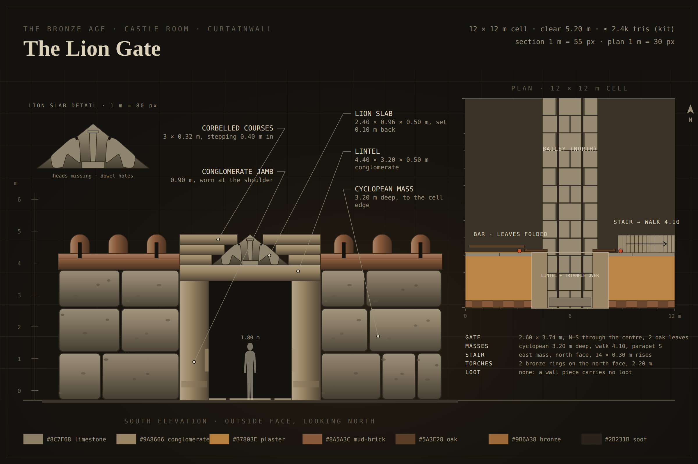

The way in, and the citadel's opinion of you, carved in the same stone. Two masses of cyclopean masonry pinch the road down to a single passage between dressed conglomerate jambs, under a lintel of some twenty tonnes. Above it the builders corbelled a triangle to spare the lintel and filled its face with a relief of two lions at a column, a king explaining that he owns both the gate and the lions; their heads, fixed on separately, are long gone. Inside, the oak leaves stand folded back against the plastered walls with the bar lying where it was dropped, torches burn in bronze rings either side of the passage, and a stone stair climbs the east mass to the walk. The doors burn; the walls do not, and the gate is the only thing in this Age that shrugs at FRANGO.

**Build** (kit metres: x east, y north, from the cell centre; heights above ground, no floor slab)

- Cell: 12.1 × 12.1 m (±6.05), no floor slab; the gate passage runs north–south through the cell centre.
- Masses: cyclopean limestone 3.20 m deep from the south cell line, x −6.05 … −2.20 (seed 9) and 2.20 … 6.05 (seed 10), three courses to 4.10 m, outer faces set back per block, inner (north) faces flat at y −2.85. Kit override: the art bible's masses stop 0.30 m short of the E/W edges; the kit runs them to the edges so a neighbour meets them.
- Jambs: dressed conglomerate 0.90 m wide (x ±1.30 … ±2.20), 3.20 m deep, 3.74 m tall; the passage between them is 2.60 m wide × 3.74 m (the CurtainWall archway).
- Lintel: one conglomerate block 4.40 × 3.20 × 0.50 m, 3.74–4.24 m, over both jambs.
- Relieving triangle: three corbelled conglomerate courses 0.32 m high, full depth, from 4.24 to 5.20 m, leaving an opening 2.40 / 1.60 / 0.80 m wide course by course.
- Lion slab: a limestone triangular prism, base 2.40 m at 4.24 m, apex 5.20 m, 0.50 m thick, its face 0.10 m behind the corbels'; relief 0.08 m proud in front of it: altar plinth 0.50 × 0.14 m, a down-tapering column 0.11 → 0.16 m wide to 0.76 m with a 0.22 m capital, and two rampant lions leaning in, headless.
- Walk and parapets: plastered walk 4.10–4.20 m on each mass, 0.44 to 3.00 m in; the Age's mud-brick breastwork on each mass's south edge, three merlons a side, sling slots in the first and third.
- Inner face: ochre plaster 0.04 m on the west mass's north face from the ground to 2.40 m, a fresco-blue dado 0.30 m tall at 1.20 m.
- Doors: two oak leaves 1.30 × 3.70 × 0.14 m folded back flat against the north faces (x ±1.30 … ±2.60), three battens each, a bronze strip 0.12 m on each leading edge.
- Bar: an oak beam 0.16 × 0.16 × 3.20 m lying by the west mass (x −5.80 … −2.60).
- Torches: two bronze ring brackets on the north faces at x ±2.90, 2.20 m up, each holding an oak torch with a flame.
- Stair: fourteen ashlar steps 1.00 m wide against the east mass's north face, 0.30 m rises and 0.236 m treads, west to east from x 2.75 to the cell edge, the top step at the walk's 4.20 m.
- Road: limestone slabs 0.06 m thick, 3.20 m wide (x ±1.60), twelve rows through the whole cell, joints staggered, 0.04 m joints; two cart ruts at x ±0.70 its full length.

**Sockets**

- Gate: 2.60 × 3.74 m clear, north–south through the cell centre, double oak leaves (open), barred from the north
- Stair: east mass, north face, 1.00 m wide, 14 rises of 0.30 m to the walk at 4.10 m (plaster top 4.20 m)
- Wall-walks: 4.10 m on each mass, open at the east and west cell edges
- Torch sockets: 2 bronze rings on the north face, 2.20 m up, at x ±2.90
- Murder-hole: none; the gate is defended from the flanking masses

**Loot anchors**

**Materials** (art-pass colour, then the kit's atlas pigment)

| Material | Hex | Kit pigment | Notes |
|---|---|---|---|
| Cyclopean limestone | `#8C7F68` | `vellum_dim` | Masses, lion slab, road. |
| Dressed conglomerate | `#9A8666` | `vellum_faint` | Jambs, lintel, corbels, relief, stair. |
| Ochre plaster | `#B7803E` | `bronze` | The west inner face and the walks. |
| Fresco blue | `#3F6F86` | `verdigris_lo` | The dado band. |
| Mud-brick | `#8A5A3C` | `leather` | The breastworks. |
| Oak | `#5A3E28` | `oak` | Leaves, battens, bar, torches. |
| Bronze | `#9B6A38` | `bronze` | Leaf edges and the torch rings. |

**In play**

- The citadel's front door: the passage is the only way through the south wall here, and the slingers on both masses cover it.
- The leaves stand open; closing and barring them is a guard action, and a FRANGO on them opens the gate for good.
- The stair on the east mass is the thief's way onto the walls from inside.

### BronzeWallStraight

**The Cyclopean Wall** · CurtainWall · stands in for WallStraight · ≤ 1.2k tris (kit)

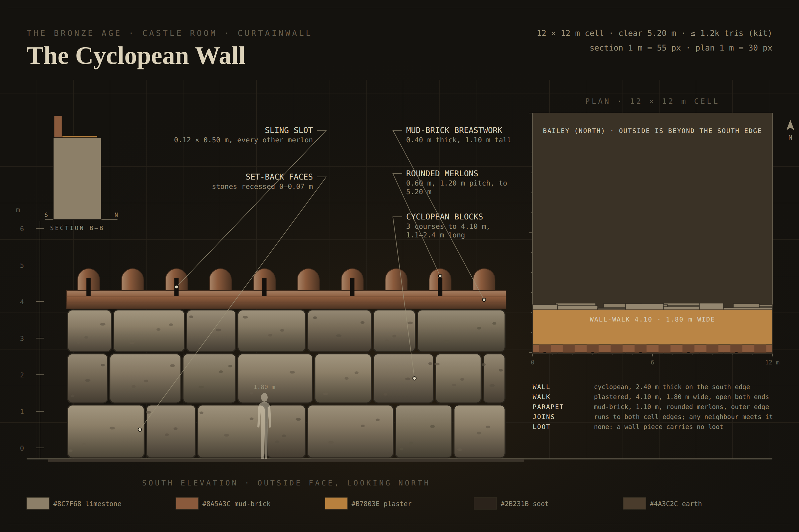

The citadel's wall is thick rather than tall. Three courses of limestone blocks, some longer than a man is tall, sit on one another with no mortar and not much dressing, their faces left rough and each one set back a little from its neighbour so the wall reads as a pile of boulders that decided to stand in a line. On top the builders laid a plastered walk wide enough for two slingers to pass, and along its outer edge a breastwork of mud-brick with rounded merlons and narrow sling slots. The stone will outlast everything. The brick will not, and the wall's defenders know which half of it to stand behind.

**Build** (kit metres: x east, y north, from the cell centre; heights above ground, no floor slab)

- Cell: 12.1 × 12.1 m (±6.05), no floor slab; the wall stands on the ground on the south edge, the bailey open to the north.
- Mass: cyclopean limestone, 2.40 m thick from the south cell line, x −6.05 … 6.05, three courses 1.50 / 1.40 / 1.20 m to 4.10 m.
- Blocks: cyclopean.blocks(−6.05, 6.05, 4.10, seed = 0): widths 1.1–2.4 m from fixed lists, each course starting at a different place in its list so no vertical joint runs through two courses; a remainder under 0.60 m joins the block before it.
- Faces: each block's outer face set back 0.00–0.07 m and its inner face ragged by −0.15 … +0.12 m, so the stones read separately from both sides; the outer face never passes the cell line.
- Wall-walk: ochre lime plaster 0.10 m thick on the mass, 4.10–4.20 m, from 0.44 m to 2.20 m in (1.76 m wide), full length, open at both ends to the neighbouring pieces.
- Parapet: mud-brick breastwork 0.40 m thick, its outer face 0.04 m inside the cell line; a 0.50 m low wall (4.10–4.60 m) along the whole run.
- Merlons: ten, 0.60 m wide at 1.20 m pitch centred on the run, each a 0.30 m box (4.60–4.90 m) under a half-round top of radius 0.30 m to 5.20 m.
- Sling slots: a dark inset 0.12 × 0.50 m on the outer face of every other merlon from the west, centred at 4.70 m.
- Joins: the run reaches both cell edges at full height, so a straight, corner, gate or bastion piece meets it without a gap.

**Sockets**

- Wall-walk: 4.10 m (plaster top 4.20 m), 1.76 m wide, open at the east and west cell edges
- Sling slots: five, on the outer (south) face at 4.70 m

**Loot anchors**

**Materials** (art-pass colour, then the kit's atlas pigment)

| Material | Hex | Kit pigment | Notes |
|---|---|---|---|
| Cyclopean limestone | `#8C7F68` | `vellum_dim` | The mass; per-block value from the set-back. |
| Mud-brick | `#8A5A3C` | `leather` | The breastwork and merlons. |
| Ochre plaster | `#B7803E` | `bronze` | The wall-walk. |
| Soot | `#2B231B` | `bone_black` | The sling slots. |

**In play**

- Wall Slingers patrol the walk and fire through the slots and crenels; the walk is 1.76 m wide, room to pass one another.
- The stone ignores FRANGO; the mud-brick breastwork is the part that can be knocked down.
- No loot: the wall is terrain, the thing between the thief and the town.

### BronzeWallCorner

**The Corner Tower** · CurtainWall · stands in for WallCorner · ≤ 2.4k tris (kit)

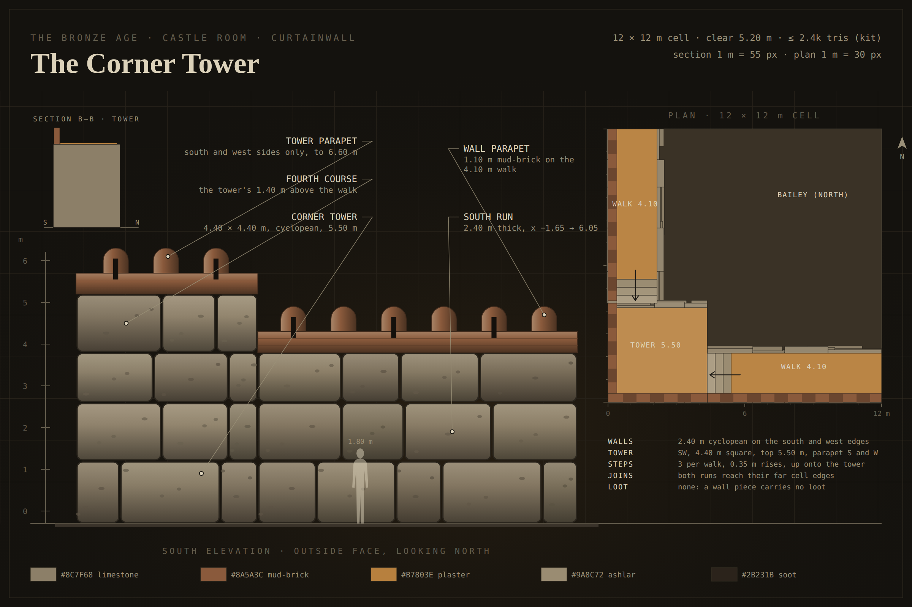

The citadel turns its corners with a tower rather than a curve: a square of cyclopean masonry 4.4 m on a side, laid in the same rough courses as the walls and then one more, so its top stands a man's reach above the walk. Slingers on it see along both walls at once. Its mud-brick parapet faces only outward; on the inside it is open to the walks, and three stone steps on each walk climb the last of the height. It is the obvious place to put a lookout and the obvious place for a thief to expect one.

**Build** (kit metres: x east, y north, from the cell centre; heights above ground, no floor slab)

- Cell: 12.1 × 12.1 m (±6.05), no floor slab; walls on the south and west edges, the bailey open to the north-east.
- Tower: cyclopean limestone, 4.40 × 4.40 m in the SW corner (x and y −6.05 … −1.65), four courses 1.50 / 1.40 / 1.20 / 1.40 m to 5.50 m; blocks cyclopean.blocks(−6.05, −1.65, 5.50, seed = 3), set-backs on the south face.
- Tower top: ochre plaster 0.10 m (5.50–5.60 m) inside the parapets, to 0.20 m short of the north face.
- Tower parapet: the Age's mud-brick breastwork on the tower's south and west edges only, base 5.50 m, top 6.60 m, three merlons a side, sling slots in the first and third.
- South run: the straight wall's section, 2.40 m thick, x −1.65 … 6.05, seed 1: three courses to 4.10 m, plastered walk, breastwork with six merlons.
- West run: the same, along the west edge, y −1.65 … 6.05, seed 2, its outer face on x = −6.05.
- Steps: three ashlar steps on each walk against the tower (0.35 m treads, 0.35 m rises, tops 4.55 / 4.90 / 5.25 m), the fourth rise onto the tower top at 5.60 m.
- Joins: the south run reaches the east cell edge and the west run the north cell edge at full height and section, meeting any straight piece.

**Sockets**

- Wall-walks: 4.10 m (plaster top 4.20 m), 1.76 m wide, open at the east and north cell edges
- Tower top: 5.60 m, reached by three steps from each walk
- Sling slots: on the outer faces, 0.60 m above each walk or the tower top

**Loot anchors**

**Materials** (art-pass colour, then the kit's atlas pigment)

| Material | Hex | Kit pigment | Notes |
|---|---|---|---|
| Cyclopean limestone | `#8C7F68` | `vellum_dim` | Tower and runs. |
| Mud-brick | `#8A5A3C` | `leather` | Breastworks and merlons. |
| Ochre plaster | `#B7803E` | `bronze` | Walks and the tower top. |
| Dressed ashlar | `#9A8C72` | `vellum_faint` | The steps. |
| Soot | `#2B231B` | `bone_black` | Sling slots. |

**In play**

- A lookout post: a Wall Slinger on the tower sees along both walks; the steps are the only way up.
- The tower's inner sides are open, so a thief who reaches the walk can climb it too.
- No loot: terrain.

### BronzeBastion

**The Horned Bastion** · CurtainWall · stands in for Bastion · ≤ 2k tris (kit)

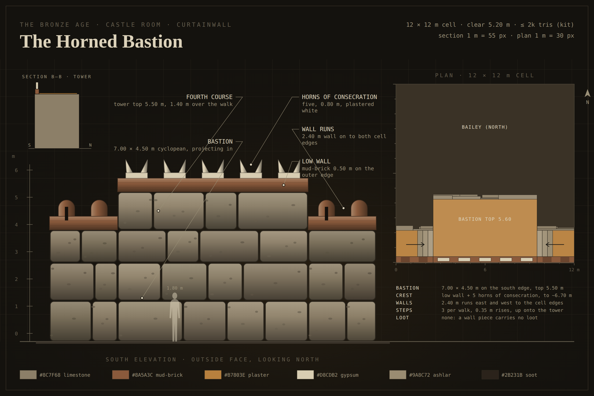

Where the wall needs to be seen from the plain, the builders pushed out a bastion: a block of cyclopean masonry seven metres long and four and a half deep, a course higher than the wall on either side. Along its outer edge a low mud-brick wall carries five horns of consecration, plastered white, the sign that the gods live inside and the palace speaks for them. From a distance they are what you see first; up close they are waist-high and make poor cover. Steps on the walks climb onto the bastion from both sides, and the slingers who hold it have the best field of fire on the wall.

**Build** (kit metres: x east, y north, from the cell centre; heights above ground, no floor slab)

- Cell: 12.1 × 12.1 m (±6.05), no floor slab; the wall on the south edge, the bailey open to the north.
- Bastion: cyclopean limestone, x −3.50 … 3.50, 4.50 m in from the south cell line (to y −1.55), four courses 1.50 / 1.40 / 1.20 / 1.40 m to 5.50 m; blocks cyclopean.blocks(−3.50, 3.50, 5.50, seed = 4), set-backs on the south face.
- Bastion top: ochre plaster 0.10 m (5.50–5.60 m), from behind the low wall to 0.20 m short of the north face.
- Low wall: mud-brick 0.40 m thick, its outer face 0.04 m inside the cell line, 5.50–6.00 m, the bastion's full width.
- Horns of consecration: five, the kit's horns at size 0.80 m (plinth 0.80 × 0.24 × 0.20 m, two up-curving horns), plastered white, on the low wall at x −2.80 / −1.40 / 0 / 1.40 / 2.80; tips at about 6.70 m.
- Wall runs: the straight wall's section (2.40 m, three courses to 4.10 m, plastered walk, breastwork with two merlons a side) from each of the bastion's east and west faces to the cell edges; west seed 5, east seed 6.
- Steps: three ashlar steps on each walk against the bastion (0.35 m treads and rises, tops 4.55 / 4.90 / 5.25 m), the fourth rise onto the top at 5.60 m.
- Joins: both runs reach their cell edges at full height and section.

**Sockets**

- Wall-walks: 4.10 m (plaster top 4.20 m), 1.76 m wide, open at the east and west cell edges
- Bastion top: 5.60 m, reached by three steps from each walk
- Sling slots: in the first merlon of each run, 4.70 m, outer face

**Loot anchors**

**Materials** (art-pass colour, then the kit's atlas pigment)

| Material | Hex | Kit pigment | Notes |
|---|---|---|---|
| Cyclopean limestone | `#8C7F68` | `vellum_dim` | Bastion and runs. |
| Mud-brick | `#8A5A3C` | `leather` | The low wall and the runs' breastworks. |
| White plaster | `#D8CDB2` | `vellum` | The horns of consecration. |
| Ochre plaster | `#B7803E` | `bronze` | Walks and the bastion top. |
| Dressed ashlar | `#9A8C72` | `vellum_faint` | The steps. |

**In play**

- The horns are the Bronze skyline's landmark: a thief can navigate the citadel by them.
- The bastion top is the Wall Slingers' best post, but the crest is only waist-high: poor cover against return fire.
- No loot: terrain.

### BronzeGateApproach

**The Cart Gate** · CurtainWall · stands in for Drawbridge · ≤ 2k tris (kit)

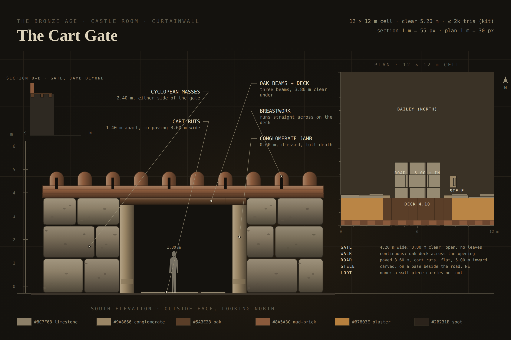

The Lion Gate is for kings. Carts come in here, through a gap in the wall between two dressed jambs, under an oak deck that carries the wall-walk and its breastwork straight across so the slingers never have to come down. The road through is paved in limestone slabs worn into two ruts by a few hundred years of oxcarts, and beside it a carved stele reminds the drivers whose road it is. There are no gate leaves; there were once, and the pivot sockets are still in the jambs. Bronze Age builders had no drawbridge to raise, so the gate is only as shut as the men standing on the deck above it.

**Build** (kit metres: x east, y north, from the cell centre; heights above ground, no floor slab)

- Cell: 12.1 × 12.1 m (±6.05), no floor slab; the wall on the south edge, the bailey open to the north.
- Masses: the straight wall's section, 2.40 m thick, three courses to 4.10 m and a plastered walk, from each cell edge to the jambs: west x −6.05 … −2.70 (seed 7), east x 2.70 … 6.05 (seed 8).
- Jambs: dressed conglomerate, 0.60 m wide (x ±2.10 … ±2.70), the wall's full 2.40 m depth and 4.10 m height, flat-faced; the opening between them is 4.20 m wide.
- Beams: three oak beams 0.30 × 0.30 m at 3.80–4.10 m, 0.25 / 1.20 / 2.00 m in from the cell line, 4.80 m long, pocketed 0.30 m into each jamb; the opening is 3.80 m clear under them.
- Deck: oak planking 0.10 m thick (4.10–4.20 m) from jamb to jamb (x ±2.70), 0.04 to 2.20 m in, carrying the walk and the breastwork across the opening.
- Parapet: the Age's breastwork along the whole run, ten merlons, sling slots in every other one; over the opening it stands on the deck.
- Road: limestone slabs 0.06 m thick, 3.60 m wide (x ±1.80), in five rows of 0.96 m from the cell line to 5.00 m in, three slabs a row with the joints staggered row to row and 0.04 m joints (the kit's paint-box overlap would close anything narrower).
- Ruts: two dark strips 0.12 m wide, 0.01 m thick on the slabs at x ±0.70, the road's full length.
- Stele: conglomerate base 0.50 × 0.90 × 0.30 m at (2.80, −2.60), a tapering limestone slab 0.60 → 0.54 m wide, 1.30 m tall, 0.15 m thick on its east half, carved face west to the road.

**Sockets**

- Gate: 4.20 m wide × 3.80 m clear, centred on the south edge, open (no leaves)
- Wall-walk: continuous at 4.10 m (plaster and deck top 4.20 m), open at the east and west cell edges
- Road: flat (≤ 0.07 m), walkable, 5.00 m in from the cell line

**Loot anchors**

**Materials** (art-pass colour, then the kit's atlas pigment)

| Material | Hex | Kit pigment | Notes |
|---|---|---|---|
| Cyclopean limestone | `#8C7F68` | `vellum_dim` | Masses, road slabs, stele. |
| Dressed conglomerate | `#9A8666` | `vellum_faint` | Jambs and the stele base. |
| Oak | `#5A3E28` | `oak` | Beams and deck. |
| Mud-brick | `#8A5A3C` | `leather` | The breastwork. |
| Ochre plaster | `#B7803E` | `bronze` | The walk. |
| Soot | `#2B231B` | `bone_black` | Cart ruts and sling slots. |

**In play**

- An open way in: no leaves to bar, but the deck overhead is a slinger post directly above the road.
- The oak deck burns: a FRANGO on it drops the walk and opens the wall-top to the bailey.
- No loot: terrain; the stele is scenery.

## OuterBailey

| Key | Room | Stands in for | |
|---|---|---|---|
| `BronzeChariotShed` | [The Chariot Shed](#bronzechariotshed) | StableBlock | A war chariot on its stand, two stalls for the team, fodder and harness: the citadel's pride, parked in a mud-brick shed. |
| `BronzeFoundry` | [The Foundry](#bronzefoundry) | BlacksmithShop | A clay shaft furnace fed by goat-hide bellows, stone moulds and crucibles, and a stack of cast ingots waiting for the palace. |
| `BronzeLevyBarracks` | [The Levy Barracks](#bronzelevybarracks) | BarracksBunk | Where the palace levy sleeps: reed mats on clay benches, spears racked on one wall and oxhide shields hung on the other. |
| `BronzeCistern` | [The Cistern Court](#bronzecistern) | WellCourtyard | A paved court round the citadel's cistern: a stone drum, its lid half drawn, a winch over it, and jars waiting to be filled. |
| `BronzeOilPress` | [The Oil Press](#bronzeoilpress) | StorehouseRoom | A lever press worked by stone weights, racks of sealed amphorae, and a floor you will slip on. |

### BronzeChariotShed

**The Chariot Shed** · OuterBailey · stands in for StableBlock · ≤ 2k tris (kit)

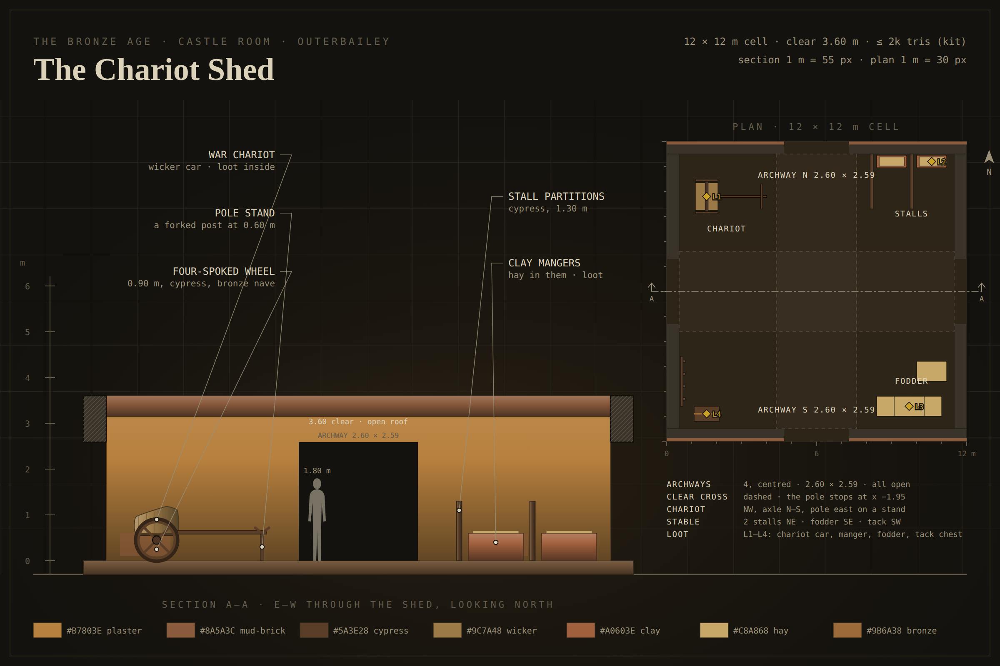

A chariot is the most expensive thing a Bronze Age noble owns that he cannot eat, and this one is parked with its pole on a forked stand as though the horses might be brought round at any moment. Its wheels are cypress with bronze naves, its car is wicker screened in hide, and the two stalls against the north wall hold the team that pulls it, or would if the grooms were not asleep. The harness hangs on a rail by the tack chest. The car is a fine place to leave something, and a finer place to find it.

**Build** (kit metres: x east, y north, from the cell centre; heights above ground, floor top at 0.30)

- Shell: the kit's OuterBailey shell, 12.0 × 12.0 × 0.30 m slab, 0.50 m ochre plaster walls 3.60 m clear (mud-brick showing low down), 0.45 m mud-brick capstone band, an archway 2.60 × 2.59 m centred on every wall.
- Chariot (NW): two four-spoked cypress wheels r 0.45 m at (−4.40, 3.15) and (−4.40, 4.45) on a bronze axle r 0.04 × 1.40 m running north–south at 0.75 m above ground.
- Chariot car: a cypress floor 0.90 × 1.10 × 0.06 m at 0.88 m, a wicker screen 0.50 m tall across its east (front) edge and 0.35 m side screens.
- Pole: cypress 1.95 × 0.08 × 0.08 m running east from the car to x −2.00, at 0.92 m; a forked stand post 0.58 m at (−2.10, 3.80) and a yoke bar 1.00 m across at (−2.20, 3.80).
- Stalls (NE): two cypress partitions 0.12 × 2.20 × 1.30 m at x 2.20 and 3.80, from the north wall to y 3.30.
- Mangers: clay, 1.20 × 0.50 × 0.60 m against the north wall at x 3.00 and 4.60, hay in them.
- Fodder (SE): four bundles 1.20 × 0.80 × 0.60 m: three by the south wall at x 3.00, 3.70 (on top) and 4.40, one at (4.60, −3.20).
- Harness rail (SW): cypress 2.00 m on the west wall at 1.80 m above ground, four leather straps 0.90 m hanging from it.
- Tack chest: cypress 1.00 × 0.60 × 0.55 m with a bronze-bound lid at (−4.40, −4.90).

**Sockets**

- Archway ×4, centred on each wall: 2.60 × 2.59 m (OuterBailey), all open
- Chariot pole: ends at x −1.95 on its stand, clear of the north–south walkway

**Loot anchors**

- L1: in the chariot car at (-4.40, 3.80, 0.91)
- L2: east manger, on the hay at (4.60, 5.20, 0.95)
- L3: top fodder bundle at (3.70, -4.60, 1.50)
- L4: tack chest at (-4.40, -4.90, 0.90)

**Materials** (art-pass colour, then the kit's atlas pigment)

| Material | Hex | Kit pigment | Notes |
|---|---|---|---|
| Ochre plaster | `#B7803E` | `bronze` | Walls, fallen away low down to the mud-brick. |
| Mud-brick | `#8A5A3C` | `leather` | Capstone band, patches, the harness straps. |
| Cypress timber | `#5A3E28` | `oak` | Wheels, car floor, pole, stalls, chest. |
| Wicker and hide | `#9C7A48` | `vellum_dim` | The car's screens. |
| Terracotta | `#A0603E` | `leather` | Mangers. |
| Hay | `#C8A868` | `vellum_dim` | Fodder bundles, manger hay; very flammable. |
| Cast bronze | `#9B6A38` | `bronze` | Axle, naves, the chest binding. |

**In play**

- The fodder and the hay are dry: IGNIS here burns the shed out in seconds.
- The chariot and the fodder stack are the only tall cover.
- The stalls are empty in the kit: a horse (if the game ever adds one) is noise.

### BronzeFoundry

**The Foundry** · OuterBailey · stands in for BlacksmithShop · ≤ 2k tris (kit)

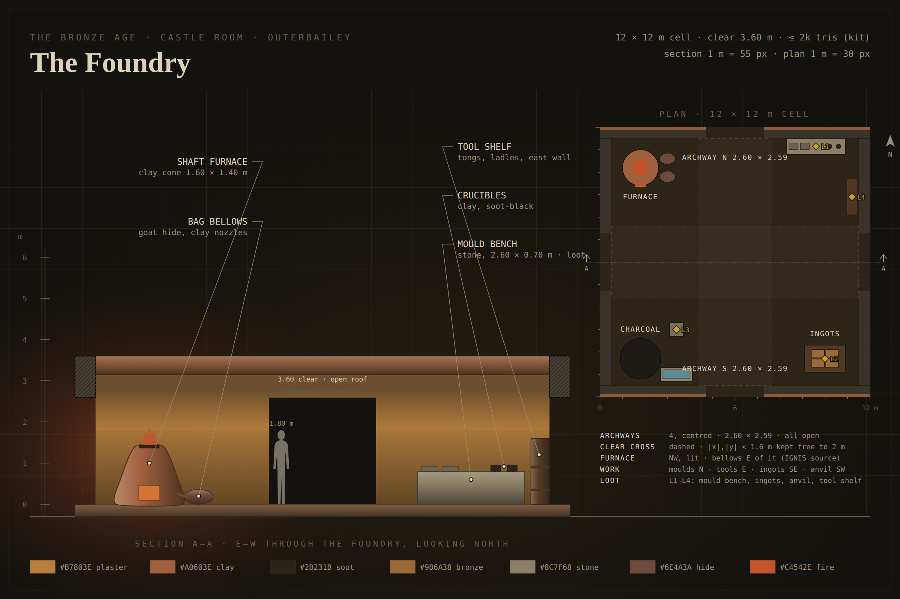

Bronze is poured, not beaten, and here is where it happens: a clay shaft furnace taller than a boy, two goat-hide bellows panting into it through clay nozzles, and a stone bench of moulds for spearheads and double axes, with the crucibles still black from the last pour. The finished work leaves as oxhide ingots, stacked crosswise on a pallet and weighed by the scribes before anyone is allowed to touch them. The furnace never quite goes out, and the charcoal heap by the wall is waiting for someone careless.

**Build** (kit metres: x east, y north, from the cell centre; heights above ground, floor top at 0.30)

- Shell: the kit's OuterBailey shell, 12.0 × 12.0 × 0.30 m slab, 0.50 m ochre plaster walls 3.60 m clear, 0.45 m mud-brick capstone band, an archway 2.60 × 2.59 m centred on every wall; soot over the top 1.35 m of the north and west walls' furnace sections.
- Shaft furnace (NW): a clay cone r 0.80 → 0.35 × 1.40 m at (−4.20, 4.20); a glowing mouth 0.50 × 0.35 m on its south face; a soot ring and a flame cone at its top.
- Bag bellows: two goat hides (flattened ellipsoids 0.70 × 0.49 × 0.35 m) on the floor at (−3.00, 4.60) and (−3.00, 3.80), a clay nozzle r 0.04 × 0.35 m from each toward the furnace.
- Mould bench (NE): stone, 2.60 × 0.70 × 0.80 m against the north wall at x 3.60; two stone moulds 0.40 × 0.30 × 0.12 m at x 2.60 and 3.10, two crucibles r 0.12 × 0.15 m at x 4.20 and 4.60.
- Tool shelf: a cypress shelf unit 1.60 m long against the east wall at (5.20, 2.90), two boards (0.35, 0.90 m), tongs and ladles on the lower.
- Ingot stack (SE): a pallet 1.80 × 1.20 × 0.12 m at (4.00, −4.30), four crosswise layers of oxhide ingots (0.56 × 0.36 × 0.06 m, alternate layers 0.52 × 0.38), top at 0.66 m.
- Charcoal heap (SW): a black cone r 0.90 → 0.25 × 0.60 m at (−4.20, −4.30).
- Water trough: stone, 1.40 × 0.60 × 0.50 m against the south wall at x −2.60, water in it.
- Anvil stone: 0.60 × 0.60 × 0.50 m at (−2.60, −3.00).

**Sockets**

- Archway ×4, centred on each wall: 2.60 × 2.59 m (OuterBailey), all open
- Furnace: NW, always lit (an IGNIS source); the charcoal heap burns

**Loot anchors**

- L1: mould bench, between moulds and crucibles at (3.60, 5.15, 1.10)
- L2: ingot stack at (4.00, -4.30, 0.66)
- L3: anvil stone at (-2.60, -3.00, 0.80)
- L4: tool shelf, top board at (5.20, 2.90, 1.23)

**Materials** (art-pass colour, then the kit's atlas pigment)

| Material | Hex | Kit pigment | Notes |
|---|---|---|---|
| Ochre plaster | `#B7803E` | `bronze` | Walls; soot heavy over the furnace. |
| Terracotta | `#A0603E` | `leather` | Furnace, nozzles. |
| Hearth soot / charcoal | `#2B231B` | `bone_black` | Charcoal heap, crucibles, soot. |
| Cast bronze | `#9B6A38` | `bronze` | Ingots and tools. |
| Stone | `#8C7F68` | `vellum_faint` | Mould bench, trough, anvil; moulds darker (line). |
| Goat hide | `#6E4A3A` | `leather` | The bellows. |
| Fire | `#C4542E` | `madder` | The furnace mouth and flame. |

**In play**

- The furnace is always lit and the charcoal heap is right beside the wall: IGNIS here spreads fast.
- The ingot stack is heavy loot (several trips); the mould bench and shelf hold small pieces.
- Bright and hot: nobody hides here, and the bellows are noisy if kicked.

### BronzeLevyBarracks

**The Levy Barracks** · OuterBailey · stands in for BarracksBunk · ≤ 2k tris (kit)

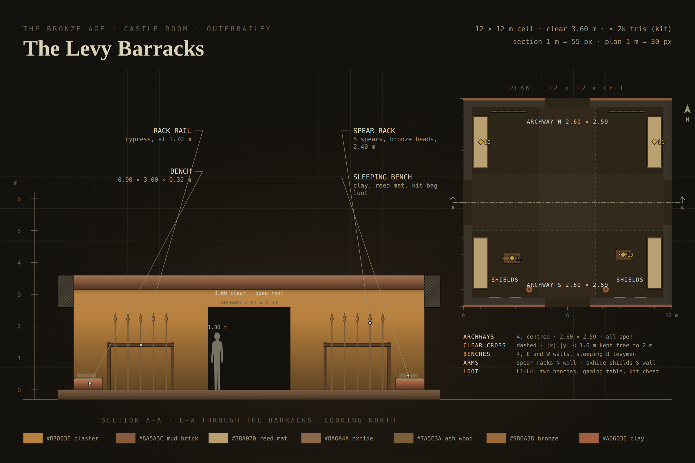

The palace levy are farmers for most of the year and soldiers when told, and they sleep here in rows on clay benches spread with reed mats, eight to a room and all of them snoring. Their spears stand in racks along the north wall, bronze heads catching whatever light comes in, and their great figure-of-eight shields of oxhide hang on the south wall like drying laundry. A low table in the corner has a gaming board scratched into it and a set of knucklebones nobody has put away. Kit bags and the chest hold what little they own.

**Build** (kit metres: x east, y north, from the cell centre; heights above ground, floor top at 0.30)

- Shell: the kit's OuterBailey shell, 12.0 × 12.0 × 0.30 m slab, 0.50 m ochre plaster walls 3.60 m clear, 0.45 m mud-brick capstone band, an archway 2.60 × 2.59 m centred on every wall.
- Sleeping benches: four clay benches 0.90 × 3.00 × 0.35 m against the east and west walls at x ±5.00, y ±3.50; a reed mat 0.80 × 2.90 × 0.03 m on each; a rolled kit bag 0.60 × 0.50 × 0.14 m at the north end of the two northern benches.
- Spear racks: two on the north wall at x ±3.40, each two uprights 0.10 × 0.10 × 1.50 m and a rail 2.10 m at 1.71 m above ground; five spears per rack, ash shafts r 0.02 × 2.10 m with bronze heads 0.30 m, at 0.40 m spacing.
- Shields: four figure-of-eight oxhide shields hung flat on the south wall at x ±3.00 and ±4.20, each two discs (r 0.35 m at 1.60 m, r 0.30 m at 2.20 m above ground), 0.06 m thick.
- Water jars: two, 0.60 m tall, belly 0.36 m, at (±2.20, −5.00).
- Gaming table (SE): cypress, 0.90 × 0.60 m, 0.50 m high, at (3.20, −3.00).
- Kit chest (SW): cypress 1.00 × 0.60 × 0.55 m with a bronze-bound lid at (−3.20, −3.20).
- Walls: plaster fallen away low down to the mud-brick in places (albedo only).

**Sockets**

- Archway ×4, centred on each wall: 2.60 × 2.59 m (OuterBailey), all open
- Spear racks: where the levy arm themselves when the alarm goes up

**Loot anchors**

- L1: NE sleeping bench at (5.00, 3.50, 0.68)
- L2: NW sleeping bench at (-5.00, 3.50, 0.68)
- L3: gaming table at (3.20, -3.00, 0.80)
- L4: kit chest at (-3.20, -3.20, 0.90)

**Materials** (art-pass colour, then the kit's atlas pigment)

| Material | Hex | Kit pigment | Notes |
|---|---|---|---|
| Ochre plaster | `#B7803E` | `bronze` | Walls. |
| Mud-brick | `#8A5A3C` | `leather` | Capstone band, bench clay, the kit bags. |
| Reed mat | `#B8A070` | `vellum_dim` | On every bench; burns. |
| Oxhide | `#8A6A4A` | `leather` | The shields, hair side out. |
| Ash wood / cypress | `#5A3E28` | `oak` | Spear shafts, racks, table, chest. |
| Cast bronze | `#9B6A38` | `bronze` | Spearheads, chest binding. |

**In play**

- Eight levymen sleep here: the room wakes all at once, and arms from the racks.
- The benches are low cover; the chest and table are in the open south half.
- The reed mats burn quickly.

### BronzeCistern

**The Cistern Court** · OuterBailey · stands in for WellCourtyard · ≤ 2k tris (kit)

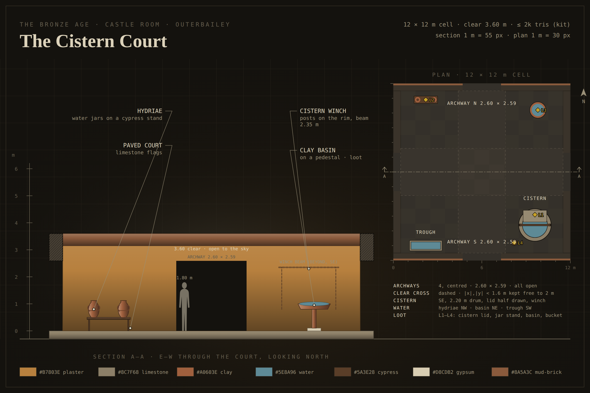

A citadel on a rock lives or dies by its water, and this court is where the water is kept: a stone drum over the cistern shaft with its lid dragged half aside, a timber winch on the rim for the rope, and a bucket left beside it by whoever was last on duty. Water jars stand on a stand against the north wall, a clay basin waits on its pedestal for washing, and a trough by the south wall serves the animals. The court is paved and open to the sky, and on a still night you can hear the cistern breathing.

**Build** (kit metres: x east, y north, from the cell centre; heights above ground, floor top at 0.30)

- Shell: the kit's OuterBailey shell, 12.0 × 12.0 × 0.30 m slab (paved), 0.50 m ochre plaster walls 3.60 m clear, 0.45 m mud-brick capstone band, an archway 2.60 × 2.59 m centred on every wall.
- Cistern head (SE): a limestone drum r 1.10 × 0.80 m at (3.60, −3.60), the water surface r 0.88 m on top, ringed by a stone lip 0.22 m wide × 0.12 m (twelve blocks) so the water sits below it.
- Lid: a stone slab 1.60 × 0.80 × 0.12 m resting on the lip's north half at (3.60, −3.00), half drawn off the shaft (top at 1.34 m).
- Winch: two cypress posts 0.14 × 0.14 × 1.44 m standing on the lip at x 2.60 and 4.60, a beam 2.10 m across them at 2.65 m above ground.
- Bucket: cypress r 0.20 × 0.35 m on the floor at (2.20, −4.80).
- Hydria stand (NW): cypress, 1.60 × 0.50 m, 0.50 m high, against the north wall at x −3.80; a water jar 0.62 m tall at each end (x −4.35, −3.25).
- Basin (NE): a clay bowl r 0.45 → 0.55 × 0.20 m on a pedestal r 0.08 × 0.72 m and a gypsum foot, water in it, at (3.80, 4.20); rim at 1.30 m above ground.
- Trough (SW): stone, 2.20 × 0.70 × 0.60 m against the south wall at x −3.80, water in it.
- Paving: limestone flags in a 1.00 m chequer (albedo only).

**Sockets**

- Archway ×4, centred on each wall: 2.60 × 2.59 m (OuterBailey), all open
- Cistern shaft: SE, open under the half-drawn lid (a drop to water)

**Loot anchors**

- L1: cistern lid at (3.60, -2.90, 1.34)
- L2: hydria stand, between the jars at (-3.80, 4.90, 0.80)
- L3: clay basin at (3.80, 4.20, 1.30)
- L4: bucket at (2.20, -4.80, 0.65)

**Materials** (art-pass colour, then the kit's atlas pigment)

| Material | Hex | Kit pigment | Notes |
|---|---|---|---|
| Ochre plaster | `#B7803E` | `bronze` | Walls; damp-dark at the foot. |
| Limestone | `#8C7F68` | `vellum_faint` | Cistern drum, trough; the lid is vellum_dim. |
| Terracotta | `#A0603E` | `leather` | Hydriae and the basin. |
| Water | `#5E8A96` | `verdigris_lo` | Cistern, basin, trough. |
| Cypress timber | `#5A3E28` | `oak` | Winch, stand, bucket. |
| Mud-brick | `#8A5A3C` | `leather` | Capstone band. |

**In play**

- Water for IGNIS fires: the court is where a burning raid can be put out, and where guards run for buckets.
- The cistern head is waist-high cover; the rest of the court is open to the sky and bright.
- The open shaft under the lid is a drop (a thrown item, or a player, is gone).

### BronzeOilPress

**The Oil Press** · OuterBailey · stands in for StorehouseRoom · ≤ 3.2k tris (kit); 2.48k built

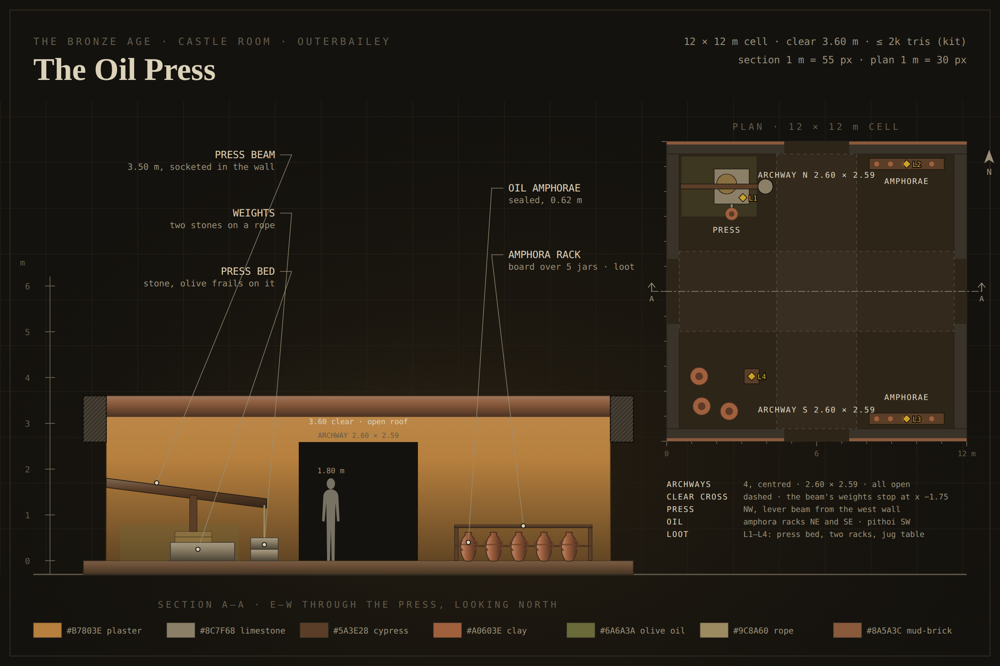

Olives go in at one end of this room and oil goes out at the other in sealed amphorae stamped for the palace. Between the two stands the press: a cypress beam socketed into the wall, bearing down on baskets of crushed olives on a stone bed while two stones on a rope do the work of a man who would rather be elsewhere, and the oil runs from the bed's spout into a jar. Everything here is slippery, the racks are full, and one spark turns the whole room into a lamp.

**Build** (kit metres: x east, y north, from the cell centre; heights above ground, floor top at 0.30)

- Shell: the kit's OuterBailey shell, 12.0 × 12.0 × 0.30 m slab, 0.50 m ochre plaster walls 3.60 m clear, 0.45 m mud-brick capstone band, an archway 2.60 × 2.59 m centred on every wall.
- Oil stain: a dark flat patch 3.00 × 2.40 m on the floor under the press, (−3.90, 4.20).
- Press bed (NW): limestone 1.40 × 1.40 × 0.40 m at (−3.40, 4.20); two olive frails (woven baskets r 0.40 × 0.12 m) stacked on it at (−3.60, 4.30).
- Press beam: cypress 3.48 × 0.20 × 0.20 m, socketed into the west wall at 2.00 m above ground and running east, falling to 1.55 m at its free end, x −2.00.
- Pressing post: cypress 0.16 × 0.16 m from the frails up to the beam at (−3.60, 4.30).
- Weights: a rope r 0.02 × 0.75 m from the beam's end to two stone discs r 0.30 × 0.25 m stacked on the floor at (−2.05, 4.20).
- Collecting jar: 0.55 m tall, belly 0.50 m, at (−3.40, 3.10), a stone spout from the bed into it.
- Amphora racks (NE, SE): against the north and south walls at x 3.60 (y ±5.10): two posts 0.75 m, a board 3.00 × 0.45 × 0.06 m on top at 1.05 m, a rail at 0.62 m; five amphorae 0.62 m tall under each board at x 2.40–4.60.
- Small pithoi (SW): three, 1.20 m tall, belly 0.70 m, lidded, at (−4.60, −4.60), (−3.50, −4.80), (−4.70, −3.40).
- Jug table: cypress 0.60 × 0.60 m, 0.70 m high, at (−2.60, −3.40).

**Sockets**

- Archway ×4, centred on each wall: 2.60 × 2.59 m (OuterBailey), all open
- Press beam socket: west wall, 2.00 m above ground

**Loot anchors**

- L1: press bed, beside the frails at (-2.95, 3.75, 0.70)
- L2: NE amphora rack board at (3.60, 5.10, 1.08)
- L3: SE amphora rack board at (3.60, -5.10, 1.08)
- L4: jug table at (-2.60, -3.40, 1.00)

**Materials** (art-pass colour, then the kit's atlas pigment)

| Material | Hex | Kit pigment | Notes |
|---|---|---|---|
| Ochre plaster | `#B7803E` | `bronze` | Walls; oil-stained low behind the press. |
| Limestone | `#8C7F68` | `vellum_faint` | Press bed, weights, spout. |
| Cypress timber | `#5A3E28` | `oak` | Beam, post, racks, table. |
| Terracotta | `#A0603E` | `leather` | Amphorae, the collecting jar; frails are leather too. |
| Oil-soaked clay | `#6A4430` | `madder` | The oil pithoi (the fire colour). |
| Olive oil stain | `#3A3420` | `line` | The floor patch under the press. |

**In play**

- Slippery: the oil patch under the press makes a running player slide (a hazard hook for later).
- IGNIS on the oil pithoi or the racks lights the room.
- The press beam and the racks are cover; the amphorae are loot but fragile.

## InnerWard

| Key | Room | Stands in for | |
|---|---|---|---|
| `BronzePithosMagazine` | [The Pithos Magazine](#bronzepithosmagazine) | StorehouseRoom (palace) | Two dozen jars taller than you, grain on one side and oil on the other, and aisles too narrow to turn round in. |
| `BronzeFrescoCourt` | [The Fresco Court](#bronzefrescocourt) | GreatHallMain | The palace's painted court: four red columns, a procession on every wall, benches all round and a fire on the altar. |
| `BronzeShrine` | [The Shrine](#bronzeshrine) | ChapelRoom | A stepped altar crowned with horns of consecration, clay idols with their arms up, and a bronze double axe on its pole. |
| `BronzePalaceKitchen` | [The Palace Kitchen](#bronzepalacekitchen) | KitchenRoom | A round hearth with a tripod cauldron on it, a domed bread oven, querns and pots, and walls black with a century of smoke. |
| `BronzeTabletArchive` | [The Tablet Archive](#bronzetabletarchive) | GuardRoomInner | Baskets of clay tablets, a scribe's table, and one bored guard with a rack of spears watching over the palace's accounts. |

### BronzePithosMagazine

**The Pithos Magazine** · InnerWard · stands in for StorehouseRoom (palace) · ≤ 4.8k tris (kit); 3.23k built

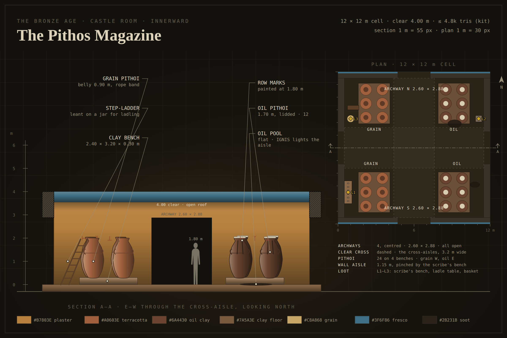

The wealth of the palace in its plainest form: grain and oil, by the tonne, in jars taller than a man. The pithoi stand on clay benches in rows, rope-banded and marked by the scribes, and between them run aisles so narrow that a man carrying anything must go sideways. The oil side is darker, sticky underfoot and lidded against the mice, and one careless spark there lights the whole east half of the room. There is little here worth carrying except the scribe's tablets and whatever was left on the ladling table; the room's value is as cover, and as a very large fire waiting to happen.

Source: the art bible's Pithos Magazine (docs/art/concept/bronze/pithos-store.svg, docs/art/bronze.md).

**Where the kit differs from the art bible**

- The art bible's four N–S jar rows cut across both archway axes; the kit puts one bench of two rows per quadrant (the same 24 jars) and keeps the cross clear.
- The half-choking amphora piles inside the east and west archways would block the walkway: left out.
- Jar belly 0.90 m instead of 1.10 m, and 1.70 m tall on a 0.30 m bench, so two rows fit a quadrant with a 1.15 m wall aisle.
- No ceiling vents (kit rooms are open-roofed); the pithoi are six-sided in the kit (24 of them).

**Build** (kit metres: x east, y north, from the cell centre; heights above ground, floor top at 0.30)

- Shell: the kit's InnerWard shell, 12.0 × 12.0 × 0.30 m slab, 0.50 m ochre plaster walls 4.00 m clear, 0.45 m fresco-blue capstone band, an archway 2.60 × 2.88 m centred on every wall.
- Benches: one clay bench per quadrant, 2.50 (E–W) × 3.20 (N–S) × 0.30 m, spanning x 1.90–4.40 and y 1.90–5.10 (mirrored in each quadrant).
- Pithoi: two rows of three per bench, rows at x ±2.50 and ±3.80, jars at y ±2.40, ±3.50, ±4.60. Each 1.70 m tall on the bench (top 2.30 m above ground), belly 0.90 m at 0.42 of the height, mouth 0.45 m with a rolled rim, one dark rope band at 0.62 of the height.
- Grain jars on the west benches (terracotta); oil jars on the east benches (darker oil-soaked clay) with a stone lid disc 0.54 m and black drips from the rim.
- Oil pools: flat dark ellipses on the floor, 1.10 × 0.66 m at (3.20, 1.90) and 0.80 × 0.48 m at (4.80, −2.90).
- Step-ladder: two rails 0.06 m and six rungs, leaning from the floor at x −5.20 to the NW front jar's shoulder at x −4.35, 1.95 m up, at y 3.05–3.30.
- Scribe's bench: clay, 0.60 × 1.80 × 0.80 m against the west wall at (−5.20, −3.50), six clay tablets 0.12 × 0.07 m on it.
- Ladle table: a painted table 0.50 × 0.50 m, 0.70 m high, in the NE wall aisle at (5.10, 2.30).
- Grain basket: r 0.28–0.32 × 0.40 m in the NW wall aisle at (−5.00, 2.30).
- Row marks: scribes' signs painted on the north wall at 1.80 m over each bench (albedo only).

**Sockets**

- Archway ×4, centred on each wall: 2.60 × 2.88 m (InnerWard), all open
- Wall aisles: 1.15 m between the benches and the walls; the scribe's bench pinches the SW one to 0.50 m
- Hide spots: the row ends at the cross-aisles, where the jar bellies give cover

**Loot anchors**

- L1: scribe's bench, tablets at (-5.20, -3.50, 1.10)
- L2: ladle table, NE aisle at (5.10, 2.30, 1.00)
- L3: grain basket, NW aisle at (-5.00, 2.30, 0.70)

**Materials** (art-pass colour, then the kit's atlas pigment)

| Material | Hex | Kit pigment | Notes |
|---|---|---|---|
| Ochre plaster | `#B7803E` | `bronze` | Walls; row marks in haematite at 1.80 m. |
| Pithos terracotta | `#A0603E` | `leather` | Grain jars and the benches; fire-cloud blotches, chipped rims. |
| Oil-soaked clay | `#6A4430` | `madder` | Oil jars: the atlas's fire colour, since this is what burns. |
| Beaten clay floor | `#7A5A3E` | `ash_hi` | Floor; grain drifts at the west jars' feet. |
| Hearth soot / oil | `#2B231B` | `bone_black` | Rope bands, oil pools, drips. |
| Fresco blue | `#3F6F86` | `verdigris_lo` | The capstone band only. |

**In play**

- IGNIS on an oil jar or pool lights the east half; the grain side follows.
- The jars are FRANGO-breakable in play: grain spills a drift that slows, oil spills a pool that burns.
- The best cover in the ward: the row ends at the cross-aisles hide a crouching player completely.
- Little loot (tablets, ladle table, basket): the room is a route and a trap, not a prize.

### BronzeFrescoCourt

**The Fresco Court** · InnerWard · stands in for GreatHallMain · ≤ 2k tris (kit); 1.29k built

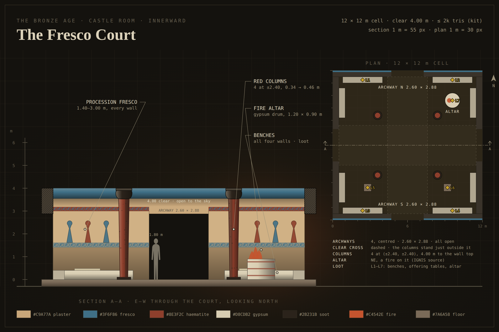

Here the household gathers when the wanax is not in the mood for it to gather in his megaron: a court open to the sky, four red columns standing round its crossing, and on every wall a painted procession of women carrying gifts toward a king who is never shown. Plastered benches run along the walls with fleeces thrown over them, offerings wait on painted tables, and a round altar in the corner keeps a fire going for whichever god is currently owed one. It is the ward's crossroads, lit by the altar and by the sky.

**Build** (kit metres: x east, y north, from the cell centre; heights above ground, floor top at 0.30)

- Shell: the kit's InnerWard shell, 12.0 × 12.0 × 0.30 m slab, 0.50 m painted plaster walls 4.00 m clear, 0.45 m fresco-blue capstone band, an archway 2.60 × 2.88 m centred on every wall.
- Procession fresco: a panel 4.10 m wide × 1.60 m tall, 1.40–3.00 m above the floor, on every wall section, with a 0.18 m haematite border on top.
- Columns: four down-tapering columns at (±2.40, ±2.40), 4.00 m to the wall top: black base disc r 0.30 × 0.10 m, haematite shaft r 0.17 → 0.23 m, black cushion capital 0.36 m, abacus 0.69 × 0.69 × 0.10 m.
- North and south benches: plastered clay, 3.20 × 0.50 × 0.40 m, backed against the walls at x ±3.60, y ±5.25, fleeces on them.
- East and west benches: 0.50 × 2.40 × 0.40 m against the walls at x ±5.25, y ±3.40.
- Fire altar (NE): a gypsum drum r 0.60 × 0.90 m at (3.60, 3.60), three haematite bands r 0.61 × 0.05 m; the fire (a flame cone r 0.16 × 0.45 m) at its west side, (3.35, 3.60).
- Offering tables: two painted tables 0.60 × 0.60 m, 0.70 m high, at (±3.20, −3.40).
- Floor: the court's paving grid is painted (albedo only).

**Sockets**

- Archway ×4, centred on each wall: 2.60 × 2.88 m (InnerWard), all open
- Fire altar: NE, an IGNIS source at 0.90 m

**Loot anchors**

- L1: north bench, west at (-3.60, 5.25, 0.70)
- L2: north bench, east at (3.60, 5.25, 0.70)
- L3: south bench, west at (-3.60, -5.25, 0.70)
- L4: south bench, east at (3.60, -5.25, 0.70)
- L5: offering table, west at (-3.20, -3.40, 1.00)
- L6: offering table, east at (3.20, -3.40, 1.00)
- L7: fire altar top at (3.60, 3.60, 1.20)

**Materials** (art-pass colour, then the kit's atlas pigment)

| Material | Hex | Kit pigment | Notes |
|---|---|---|---|
| Painted lime plaster | `#C9A77A` | `bronze` | Walls; soot over the altar corner. |
| Fresco blue | `#3F6F86` | `verdigris_lo` | Procession band and capstone. |
| Haematite red | `#8E3F2C` | `madder` | Column shafts, borders, altar bands, the fire. |
| Gypsum | `#D8CDB2` | `vellum` | Benches and the altar drum. |
| Hearth soot | `#2B231B` | `bone_black` | Column bases and capitals. |
| Painted floor | `#7A6A58` | `vellum_faint` | Offering tables; the floor is the zone's ash_hi. |

**In play**

- The ward's crossroads: every archway opens onto the court, so guards pass through it often.
- Seven loot anchors, spread round the walls: easy pickings, in the open.
- The columns are the only cover in the middle; the altar fire lights the whole court.

### BronzeShrine

**The Shrine** · InnerWard · stands in for ChapelRoom · ≤ 1.6k tris (kit); 0.88k built

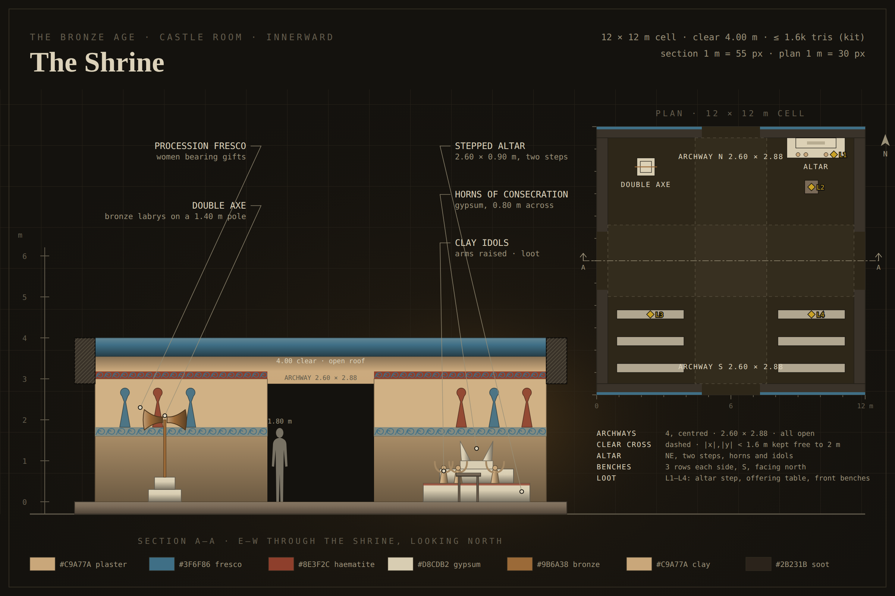

The palace keeps its gods close and its gods keep their offerings closer. A stepped bench altar stands in the corner under a pair of gypsum horns, clay idols lined up along its lower step with their arms raised in the gesture that means either blessing or surrender, and across the room a bronze double axe stands on its pole, the sign of the house, taller than a man. The worshippers sit on low benches at the back and face the altar. The idols are small, light and unlucky; the offering table is usually worth the risk.

**Build** (kit metres: x east, y north, from the cell centre; heights above ground, floor top at 0.30)

- Shell: the kit's InnerWard shell, 12.0 × 12.0 × 0.30 m slab, 0.50 m painted plaster walls 4.00 m clear, 0.45 m fresco-blue capstone band, an archway 2.60 × 2.88 m centred on every wall.
- Procession fresco: a panel 4.10 m wide × 1.40 m tall, 1.60–3.00 m above the floor, on each section of the north, east and west walls, haematite border on top.
- Stepped altar (NE): gypsum lower step 2.60 × 0.90 × 0.45 m at (3.80, 5.05) with a haematite band 0.08 m along its front top edge; upper step 1.80 × 0.45 × 0.35 m at (3.80, 5.27) against the north wall.
- Horns of consecration: gypsum, 0.80 m across, on the upper step at (3.80, 5.27).
- Clay idols: three, 0.45 m tall (a bell skirt r 0.10 → 0.03 m, a head r 0.06 m, arms raised), on the lower step at x 3.00, 3.35, 4.25, y 4.75.
- Offering table: a painted table 0.60 × 0.60 m, 0.70 m high, at (3.60, 3.30), before the altar.
- Double axe (NW): a stepped gypsum stand 0.80 × 0.80 × 0.30 m and 0.50 × 0.50 × 0.30 m at (−3.80, 4.20); a bronze pole r 0.03 × 1.40 m; the axe head at 2.30 m above ground, two curved blades each 0.45 m long × 0.50 m tall × 0.04 m.
- Worshippers' benches: plastered, 3.00 × 0.40 × 0.40 m, three rows each side at x ±3.60, y −2.40, −3.60, −4.80, facing north.

**Sockets**

- Archway ×4, centred on each wall: 2.60 × 2.88 m (InnerWard), all open
- Altar: NE, lower step at 0.75 m above ground

**Loot anchors**

- L1: altar, lower step (by the idols) at (4.60, 4.75, 0.75)
- L2: offering table at (3.60, 3.30, 1.00)
- L3: front bench, west at (-3.60, -2.40, 0.70)
- L4: front bench, east at (3.60, -2.40, 0.70)

**Materials** (art-pass colour, then the kit's atlas pigment)

| Material | Hex | Kit pigment | Notes |
|---|---|---|---|
| Painted lime plaster | `#C9A77A` | `bronze` | Walls; lamp soot over the altar. |
| Fresco blue | `#3F6F86` | `verdigris_lo` | The procession band, capstone. |
| Haematite red | `#8E3F2C` | `madder` | Band on the altar step, fresco border. |
| Gypsum | `#D8CDB2` | `vellum` | Altar, horns, the axe stand, benches. |
| Cast bronze | `#9B6A38` | `bronze` | The double axe and its pole. |
| Idol clay | `#C9A77A` | `vellum_dim` | The idols; painted eyes and necklaces in albedo. |

**In play**

- The idols are light, quick loot that the household notices missing.
- The double axe stand and the altar are the only cover north of the cross; the benches are low cover to the south.
- A quiet room: no fire, lit from the archways.

### BronzePalaceKitchen

**The Palace Kitchen** · InnerWard · stands in for KitchenRoom · ≤ 2k tris (kit)

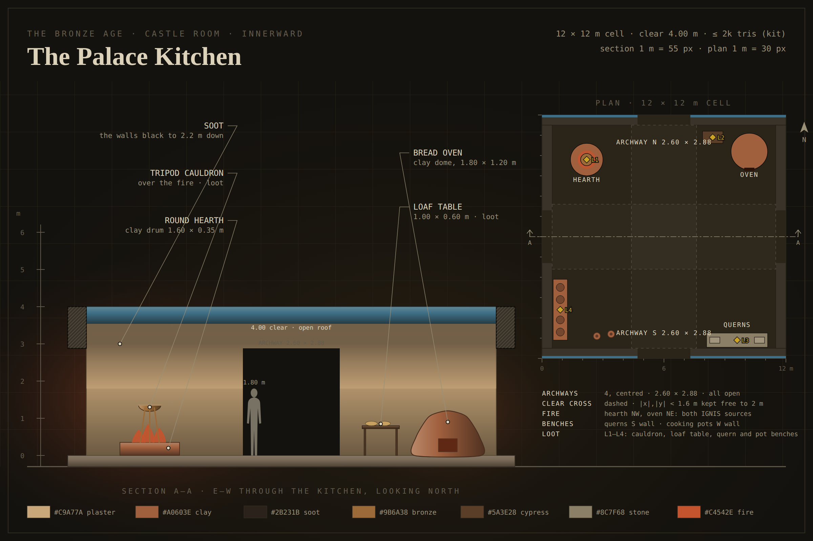

The palace eats well and this is why: a round clay hearth with a bronze tripod cauldron standing in the fire, a domed oven in the far corner baking bread for a household of two hundred, querns along the wall for the grinding, and pots and amphorae wherever there was room. The walls have not been ochre for a generation; the smoke has seen to that. Two fires burn here at all hours, so the kitchen is the brightest room in the ward and the most likely to catch.

**Build** (kit metres: x east, y north, from the cell centre; heights above ground, floor top at 0.30)

- Shell: the kit's InnerWard shell, 12.0 × 12.0 × 0.30 m slab, 0.50 m plaster walls 4.00 m clear, 0.45 m fresco-blue capstone band, an archway 2.60 × 2.88 m centred on every wall.
- Soot: a soot panel over the top 1.75 m of every wall section, below the capstone (the walls black from 2.2 m under the top).
- Hearth (NW): a clay drum r 0.80 × 0.35 m at (−3.80, 3.80), three flame cones on it.
- Tripod cauldron: a bronze tripod (legs 0.90 m, bowl r 0.30 m) standing on the hearth over the fire; its bowl at 1.79 m above ground.
- Bread oven (NE): a clay dome r 0.90 → 0.25 m × 1.20 m at (4.20, 4.20); its mouth 0.50 × 0.35 m on the south face, dark.
- Loaf table: cypress, 1.00 × 0.60 m, 0.80 m high, at (2.40, 4.90), two loaves on it.
- Quern bench (SE): stone, 3.00 × 0.70 × 0.50 m against the south wall at x 3.60; a saddle quern 0.50 × 0.30 × 0.10 m at each end (x 2.50 and 4.70).
- Pot bench (SW): clay, 0.70 × 3.00 × 0.50 m against the west wall at y −3.60; four soot-black cooking pots r 0.20 × 0.30 m on it at y −4.70, −4.10, −3.10, −2.50.
- Amphorae: two, 0.62 m tall, on the floor at (−2.60, −4.80) and (−3.30, −4.90).

**Sockets**

- Archway ×4, centred on each wall: 2.60 × 2.88 m (InnerWard), all open
- Hearth NW and oven NE: both IGNIS sources, always lit

**Loot anchors**

- L1: tripod cauldron over the hearth at (-3.80, 3.80, 1.79)
- L2: loaf table at (2.40, 4.90, 1.10)
- L3: quern bench, between the querns at (3.60, -5.10, 0.80)
- L4: pot bench, between the pots at (-5.10, -3.60, 0.80)

**Materials** (art-pass colour, then the kit's atlas pigment)

| Material | Hex | Kit pigment | Notes |
|---|---|---|---|
| Painted lime plaster | `#C9A77A` | `bronze` | Walls, under the soot. |
| Hearth soot | `#2B231B` | `bone_black` | The upper walls, the cooking pots, the oven mouth. |
| Terracotta | `#A0603E` | `leather` | Hearth, oven, pot bench, amphorae. |
| Cast bronze | `#9B6A38` | `bronze` | The tripod cauldron. |
| Cypress timber | `#5A3E28` | `oak` | Loaf table. |
| Grinding stone | `#8C7F68` | `vellum_faint` | Quern bench; the querns are vellum_dim. |

**In play**

- The brightest room in the ward: two fires, always lit, so nobody hides here.
- The tripod cauldron is loot, but it stands in the fire.
- Hearth and oven are IGNIS sources; the soot-dry walls burn slowly, the amphorae of oil quickly.

### BronzeTabletArchive

**The Tablet Archive** · InnerWard · stands in for GuardRoomInner · ≤ 2.4k tris (kit); 1.50k built

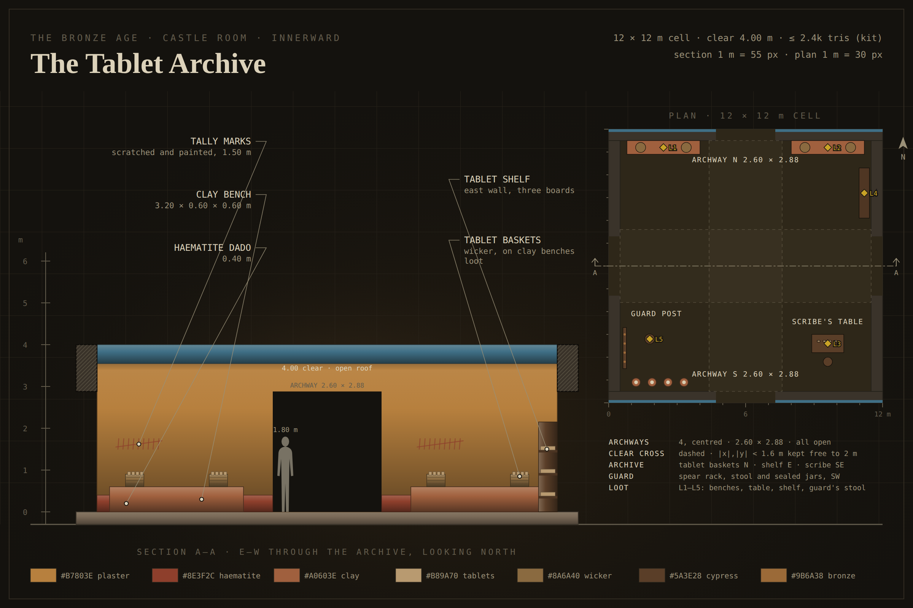

Every jar of oil, every sheep, every bronze spearhead the palace owns is written down somewhere, and the somewhere is here: baskets of unfired clay tablets on the benches, more on a shelf, and a scribe's table under the light with the day's accounts drying on it. The palace thinks this room important enough to post a guard, who sits by his spears in the corner and watches the door rather than the tablets, which no thief has ever wanted. The sealed jars by his stool are another matter.

**Build** (kit metres: x east, y north, from the cell centre; heights above ground, floor top at 0.30)

- Shell: the kit's InnerWard shell, 12.0 × 12.0 × 0.30 m slab, 0.50 m ochre plaster walls 4.00 m clear, 0.45 m fresco-blue capstone band, an archway 2.60 × 2.88 m centred on every wall.
- Dado: a haematite panel 0.40 m tall at the foot of every wall section.
- Tablet benches: clay, 3.20 × 0.60 × 0.60 m, against the north wall at x ±3.60, y 5.20; on each, two wicker baskets r 0.22 × 0.30 m at x ±1.00 from the bench's centre, four tablets standing in each.
- Tablet shelf: a cypress shelf unit 2.20 m long × 0.45 m deep against the east wall at (5.20, 3.20), three boards (0.35, 0.90, 1.45 m), a row of tablets 0.90 m long on each board.
- Scribe's table (SE): cypress, 1.40 × 0.80 m, 0.75 m high, at (3.60, −3.40), four tablets on it; his stool r 0.20 × 0.45 m at (3.60, −4.20).
- Spear rack (SW): two uprights 0.10 × 0.10 × 1.50 m and a rail 1.80 m at 1.70 m above ground against the west wall at y −3.60; four bronze-tipped spears r 0.025 × 2.40 m standing in it.
- Guard's stool: r 0.22 × 0.45 m at (−4.20, −3.20).
- Sealed jars: four, 0.60 m tall, belly 0.36 m, with clay seals, along the south wall at x −4.80, −4.10, −3.40, −2.70, y −5.10.
- Tally marks: scratched and painted on the north wall at 1.50–1.75 m (albedo only).

**Sockets**

- Archway ×4, centred on each wall: 2.60 × 2.88 m (InnerWard), all open
- Guard post: SW, a stool facing the south and west archways

**Loot anchors**

- L1: west tablet bench, between the baskets at (-3.60, 5.20, 0.90)
- L2: east tablet bench, between the baskets at (3.60, 5.20, 0.90)
- L3: scribe's table at (3.60, -3.40, 1.05)
- L4: tablet shelf, top board at (5.20, 3.20, 1.78)
- L5: guard's stool at (-4.20, -3.20, 0.75)

**Materials** (art-pass colour, then the kit's atlas pigment)

| Material | Hex | Kit pigment | Notes |
|---|---|---|---|
| Ochre plaster | `#B7803E` | `bronze` | Walls; tally marks in haematite. |
| Haematite red | `#8E3F2C` | `madder` | Dado. |
| Terracotta | `#A0603E` | `leather` | Benches and the sealed jars. |
| Unfired tablets | `#B89A70` | `vellum_dim` | The tablets; they crumble when dropped. |
| Cypress / wicker | `#5A3E28` | `oak` | Baskets, shelf, table, stools, spear rack. |
| Cast bronze | `#9B6A38` | `bronze` | The spears. |

**In play**

- A guard is posted here: the stool faces the south and west archways.
- The tablets are worthless loot (and crumble if dropped); the sealed jars and the stool's anchor are the prizes.
- The spear rack is where the guard arms himself when the alarm goes up.

## Keep

| Key | Room | Stands in for | |
|---|---|---|---|
| `BronzeMegaron` | [The Megaron](#bronzemegaron) | ThroneRoomKeep | The king's hall: a painted hearth ring, four red columns tapering the wrong way, and a gypsum throne in the corner. |
| `BronzeTreasury` | [The Treasury](#bronzetreasury) | TreasuryVault | Bronze by the ingot, gold by the face: the wanax's wealth, stacked and shelved in a plain red-footed room. |
| `BronzeQueensHall` | [The Queen's Hall](#bronzequeenshall) | RoyalBedchamber | The queen's own hall: a linen bed, a loom with the week's weaving on it, dolphins on the walls and a small fire. |
| `BronzeBathRoom` | [The Bath](#bronzebathroom) | LordsSolar | A painted clay tub on its plinth, a stone basin, painted lilies and a great deal of scented oil, all of it for one person. |
| `BronzeMegaronStair` | [The Megaron Stair](#bronzemegaronstair) | KeepStairwell | A gypsum stair to a railed gallery, horns of consecration on the rail and a chest waiting at the top. |

### BronzeMegaron

**The Megaron** · Keep · stands in for ThroneRoomKeep · ≤ 2.4k tris (kit); 1.57k built

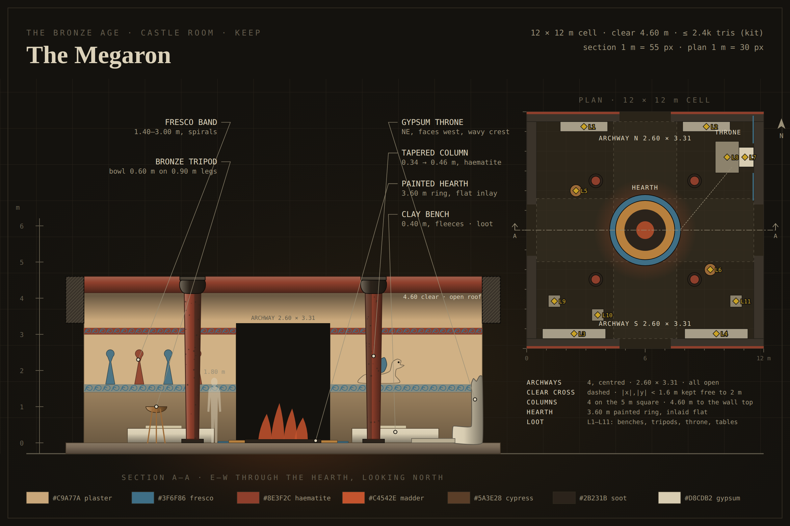

Here a god-king sits to be warm and important, and here you will find him out. A great painted ring marks the hearth at the crossing of the hall, four haematite columns stand guard round it, widening as they rise in the manner of the island palaces, and the throne sits plastered against the east wall with griffins painted either side to explain who owns the room. Fleeces lie on clay benches along the walls, tripods of bronze stand by the fire, and every one of them is worth carrying. In the kit the hearth is inlaid flat so the whole castle can walk across the hall.

Source: the art bible's Megaron (docs/art/concept/bronze/megaron-hall.svg, docs/art/bronze.md).

**Where the kit differs from the art bible**

- The hearth's 0.20 m raised rim would sit across the clear cross: the hearth is a flat inlaid ring (0.04 / 0.07 / 0.10 m) instead.
- The throne cannot fill the east archway (every kit room opens on four sides): it stands against the east wall in the NE quadrant, facing west.
- No roof, smoke lantern or porch columns: kit rooms are open-roofed shells, and the porch would cut the south archway.
- The frescoes are flat colour panels in the kit (the atlas has no fresco blue; verdigris_lo stands in).

**Build** (kit metres: x east, y north, from the cell centre; heights above ground, floor top at 0.30)

- Shell: the kit's Keep shell. 12.0 × 12.0 × 0.30 m floor slab, 0.50 m walls rising 4.60 m clear from the slab top (to 4.90 m), ochre plaster, a 0.45 m haematite capstone band at the top; an archway 2.60 × 3.31 m centred on every wall.
- Hearth: three flat discs centred at (0, 0) on the floor: fresco-blue ring r 1.80 m × 0.04 m, flame-painted ring r 1.50 m × 0.07 m, soot ash bed r 1.05 m × 0.10 m (16 segments). All under 0.12 m, so walkable.
- Columns: four at (±2.50, ±2.50), 4.60 m to the wall top. Black base disc r 0.30 × 0.10 m; haematite shaft 3.78 m tapering from r 0.17 at the foot to r 0.23 at the top; black cushion capital 0.36 m (r 0.25 → 0.35); square abacus 0.69 × 0.69 × 0.10 m.
- Throne: gypsum seat 0.70 (E–W) × 1.00 (N–S) × 0.46 m, centred (5.05, 3.70); back slab 0.25 × 1.00 × 1.80 m against the east wall at x 5.40; wavy crest of three cylinders r 0.14 m lying E–W on the back's top edge, the middle one 0.06 m higher.
- Footstool step: 1.20 × 1.60 × 0.12 m at (4.15, 3.70), in front of the throne.
- Griffin panels: two fresco panels 1.40 wide × 1.10 m tall on the east wall, bottom 0.90 m above the floor, centred y 2.20 and 5.10, either side of the throne.
- Clay benches: plastered, 0.40 m high × 0.50 m deep, backed against the walls. North: 2.40 m long at x ±3.10, y 5.25. South: 3.20 m long at x ±3.60, y −5.25.
- Tripods: two bronze tripods, three legs r 0.03 × 0.90 m splayed on a 0.21 m radius, bowl r 0.30 → 0.21 × 0.28 m on top; at (−3.50, 2.00) and (3.30, −2.00).
- Offering tables: three 0.60 × 0.60 m tables 0.70 m high on four legs, faded plaster colour, at (−4.60, −3.60), (−2.40, −4.30) and (4.60, −3.60).
- Fresco band: on the north, south and west walls, one panel per wall section (4.10 m wide, centred ±3.40 along the wall), 1.40–3.00 m above the floor, with a 0.18 m haematite border on top.

**Sockets**

- Archway ×4, centred on each wall: 2.60 × 3.31 m (Keep), all open
- Throne: NE quadrant, seat top 0.76 m above ground, faces west into the hall
- Hearth: a flat ring at the crossing (an IGNIS source in play; no geometry above 0.10 m)

**Loot anchors**

- L1: north bench, west (fleece) at (-3.10, 5.25, 0.70)
- L2: north bench, east (fleece) at (3.10, 5.25, 0.70)
- L3: south bench, west at (-3.60, -5.25, 0.70)
- L4: south bench, east at (3.60, -5.25, 0.70)
- L5: west tripod bowl at (-3.50, 2.00, 1.44)
- L6: east tripod bowl at (3.30, -2.00, 1.44)
- L7: throne seat at (5.05, 3.70, 0.76)
- L8: footstool step before the throne at (4.15, 3.70, 0.42)
- L9: offering table, SW corner at (-4.60, -3.60, 1.00)
- L10: offering table, by the south bench at (-2.40, -4.30, 1.00)
- L11: offering table, SE corner at (4.60, -3.60, 1.00)

**Materials** (art-pass colour, then the kit's atlas pigment)

| Material | Hex | Kit pigment | Notes |
|---|---|---|---|
| Painted lime plaster | `#C9A77A` | `bronze` | Walls; chalky, roughness 0.95; soot gradient from the wall top down 1.2 m. |
| Haematite red | `#8E3F2C` | `madder` | Column shafts and the capstone band; soot heaviest on the hearth side. |
| Fresco blue | `#3F6F86` | `verdigris_lo` | Fresco bands, griffin panels, the hearth's outer ring. |
| Hearth soot | `#2B231B` | `bone_black` | Column bases and capitals, the hearth's ash bed. |
| Gypsum | `#D8CDB2` | `vellum` | Throne and the clay benches' plaster skin; worn pale where sat on. |
| Cast bronze | `#9B6A38` | `bronze` | Tripods; darker in the bowl, bright on the rim where handled. |
| Painted floor | `#7A6A58` | `vellum_faint` | Floor slab and offering tables; the art bible's octopus grid is albedo only. |

**In play**

- The hearth ring is always lit in play: IGNIS in this room spreads quickly (the Bronze Age is dry).
- Eleven loot anchors, the most in the Keep: fleeces on the benches, the tripod bowls, the throne and its step, three offering tables.
- The four columns and the throne are the only cover; the clear cross between the archways is wide open under the hearth's light.
- All four archways are open, so the hall is a crossroads of the Keep: guards pass through it.

### BronzeTreasury

**The Treasury** · Keep · stands in for TreasuryVault · ≤ 2k tris (kit); 1.20k built

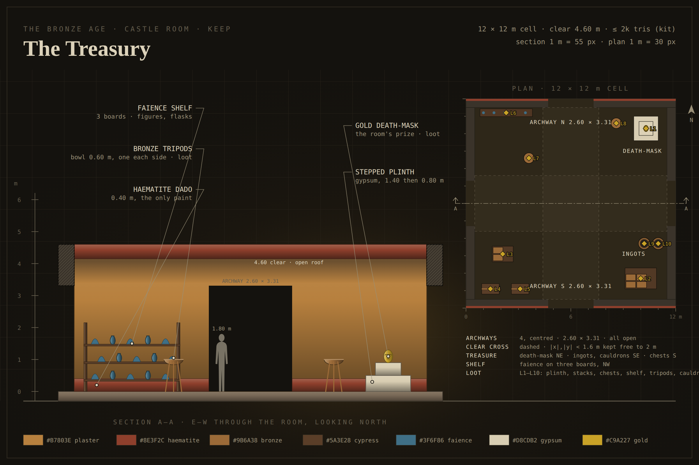

Here is where a king keeps the things that make him one. Oxhide ingots lie in crosswise stacks on their pallets like loaves in a bakery nobody is allowed to eat from, faience figures crowd a shelf in the corner, and on a stepped plinth of gypsum the gold death-mask of some earlier king looks out at the door with an expression of permanent disappointment. The room is plain on purpose: no frescoes, only a red dado, because nobody comes here to look at the walls. Everything in it is loot, and most of it is heavy.

**Build** (kit metres: x east, y north, from the cell centre; heights above ground, floor top at 0.30)

- Shell: the kit's Keep shell, 12.0 × 12.0 × 0.30 m slab, 0.50 m ochre plaster walls 4.60 m clear, 0.45 m haematite capstone band, an archway 2.60 × 3.31 m centred on every wall.
- Dado: a haematite panel 0.40 m tall at the foot of every wall section (4.10 m wide, centred ±3.40 along each wall), flat against the wall.
- Death-mask plinth (NE): gypsum block 1.40 × 1.40 × 0.50 m centred (4.30, 4.30), a second block 0.80 × 0.80 × 0.40 m on top (top at 1.20 m above ground).
- Gold death-mask: an oval 0.28 wide × 0.13 deep × 0.39 m tall, standing on the upper plinth at (4.30, 4.30).
- Ingot stack SE: a timber pallet 1.80 × 1.20 × 0.12 m at (4.00, −4.30), four crosswise layers of oxhide ingots 0.56 × 0.36 × 0.06 m (alternate layers 0.52 × 0.40), 2 × 2 per layer; top at 0.66 m.
- Ingot stack SW: a pallet 1.20 × 0.90 × 0.12 m at (−3.90, −2.90), three layers, 1 × 2 per layer; top at 0.60 m.
- Chests: two cypress chests 1.00 × 0.60 × 0.55 m with bronze-bound lids 0.05 m, against the south wall at x −4.60 and −2.90, y −4.90.
- Faience shelf (NW): a timber shelf unit 3.00 m wide × 0.45 m deep, three boards at 0.35, 0.90 and 1.45 m above the floor, backed against the north wall at x −3.70, y 5.20; small faience flasks (0.26 m tall, 0.16 m belly) on every board.
- Tripods: two bronze tripods, legs 0.90 m, bowl r 0.30 m, at (−2.40, 2.60) and (2.60, 4.60), the second standing guard by the plinth.
- Cauldrons (SE): two bronze cauldrons r 0.34 → 0.26 m × 0.45 m on the floor at (4.20, −2.30) and (5.00, −2.30), soot inside.
- Everything stands in the corner quadrants; the clear cross between the archways is bare floor.

**Sockets**

- Archway ×4, centred on each wall: 2.60 × 3.31 m (Keep), all open
- Death-mask plinth: NE, the room's prize at 1.20 m

**Loot anchors**

- L1: death-mask plinth, upper step at (4.30, 4.30, 1.20)
- L2: SE ingot stack at (4.00, -4.30, 0.66)
- L3: SW ingot stack at (-3.90, -2.90, 0.60)
- L4: west chest, south wall at (-4.60, -4.90, 0.90)
- L5: east chest, south wall at (-2.90, -4.90, 0.90)
- L6: faience shelf, top board at (-3.70, 5.20, 1.78)
- L7: west tripod bowl at (-2.40, 2.60, 1.44)
- L8: east tripod bowl, by the plinth at (2.60, 4.60, 1.44)
- L9: cauldron, SE (west) at (4.20, -2.30, 0.75)
- L10: cauldron, SE (east) at (5.00, -2.30, 0.75)

**Materials** (art-pass colour, then the kit's atlas pigment)

| Material | Hex | Kit pigment | Notes |
|---|---|---|---|
| Ochre plaster | `#B7803E` | `bronze` | Walls; chalky, soot only faintly at the top (no hearth here). |
| Haematite red | `#8E3F2C` | `madder` | Dado and capstone band; scuffed pale at knee height by the stacks. |
| Cast bronze | `#9B6A38` | `bronze` | Ingots, tripods, cauldrons, chest bindings; ingot edges bright, faces dull and pitted. |
| Cypress timber | `#5A3E28` | `oak` | Pallets, chests, the shelf. |
| Faience | `#3F6F86` | `verdigris_lo` | Flasks and figures on the shelf; glossy, crazed. |
| Gypsum | `#D8CDB2` | `vellum` | The stepped plinth; worn at the front edge. |
| Gold | `#C9A227` | `orpiment` | The death-mask only: it is the loot. |

**In play**

- Ten loot anchors, most of them heavy: an ingot stack is several trips or a two-player carry.
- The death-mask is the room's prize and sits in plain sight of the north and east archways.
- No hearth and no frescoes: the room is dim, lit only from the doorways, so it is a good place to hide and a bad place to be found.
- The ingot stacks are low cover (0.60–0.66 m); the plinth and shelf are the only tall cover.

### BronzeQueensHall

**The Queen's Hall** · Keep · stands in for RoyalBedchamber · ≤ 1.8k tris (kit); 0.94k built

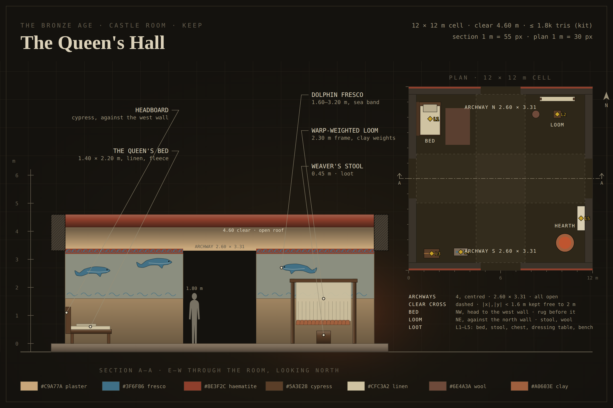

The wanax has his megaron; the queen has this, and prefers it. Dolphins leap along the walls above a painted sea, a warp-weighted loom stands against the north wall with a half-woven cloth and a row of clay weights keeping the threads in order, and the bed in the corner is made up in linen with a fleece thrown over the foot. A small round hearth in the far corner keeps the room warm and lights it badly. The loom's weaving and the dressing table's oil flasks are small, light and quick to take; the chest is the heavy prize.

**Build** (kit metres: x east, y north, from the cell centre; heights above ground, floor top at 0.30)

- Shell: the kit's Keep shell, 12.0 × 12.0 × 0.30 m slab, 0.50 m painted plaster walls 4.60 m clear, 0.45 m haematite capstone band, an archway 2.60 × 3.31 m centred on every wall.
- Dolphin fresco: a sea-band panel 4.10 m wide × 1.60 m tall, 1.60–3.20 m above the floor, on each section of the north, east and west walls, with a 0.18 m haematite spiral border on top.
- Bed (NW): cypress frame 1.50 × 2.30 × 0.15 m on four legs 0.50 m tall, centred (−4.60, 3.90), long axis north–south; linen mattress 1.40 × 2.10 × 0.12 m (top at 0.92 m); a fleece 0.90 × 0.50 m over the foot; headboard 0.20 × 2.20 × 0.95 m against the west wall.
- Rug: a flat wool rug 1.60 × 2.40 × 0.03 m at (−2.80, 3.40), in front of the bed.
- Loom (NE): two cypress uprights 0.12 × 0.12 × 2.30 m at x 2.60 and 4.80, 0.30 m off the north wall; top beam 2.40 m at 2.24 m; the web 1.96 × 1.38 m from the beam down to 0.80 m above the floor, a haematite woven band near the top; seven clay loom weights (cones r 0.06 × 0.12 m) hanging on the warp's foot.
- Weaver's stool: a cypress block 0.50 × 0.50 × 0.45 m at (3.70, 4.20), before the loom; a wool basket r 0.25 × 0.35 m at (2.30, 4.20).
- Hearth (SE): a round clay hearth r 0.60 × 0.20 m at (4.20, −4.20), the fire bed r 0.40 m on top.
- Bench: a plastered clay bench 0.50 × 1.60 × 0.40 m against the east wall at (5.25, −2.60).
- Chest (SW): a cypress chest 1.00 × 0.60 × 0.55 m with a bronze-bound lid at (−4.50, −4.90).
- Dressing table (SW): a painted table 0.90 × 0.50 m, 0.75 m high, at (−2.60, −4.80), three faience oil flasks on it.

**Sockets**

- Archway ×4, centred on each wall: 2.60 × 3.31 m (Keep), all open
- Hearth: SE, a fire bed at floor level (an IGNIS source)

**Loot anchors**

- L1: the bed at (-4.60, 3.90, 0.92)
- L2: weaver's stool at (3.70, 4.20, 0.75)
- L3: chest, SW at (-4.50, -4.90, 0.90)
- L4: dressing table at (-2.60, -4.80, 1.05)
- L5: bench, east wall at (5.25, -2.60, 0.70)

**Materials** (art-pass colour, then the kit's atlas pigment)

| Material | Hex | Kit pigment | Notes |
|---|---|---|---|
| Painted lime plaster | `#C9A77A` | `bronze` | Walls; soot faint, gathered over the hearth corner. |
| Fresco blue | `#3F6F86` | `verdigris_lo` | The sea band and dolphins; flasks. |
| Haematite red | `#8E3F2C` | `madder` | Spiral border, capstone, the woven band, the fire bed. |
| Cypress timber | `#5A3E28` | `oak` | Bed, loom, stool, chest. |
| Linen | `#CFC3A2` | `vellum` | Mattress and the web on the loom. |
| Undyed wool | `#6E4A3A` | `leather` | Rug, basket; the fleece is vellum_dim. |
| Terracotta | `#A0603E` | `leather` | Loom weights and the hearth. |

**In play**

- The loom's web and the flasks are light, quick loot; the chest is the heavy prize.
- The hearth is the room's only light and an IGNIS source; the linen bed and the loom's web burn fast.
- Cover: the bed and the loom frame; the rest of the hall is open floor under the dolphins.

### BronzeBathRoom

**The Bath** · Keep · stands in for LordsSolar · ≤ 2k tris (kit); 1.26k built

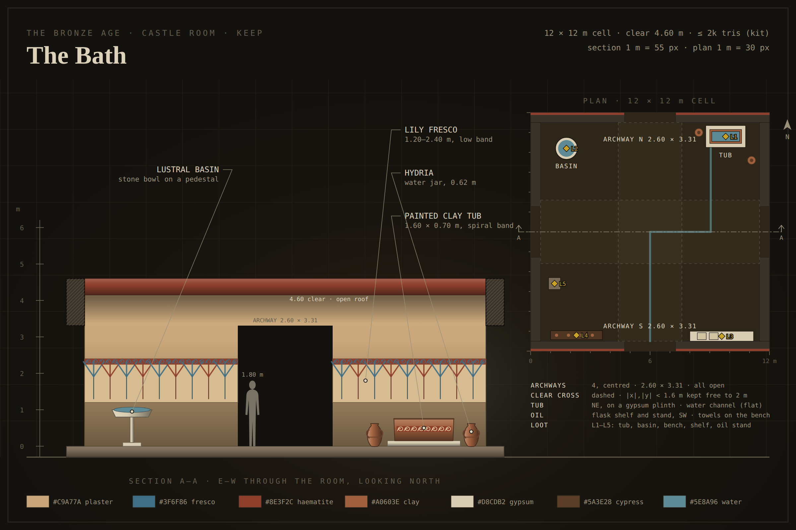

Kings bathe, and this king bathes in a painted clay tub on a gypsum plinth, with water jars stood ready at either end and a channel cut in the floor to carry the water away out of the south door. A stone basin on its pedestal waits in the other corner for the washing of hands before an offering, and the walls are painted with lilies at a sitting height, since nobody stands up in a bath. The shelf of scented oil is worth more than it looks, and every flask on it will break if dropped.

Source: the art bible's the bathroom at Pylos (plan); art bible palette (docs/art/bronze.md).

**Build** (kit metres: x east, y north, from the cell centre; heights above ground, floor top at 0.30)

- Shell: the kit's Keep shell, 12.0 × 12.0 × 0.30 m slab, 0.50 m painted plaster walls 4.60 m clear, 0.45 m haematite capstone band, an archway 2.60 × 3.31 m centred on every wall.
- Lily fresco: a panel 4.10 m wide × 1.20 m tall, 1.20–2.40 m above the floor, on each section of the north, east and west walls, with a 0.16 m haematite spiral border on top.
- Lustral basin (NW): a gypsum foot r 0.25 × 0.10 m, a tapered pedestal 0.72 m, and a bowl r 0.45 → 0.55 × 0.20 m on top (rim at 1.30 m above ground), water in it, at (−4.20, 4.20).
- Tub plinth (NE): gypsum 2.00 × 1.10 × 0.15 m at (3.80, 4.80).
- Tub: painted clay 1.60 × 0.70 × 0.60 m on the plinth, a 0.14 m haematite spiral band round it, water 0.03 m below the rim (at 1.05 m above ground).
- Hydriae: two water jars 0.62 m tall, belly 0.40 m, at (2.45, 5.00) and (5.10, 3.60).
- Water channel: a flat 0.10 m strip in the floor, south from the tub's plinth at x 3.05 to the crossing, west along y 0 to the centre, then south to the south archway.
- Bench (SE): a plastered clay bench 3.20 × 0.50 × 0.40 m against the south wall at x 3.60; two folded towels 0.45 × 0.35 × 0.10 m on it.
- Oil shelf (SW): a timber shelf unit 2.60 m wide against the south wall at x −3.70, three boards (0.35, 0.90, 1.45 m); four oil flasks 0.22 m tall on each board.
- Oil stand: a painted offering table 0.60 × 0.60 m, 0.70 m high, at (−4.80, −2.60).

**Sockets**

- Archway ×4, centred on each wall: 2.60 × 3.31 m (Keep), all open
- Water channel: exits through the south archway at floor level

**Loot anchors**

- L1: in the tub at (3.80, 4.80, 1.05)
- L2: lustral basin at (-4.20, 4.20, 1.30)
- L3: bench, with the towels at (3.60, -5.25, 0.70)
- L4: oil shelf, top board at (-3.70, -5.20, 1.78)
- L5: oil stand at (-4.80, -2.60, 1.00)

**Materials** (art-pass colour, then the kit's atlas pigment)

| Material | Hex | Kit pigment | Notes |
|---|---|---|---|
| Painted lime plaster | `#C9A77A` | `bronze` | Walls; damp-darkened near the tub. |
| Lily ground | `#D8C49A` | `vellum_dim` | The fresco band's pale ground. |
| Haematite red | `#8E3F2C` | `madder` | Spiral borders, the tub's band, capstone. |
| Terracotta | `#A0603E` | `leather` | Tub, hydriae, oil flasks. |
| Gypsum | `#D8CDB2` | `vellum` | Plinth, basin, bench. |
| Water | `#5E8A96` | `verdigris_lo` | In the tub, the basin and the floor channel. |

**In play**

- The oil flasks are fragile, flammable loot: dropped they break, and spilled oil takes IGNIS.
- The tub is waist-high cover in the NE; the rest of the room is open.
- The floor channel leads to the south archway, so this room usually sits beside a service room.

### BronzeMegaronStair

**The Megaron Stair** · Keep · stands in for KeepStairwell · ≤ 1.6k tris (kit); 0.89k built

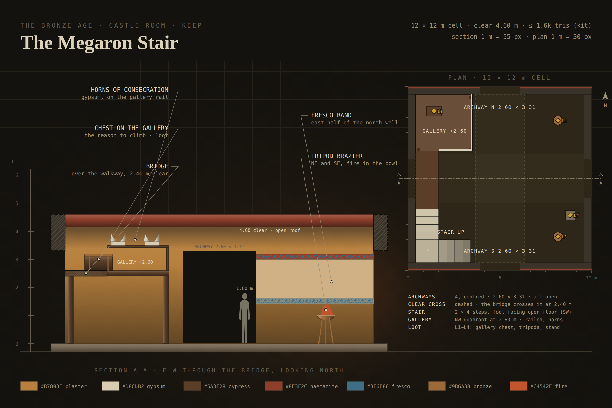

The palace has an upstairs, and this is the way to it: two short flights of gypsum steps turning at a landing in the corner, a timber bridge over the passage below, and a railed gallery where the household keeps what it does not want the kitchen to see. Horns of consecration stand on the gallery rail to remind you whose house this is, tripods burn in the far corners, and a bronze-bound chest sits on the gallery, which is the whole reason anybody climbs. Coming down with it is slower than going up.

**Build** (kit metres: x east, y north, from the cell centre; heights above ground, floor top at 0.30)

- Shell: the kit's Keep shell, 12.0 × 12.0 × 0.30 m slab, 0.50 m ochre plaster walls 4.60 m clear, 0.45 m haematite capstone band, an archway 2.60 × 3.31 m centred on every wall.
- Stair (castle_builders._stair_to_gallery, top 2.60 m): first flight of 4 gypsum steps 1.50 m wide, west along the south wall from x −1.90 to −4.00 (centre line y −4.75); a 1.50 m corner landing at half height; second flight of 4 steps north along the west wall from y −4.00 to −2.00. The foot faces open floor.
- Bridge: cypress, 1.50 m wide × 4.00 m long × 0.20 m, at x −4.75 over the east–west walkway, underside 2.40 m above the floor.
- Gallery: cypress deck 3.70 × 3.70 × 0.20 m filling the NW quadrant at 2.60 m, on three posts 0.20 × 0.20 m at (−1.90, 1.90), (−1.90, 5.30), (−5.30, 1.90).
- Rail: cypress, 0.90 m high, along the gallery's east edge (x −1.85) and south edge (y 1.85, from x −4.00 to −1.80), leaving the bridge end open.
- Horns of consecration: two gypsum horns 0.50 m across on the south rail's top at x −3.60 and −2.40.
- Chest: cypress 1.00 × 0.60 × 0.55 m with a bronze-bound lid, on the gallery at (−4.30, 4.40).
- Fresco: a band 1.40–3.00 m above the floor on the east half of the north wall and both sections of the east wall, haematite border on top.
- Tripod braziers: bronze tripods (legs 0.90 m, bowl r 0.30 m) at (3.80, 3.80) and (3.80, −3.80), a fire cone in each bowl.
- Stand: a painted offering table 0.60 × 0.60 m, 0.70 m high, at (4.60, −2.40).

**Sockets**

- Archway ×4, centred on each wall: 2.60 × 3.31 m (Keep), all open
- Stair up: foot at (−1.90, −4.75), facing east onto open floor; gallery at +2.60 m
- Bridge over the east–west walkway: 2.40 m clear underneath

**Loot anchors**

- L1: chest on the gallery at (-4.30, 4.40, 3.50)
- L2: NE tripod bowl at (3.80, 3.80, 1.44)
- L3: SE tripod bowl at (3.80, -3.80, 1.44)
- L4: stand, SE at (4.60, -2.40, 1.00)

**Materials** (art-pass colour, then the kit's atlas pigment)

| Material | Hex | Kit pigment | Notes |
|---|---|---|---|
| Ochre plaster | `#B7803E` | `bronze` | Walls; soot above the tripods. |
| Gypsum | `#D8CDB2` | `vellum` | Steps (worn to a dip in the middle of each tread), the horns. |
| Cypress timber | `#5A3E28` | `oak` | Bridge, gallery, posts, rail, chest. |
| Fresco blue | `#3F6F86` | `verdigris_lo` | The fresco band. |
| Haematite red | `#8E3F2C` | `madder` | Capstone, fresco border, the fire in the bowls. |
| Cast bronze | `#9B6A38` | `bronze` | Tripods and the chest's binding. |

**In play**

- The chest on the gallery is the prize, and carrying it down the stair is slow.
- The gallery sees the whole room and both east–west archways: a lookout for a guard or for you.
- Anyone under the bridge can't be seen from the gallery.
- The tripods are the room's light and its fire hazard.

## Crypt

| Key | Room | Stands in for | |
|---|---|---|---|
| `BronzeDromos` | [The Dromos](#bronzedromos) | CryptAntechamber | The walled passage down to the tombs: corbelled ashlar, carved grave stelae, and the offerings of people who wanted the dead to stay put. |
| `BronzeGraveCircle` | [The Grave Circle](#bronzegravecircle) | TombCorridor | A ring of upright slabs round four shaft graves, the old kings' burial ground, walled in by the new kings' citadel. |
| `BronzeLarnaxVault` | [The Larnax Vault](#bronzelarnaxvault) | BurialVault | Eight painted clay coffins on little legs, their gabled lids heaped with grave goods, and a storage jar in every corner. |
| `BronzeTholos` | [The Tholos](#bronzetholos) | CryptChamberFinal | The beehive tomb's chamber: four rings of corbelled ashlar stepping inward overhead, a king on his bier under a gold mask, gold cups set out for him. |
| `BronzeShaftStair` | [The Shaft Stair](#bronzeshaftstair) | CryptStairwell | Four steps up to a dais where a painted larnax lies in state, and in the far corner the open mouth of a shaft grave with the diggers' sheerlegs still over it. |

### BronzeDromos

**The Dromos** · Crypt · stands in for CryptAntechamber · ≤ 2k tris (kit)

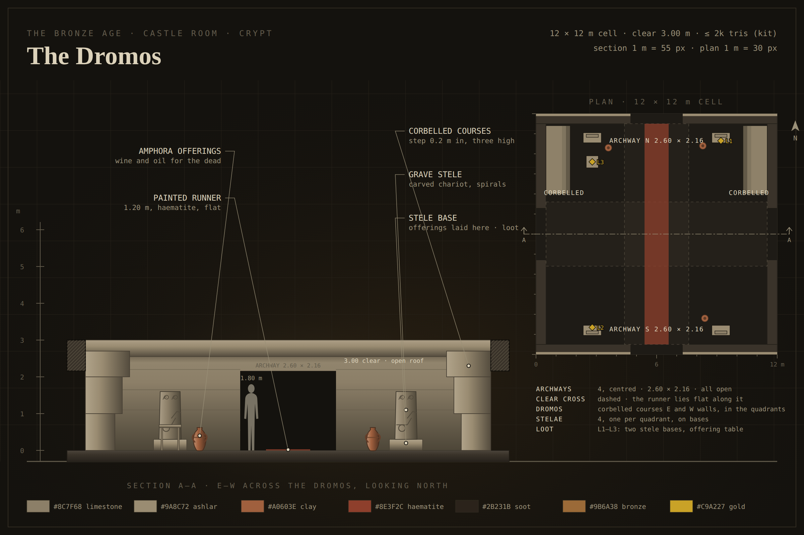

Every tholos has its dromos, a stone passage cut down into the hill with walls of dressed blocks that lean inward course by course as if to keep the living out. Here the dead are announced before they are met: a grave stele stands in each corner carved with a chariot and a running spiral, amphorae of wine and oil stand at their feet, and a red runner is painted down the floor toward whatever lies beyond. The offerings on the stele bases are the first loot in the crypt, and the last anyone was meant to touch.

**Build** (kit metres: x east, y north, from the cell centre; heights above ground, floor top at 0.30)

- Shell: the kit's Crypt shell, 12.0 × 12.0 × 0.30 m slab, 0.50 m limestone walls 3.00 m clear, 0.45 m ashlar capstone band, an archway 2.60 × 2.16 m centred on every wall.
- Corbelled courses, where: along the east and west walls in each of the four quadrants, y ±2.00 to ±5.45 (3.45 m long), so the archway axes stay open.
- First course: ashlar 0.00–1.00 m above the floor, standing 0.80 m out from the wall.
- Second course: 1.00–2.00 m, standing 1.00 m out: 0.20 m further in than the course below.
- Third course: 2.00–2.70 m, standing 1.20 m out; above 2 m the passage between the east and west courses narrows to 3.10 m.
- Stele bases: four ashlar blocks 0.90 × 0.50 × 0.30 m, one per quadrant at (±3.20, ±4.80); offerings are laid on their front halves.
- Stele slabs: limestone, tapering 0.60 → 0.54 m wide, 1.30 m tall, 0.15 m thick, standing at the back of each base (toward the north or south wall), carved with a chariot and a running spiral (albedo).
- Amphora offerings: three amphorae 0.62 m tall at (2.30, 4.40), (−2.40, 4.30) and (2.40, −4.20).
- Offering table: ashlar, 0.60 × 0.60 m, 0.70 m high, at (−3.20, 3.60).
- Runner: a haematite band 1.20 m wide painted down the north–south axis, flat (0.03 m).

**Sockets**

- Archway ×4, centred on each wall: 2.60 × 2.16 m (Crypt), all open
- The passage: east–west it narrows to 3.10 m between the upper courses, above 2.00 m

**Loot anchors**

- L1: NE stele base at (3.20, 4.65, 0.60)
- L2: SW stele base at (-3.20, -4.65, 0.60)
- L3: offering table at (-3.20, 3.60, 1.00)

**Materials** (art-pass colour, then the kit's atlas pigment)

| Material | Hex | Kit pigment | Notes |
|---|---|---|---|
| Limestone | `#8C7F68` | `vellum_dim` | Walls and the stele slabs; lichen-free, lamp-sooted at the top. |
| Dressed ashlar | `#9A8C72` | `vellum_faint` | The corbelled courses, bases, capstone band. |
| Terracotta | `#A0603E` | `leather` | Amphorae. |
| Haematite red | `#8E3F2C` | `madder` | The runner. |
| Floor | `#2B231B` | `bone_black` | The Crypt floor. |

**In play**

- The first crypt room: dark, low (3.00 m), and the corbelled courses make it feel narrower still.
- Three loot anchors, all offerings: taking them is the kind of thing that wakes the dead in stories.
- The stelae and courses give cover along the walls; the runner leads the eye (and the guards) down the middle.

### BronzeGraveCircle

**The Grave Circle** · Crypt · stands in for TombCorridor · ≤ 2k tris (kit)

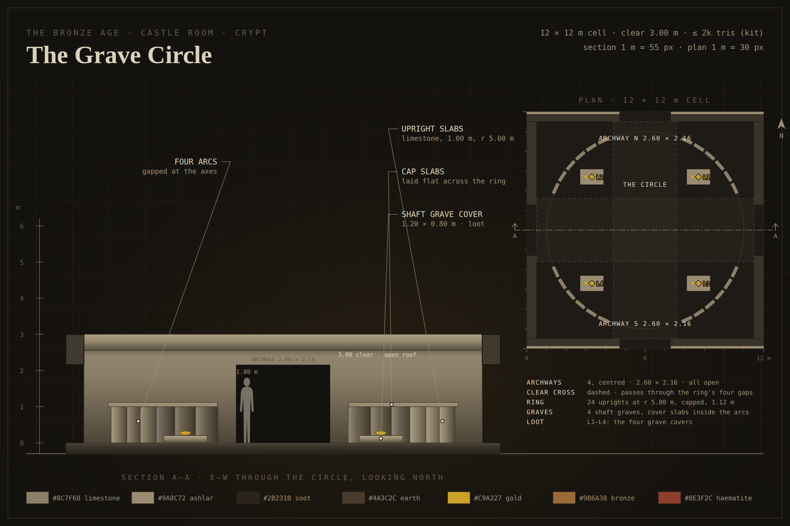

Before there was a citadel there were these graves, and when the citadel was built its lords were careful to wall them in rather than build over them: four shafts cut into the rock, each capped with a stone slab, and round them a ring of upright stones topped with flat ones, a fence to keep the dead in. The ring has four gaps where the passages run through, and in each gap a draught that smells of old earth. The families still leave gold cups on the covers. They are still there.

Source: the art bible's Grave Circle A at Mycenae (plan and ring).

**Build** (kit metres: x east, y north, from the cell centre; heights above ground, floor top at 0.30)

- Shell: the kit's Crypt shell, 12.0 × 12.0 × 0.30 m slab, 0.50 m limestone walls 3.00 m clear, 0.45 m ashlar capstone band, an archway 2.60 × 2.16 m centred on every wall.
- Ring: 24 upright limestone slabs 0.60 m wide (tangential) × 0.20 m thick × 1.00 m tall, on a circle of radius 5.00 m about the cell centre.
- Arcs: six uprights per quadrant at 25°, 33°, 41°, 49°, 57° and 65° from the east–west axis, so each arc stops short of the axes and the clear cross runs through the four gaps.
- Cap slabs: flat ashlar slabs 0.30 m wide × 0.12 m, each bridging a neighbouring pair of uprights, top at 1.42 m above ground.
- Shaft grave covers: four ashlar slabs 1.20 × 0.80 × 0.20 m at (±2.70, ±2.70), inside the arcs.
- Gold cups: one on each cover, r 0.08 → 0.05 × 0.10 m, 0.30 m west of the cover's centre.
- Floor: the Crypt's dark floor; earth darker inside the ring (albedo only).
- Nothing stands in the cross: between the arcs and the archways is open floor.

**Sockets**

- Archway ×4, centred on each wall: 2.60 × 2.16 m (Crypt), all open
- Ring gaps: four, on the axes, each at least 3.2 m wide

**Loot anchors**

- L1: NE grave cover at (2.70, 2.70, 0.50)
- L2: NW grave cover at (-2.70, 2.70, 0.50)
- L3: SE grave cover at (2.70, -2.70, 0.50)
- L4: SW grave cover at (-2.70, -2.70, 0.50)

**Materials** (art-pass colour, then the kit's atlas pigment)

| Material | Hex | Kit pigment | Notes |
|---|---|---|---|
| Limestone | `#8C7F68` | `vellum_dim` | Walls and the uprights; weathered, rounded at the top. |
| Dressed ashlar | `#9A8C72` | `vellum_faint` | Cap slabs, grave covers, capstone band. |
| Gold | `#C9A227` | `orpiment` | The cups on the covers: loot. |
| Floor | `#2B231B` | `bone_black` | The Crypt floor. |

**In play**

- Four gold cups in plain sight on the covers: easy loot, and the ring's uprights are the only cover.
- The ring is waist-to-chest high (1.42 m): a crouching player can hide behind it from the archways.
- The four gaps funnel movement across the room along the axes.

### BronzeLarnaxVault

**The Larnax Vault** · Crypt · stands in for BurialVault · ≤ 2.4k tris (kit)

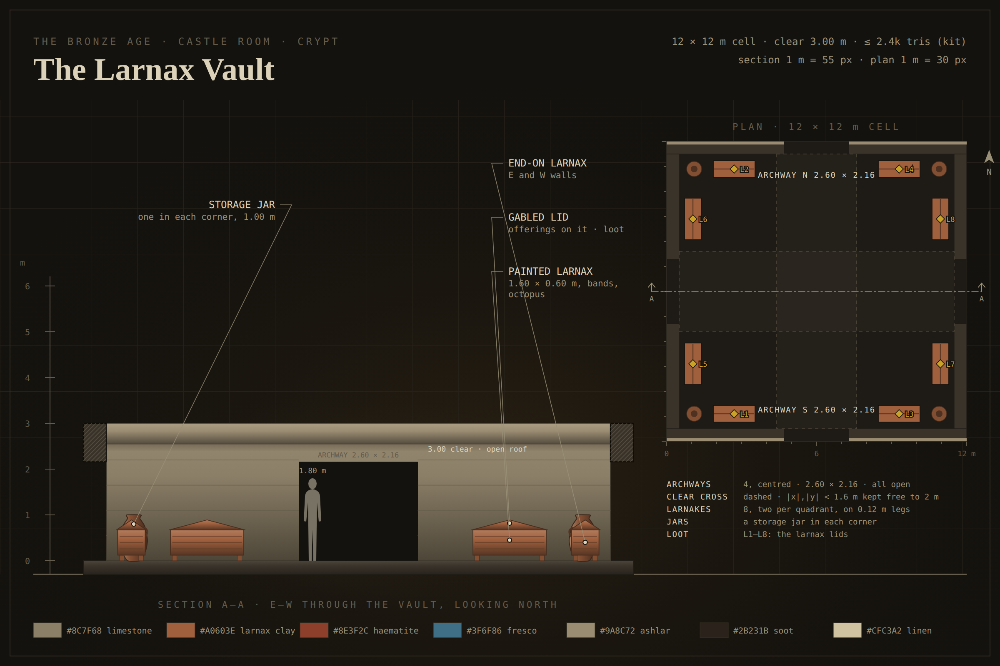

The household's dead lie here in larnakes, clay chests painted with bands and octopus and birds by potters who knew exactly who would be inside them. Each stands on four stubby legs like furniture, which in a sense it is, under a gabled lid heaped with whatever the family could spare: a cup, a pin, a string of beads. Storage jars in the corners hold the food the dead were expected to want. The lids come off easily. The larnakes themselves are too heavy to move and too fragile to drop.

**Build** (kit metres: x east, y north, from the cell centre; heights above ground, floor top at 0.30)

- Shell: the kit's Crypt shell, 12.0 × 12.0 × 0.30 m slab, 0.50 m limestone walls 3.00 m clear, 0.45 m ashlar capstone band, an archway 2.60 × 2.16 m centred on every wall.
- Larnax form: a painted clay chest 1.60 × 0.60 × 0.55 m on four legs 0.12 × 0.12 × 0.12 m, a haematite band round it at 0.33 m, and a gabled lid (a prism 0.66 m across, 0.20 m high) on top; lid ridge at 1.17 m above ground.
- North and south larnakes: four, long axis east–west, against the north and south walls at (±3.30, ±4.90).
- East and west larnakes: four, long axis north–south, against the east and west walls at (±4.95, ±2.90).
- Storage jars: four, 1.00 m tall, belly 0.60 m, one in each corner at (±4.90, ±4.90).
- Paint: bands, running octopus and birds on the larnax sides (albedo only).
- The cross: bare floor from archway to archway.
- Walls: coursed limestone joints every 0.55 m (albedo only).

**Sockets**

- Archway ×4, centred on each wall: 2.60 × 2.16 m (Crypt), all open
- Larnax lids: eight, each a loot anchor at 1.17 m

**Loot anchors**

- L1: SW larnax (south wall) at (-3.30, -4.90, 1.17)
- L2: NW larnax (north wall) at (-3.30, 4.90, 1.17)
- L3: SE larnax (south wall) at (3.30, -4.90, 1.17)
- L4: NE larnax (north wall) at (3.30, 4.90, 1.17)
- L5: west larnax, south at (-4.95, -2.90, 1.17)
- L6: west larnax, north at (-4.95, 2.90, 1.17)
- L7: east larnax, south at (4.95, -2.90, 1.17)
- L8: east larnax, north at (4.95, 2.90, 1.17)

**Materials** (art-pass colour, then the kit's atlas pigment)

| Material | Hex | Kit pigment | Notes |
|---|---|---|---|
| Limestone | `#8C7F68` | `vellum_dim` | Walls. |
| Larnax clay | `#A0603E` | `leather` | Coffins and jars; painted in haematite and fresco blue. |
| Haematite red | `#8E3F2C` | `madder` | The larnax bands. |
| Dressed ashlar | `#9A8C72` | `vellum_faint` | Capstone band. |
| Floor | `#2B231B` | `bone_black` | The Crypt floor. |

**In play**

- Eight loot anchors, the most in the Bronze crypt: small grave goods on every lid.
- The larnakes are knee-high cover along every wall; the cross is open.
- Larnakes are fragile in play: a FRANGO or a dropped body breaks one.

### BronzeTholos

**The Tholos** · Crypt · stands in for CryptChamberFinal · ≤ 2.4k tris (kit)

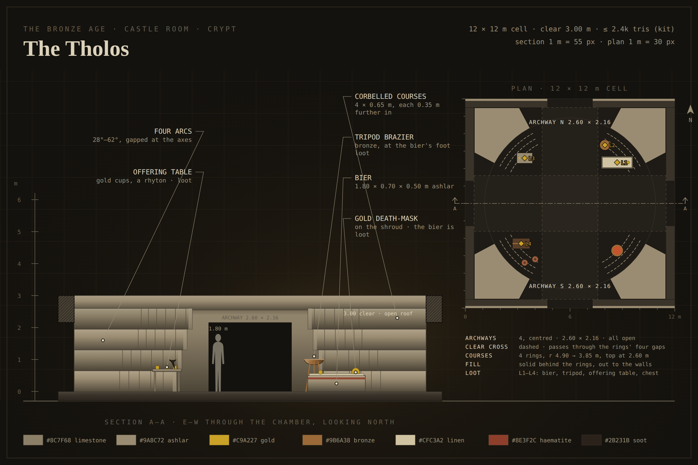

The tholos is the last room of the tomb and the reason for all the others. Its ashlar courses were laid in rings, each ring a hand's breadth further in than the one below, so the walls lean over you as they rise toward a dome that closes somewhere out of sight; behind them the earth of the mound is packed solid to the old walls. The rings break at the four doorways where the diggers came through. In the north-east corner the king lies on a painted bier with a beaten gold mask over his face, a tripod brazier still standing at his feet. Across from him an offering table holds his cups, and a bronze-bound chest in the south-west keeps what his heirs did not dare to take back. Everything in here was meant to be left alone, which is why it is still here.

**Build** (kit metres: x east, y north, from the cell centre; heights above ground, floor top at 0.30)

- Shell: the kit's Crypt shell, 12.0 × 12.0 × 0.30 m slab, 0.50 m limestone walls 3.00 m clear, 0.45 m ashlar capstone band, an archway 2.60 × 2.16 m centred on every wall.
- Corbelled courses: four rings of ashlar, each 0.65 m high, inner radius 4.90 / 4.55 / 4.20 / 3.85 m from the cell centre, bottoms at 0.00 / 0.65 / 1.30 / 1.95 m above the floor; the top course ends at 2.60 m.
- Arcs: each ring built as four arcs, one per quadrant, from 28° to 62° off the nearer axis in six facets (45° is a facet corner); the gaps at the axes leave the archways and the clear cross open.
- Fill: behind each arc the course runs solid out to 0.02 m short of the walls, into the corner, so from above the stepped treads read as the mound's packing; one stepped mesh per quadrant, courses sharing their edges.
- Bier (NE): ashlar block 1.80 × 0.70 × 0.50 m at (2.70, 2.35), long axis east–west, a haematite band 1.82 × 0.72 × 0.06 m round it at 0.38 m, a linen shroud 1.70 × 0.60 × 0.06 m on top and a gold death-mask 0.22 × 0.18 × 0.05 m at the head (east) end; it sits under the upper courses' overhang with 0.74 m to spare.
- Tripod brazier (NE): the Age's bronze tripod, legs 0.90 m, bowl r 0.30 m, at (2.00, 3.35), at the bier's foot.
- Offering table (NW): ashlar, 0.90 × 0.60 m, top at 0.70 m, at (−2.60, 2.60), three gold cups on it.
- Chest (SW): timber, 1.00 × 0.60 × 0.55 m with a 0.05 m bronze lid band, at (−2.80, −2.30); two amphorae 0.62 m beside it at (−2.00, −3.20) and (−2.60, −3.40).
- Standing brazier (SE): the kit brazier in bronze with a haematite fire bed, at (2.70, −2.70).
- Paint: alternate courses a shade apart so the rings read from above (albedo only).

**Sockets**

- Archway ×4, centred on each wall: 2.60 × 2.16 m (Crypt), all open
- Bier top: loot anchor at 0.86 m
- Tripod bowl, offering table and chest lid: loot anchors

**Loot anchors**

- L1: the bier, on the shroud at (2.70, 2.35, 0.86)
- L2: the tripod brazier's bowl at (2.00, 3.35, 1.44)
- L3: the offering table at (-2.60, 2.60, 1.00)
- L4: the bronze-bound chest at (-2.80, -2.30, 0.90)

**Materials** (art-pass colour, then the kit's atlas pigment)

| Material | Hex | Kit pigment | Notes |
|---|---|---|---|
| Limestone | `#8C7F68` | `vellum_dim` | Walls, and alternate courses. |
| Dressed ashlar | `#9A8C72` | `vellum_faint` | Courses, bier, offering table, capstone band. |
| Gold | `#C9A227` | `orpiment` | The death-mask and the cups. |
| Bronze | `#9B6A38` | `bronze` | Braziers and the chest's lid band. |
| Linen | `#CFC3A2` | `vellum` | The shroud. |
| Floor | `#2B231B` | `bone_black` | The Crypt floor. |

**In play**

- The final chamber: the death-mask on the bier is the Bronze crypt's headline loot.
- The overhanging rings make the corners dark nooks under a low stone ceiling; the cross stays open end to end.
- Four loot anchors across three quadrants, so a thief crosses the room's centre to clear it; the tripod is bronze worth carrying.

### BronzeShaftStair

**The Shaft Stair** · Crypt · stands in for CryptStairwell · ≤ 2k tris (kit)

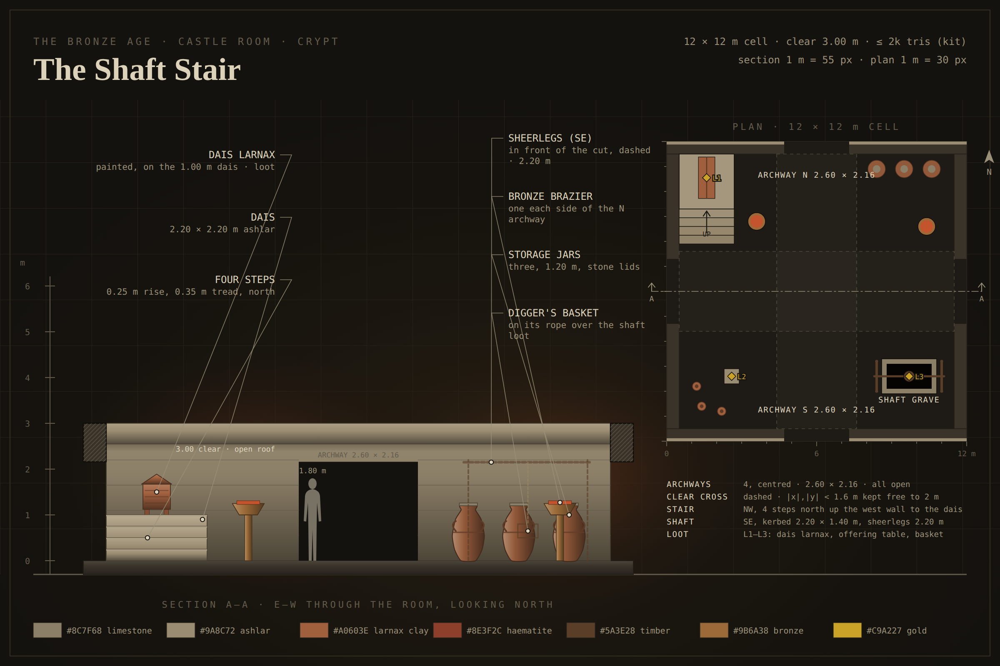

Someone was digging here when the palace fell. A short ashlar stair climbs the west wall to a dais where the family's most honoured dead lies in a painted larnax, raised above the floor so the lamps of visitors would fall on it. Across the room a new shaft grave gapes inside its stone kerb, the sheerlegs still standing over it and a basket still hanging on its rope, full of whatever the diggers brought up or meant to send down. Storage jars stand along the north wall for the funeral feast, and bronze braziers on either side of the north doorway have burned down to embers. The shaft is too deep to see the bottom of, which is the point of a shaft.

**Build** (kit metres: x east, y north, from the cell centre; heights above ground, floor top at 0.30)

- Shell: the kit's Crypt shell, 12.0 × 12.0 × 0.30 m slab, 0.50 m limestone walls 3.00 m clear, 0.45 m ashlar capstone band, an archway 2.60 × 2.16 m centred on every wall.
- Stair and dais (NW): the kit's stair-to-dais in ashlar: four steps 2.20 m wide, 0.35 m tread, 0.25 m rise, climbing north along the west wall from y 1.90 to 3.30, then the dais 2.20 × 2.20 × 1.00 m filling the corner (x −5.50…−3.30, y 3.30…5.50).
- Dais larnax: the Age's painted larnax, 1.60 × 0.60 × 0.55 m on 0.12 m legs with a gabled lid, long axis north–south at (−4.40, 4.55) on the dais; lid ridge at 2.17 m.
- Storage jars (NE): three pithoi 1.20 m tall, belly 0.70 m, with stone lids, along the north wall at x 2.40 / 3.50 / 4.60, y 4.90.
- Braziers: the kit brazier in bronze with a haematite fire bed, 1.31 m, at (−2.40, 2.80) and (4.40, 2.60), either side of the north archway.
- Shaft kerb (SE): four limestone blocks 0.35 m high, 0.20 m thick, round a 1.80 × 1.00 m opening, outer 2.20 × 1.40 m, centred (3.70, −3.40); a black void slab 0.02 m thick fills the opening at floor level.
- Sheerlegs (SE): two timber A-frames just outside the kerb's ends at x 2.40 and 5.00, legs 0.10 × 0.10 m from y −4.00 and −2.80 meeting at 2.20 m over y −3.40, and a crossbar r 0.06 m from x 2.30 to 5.10 at 2.15 m.
- Basket (SE): a wicker basket r 0.22 m, 0.30 m tall, hanging on a rope from the crossbar over the shaft's centre, its bottom at 0.50 m and top at 0.80 m above the floor.
- Offering table (SW): ashlar 0.60 × 0.60 m, top at 0.70 m, at (−3.40, −3.40), two gold cups; three amphorae 0.62 m round it at (−4.60, −4.60), (−4.80, −3.80), (−3.80, −4.80).

**Sockets**

- Archway ×4, centred on each wall: 2.60 × 2.16 m (Crypt), all open
- Dais larnax lid: loot anchor at 2.17 m
- Offering table and the hanging basket: loot anchors

**Loot anchors**

- L1: the dais larnax's lid at (-4.40, 4.55, 2.17)
- L2: the offering table at (-3.40, -3.40, 1.00)
- L3: the basket over the shaft at (3.70, -3.40, 1.10)

**Materials** (art-pass colour, then the kit's atlas pigment)

| Material | Hex | Kit pigment | Notes |
|---|---|---|---|
| Limestone | `#8C7F68` | `vellum_dim` | Walls and the shaft kerb. |
| Dressed ashlar | `#9A8C72` | `vellum_faint` | Stair, dais, offering table, capstone band. |
| Larnax clay | `#A0603E` | `leather` | The larnax, jars and amphorae. |
| Timber | `#5A3E28` | `oak` | Sheerlegs, crossbar and basket. |
| Bronze | `#9B6A38` | `bronze` | The braziers. |
| Gold | `#C9A227` | `orpiment` | The cups. |
| Void | `#2B231B` | `bone_black` | The shaft's opening, and the Crypt floor. |

**In play**

- The dais larnax is the prize and the stair its only approach: a thief on the dais is on show to both north and west archways.
- The basket hangs over the open shaft: reachable across the knee-high kerb, but it swings in the story, not in physics.
- The shaft reads as a drop but is a flat void slab; the kerb keeps the NavMesh from walking over it.
