# The Late Medieval: castle rooms

Generated by `python3 Tools/ArtBible/build_room_sheets.py` from `docs/art/rooms/data/LateMedieval/*.json`. Do not edit by hand. One sheet per room and curtain-wall piece of The Late Medieval's castle set; the models are `Assets/_Project/Art/Models/Castle/LateMedieval/<Key>.fbx`, built to these sheets. Rules: [`README.md`](README.md). Plan: [`docs/plans/era-castle-rooms.md`](../../plans/era-castle-rooms.md).

## CurtainWall

| Key | Room | Stands in for | |
|---|---|---|---|
| `LateBarbican` | [The Crooked Barbican](#latebarbican) | GatehouseModule | A gate between two octagonal towers whose passage turns a corner behind a baffle wall under a deck of murder-holes: the art bible's Crooked Barbican, built to the kit. |
| `LateWallStraight` | [The Machicolated Wall](#latewallstraight) | WallStraight | A dressed-sandstone curtain with a brick frieze and a corbelled, crenellated parapet carried out over machicolation slots, keyhole gun-loops in its face and a timber walk on its inner side. |
| `LateWallCorner` | [The Corner Tower](#latewallcorner) | WallCorner | An octagonal sandstone tower with a machicolated crown and a conical tile roof where the south and west machicolated walls meet. |
| `LateBastion` | [The Artillery Bulwark](#latebastion) | Bastion | A low, wide round bulwark of sandstone with a gun platform level with the walks, a thick parapet ring, a ring of gunports at its base, and a bombard aimed out through its embrasure. |
| `LateDrawbridge` | [The Bascule Bridge](#latedrawbridge) | Drawbridge | A gate through the machicolated wall with its oak deck lowered, worked by two counterweighted arms that pivot on the walk above and hold the deck's inner end on chains. |

### LateBarbican

**The Crooked Barbican** · CurtainWall · stands in for GatehouseModule · ≤ 2.4k tris (kit)

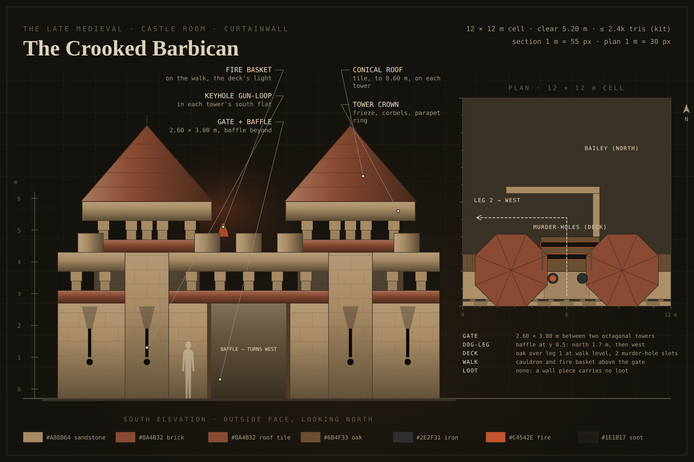

Whoever built this had met raiders before and did not care for them. You come in by the gate between two roofed octagonal towers and walk north under an oak deck, and before you have gone two strides a wall stands across your way, so the passage turns west, deliberately, and nobody gets a straight run at the bailey. The deck overhead is broken by two slots through which the guards pour hot sand from the cauldron on the walk, by the light of the fire basket beside it. The towers' keyhole loops cover the approach, the oak leaves stand folded back ready to close, and every one of those defences was built for the new hand-cannon.

**Where the kit differs from the art bible**

- The art bible's enclosed L-shaped passage, its vault, stair block and guardroom become an open dog-leg: the kit's wall pieces are open to the bailey and the sky, so a baffle wall across the end of a short first leg forces the turn.
- The passage turns west rather than east, and the art bible's outer gate moves to the centre of the south wall between two octagonal towers (the plan's gatehouse form).
- The seven vault murder-holes become two slots in an oak deck over the first leg, at walk level.

**Build** (kit metres: x east, y north, from the cell centre; heights above ground, no floor slab)

- Cell: 12.1 × 12.1 m (±6.05), no floor slab; the wall on the south edge, the bailey open to the north.
- Towers: two octagonal sandstone towers (flats facing the axes, circumradius 1.80 m, apothem 1.66 m) centred (±3.20, −3.94), their south flats on the wall's face line 0.45 m in from the cell edge; drum to 4.60 m, brick frieze ring, corbels on the six outward flats, a parapet ring (circumradius 2.20 m) to 6.20 m, a conical tile roof (circumradius 2.25 m) to 8.60 m with a finial; doorways on the east and west flats off the walks; a keyhole gun-loop in each south flat.
- Runs: the Late wall section (sandstone 1.60 m, walk 4.00 m, frieze, corbels, parapet out to d 0.05, merlons to 5.20 m, timber walk) from each cell edge to the towers' south-flat corners (x ±3.89), a keyhole gun-loop in each at x ±5.00.
- Gate wall: the section between the towers (x ±2.51) with a gate 2.60 × 3.00 m at the centre under a sandstone lintel (3.00–4.00 m); the crown runs over it.
- Leaves: two oak leaves 0.12 × 1.30 × 3.00 m folded back inside against the first leg's sides at x ±1.41, y −3.95 … −2.65, an iron strap across each.
- East side wall: sandstone 0.40 m thick (x 1.50 … 1.90), 3.80 m tall, from the wall's inner face (y −4.00) into the baffle (y 0.85).
- Baffle: sandstone 5.40 × 0.40 × 3.00 m across the passage at y 0.50 … 0.90, x −3.50 … 1.90; the first leg runs north 1.7 m from the towers, then the passage turns west between the west tower (north flat at y −2.28) and the baffle, 2.78 m wide.
- Deck: oak at walk level (3.80–4.00 m), x −1.50 … 1.90, in three strips (y −4.00 … −3.30, −3.00 … −2.60, −2.30 … −2.00) resting on the wall, the east side wall and the west tower; the two 0.30 m gaps are the murder-holes.
- On the walk above the gate: an iron hot-sand cauldron r 0.30 m, 0.45 m, with its sand, at (0.90, −4.40); an iron fire basket on a 0.90 m tripod with a flame at (−0.80, −4.40).

**Sockets**

- Gate: 2.60 × 3.00 m, centred on the south wall, leaves folded back (open)
- Passage: north 1.7 m then west, 2.78 m wide, under the murder-hole deck
- Wall-walks: 4.00 m, the deck continuing them over the first leg; tower doorways east and west; keyhole gun-loops: four

**Loot anchors**

**Materials** (art-pass colour, then the kit's atlas pigment)

| Material | Hex | Kit pigment | Notes |
|---|---|---|---|
| Dressed sandstone | `#A88B64` | `vellum_dim` | Towers, walls, baffle, crowns. |
| Brick | `#8A4B32` | `leather` | Friezes. |
| Roof tile | `#8A4B32` | `leather` | The conical roofs. |
| Oak | `#6B4F33` | `oak` | Leaves, deck, timber walks. |
| Iron | `#2E2F31` | `iron` | Cauldron, fire basket, straps. |
| Fire | `#C4542E` | `madder` | The fire basket's flame. |

**In play**

- The turn is the point: nobody in the first leg can see the bailey, and every guard on the deck can see them; the murder-holes pour hot sand.
- The keyhole loops in the towers are handgunner posts covering the approach.
- The fire basket is the deck's only light: knock it over and the sand-men cannot aim.

### LateWallStraight

**The Machicolated Wall** · CurtainWall · stands in for WallStraight · ≤ 1.2k tris (kit)

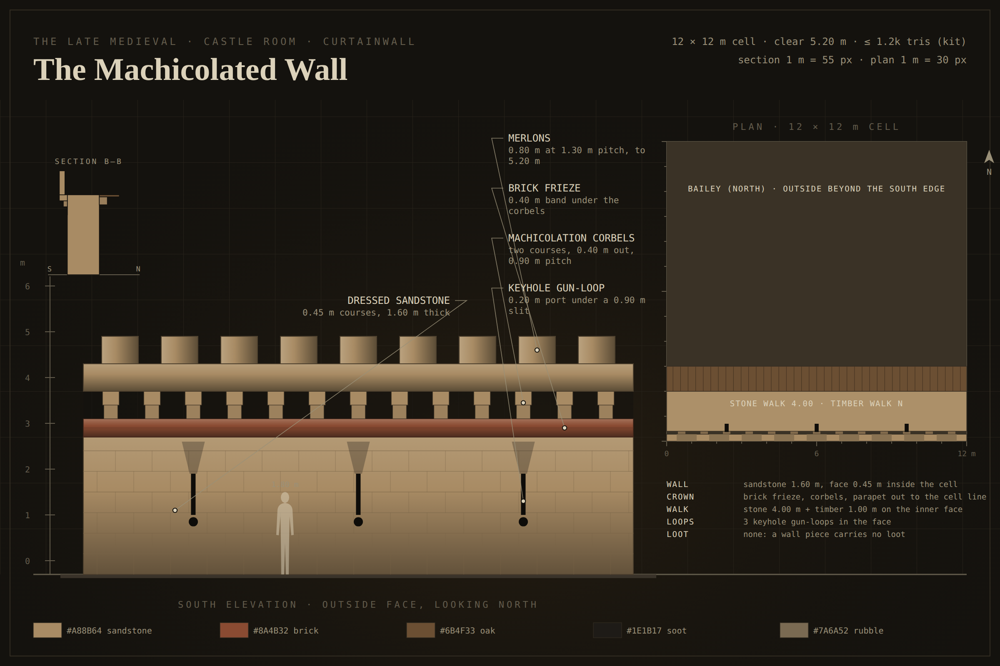

The Burgundian wall is built to be defended from the top. Its sandstone face rises plain and dressed to a band of brick, and above that a row of stepped corbels carries the parapet forward, leaving a slot between each pair through which a defender can drop stones or hot sand straight down onto anyone at the foot of the wall. The crenellated parapet above gives cover to the handgunners on the walk; lower down, keyhole gun-loops cut through the face let others fire at head height from inside. The stone walk on top is widened on the inner side by timber boards on corbels, so two men can pass with a gun between them.

**Build** (kit metres: x east, y north, from the cell centre; heights above ground, no floor slab)

- Cell: 12.1 × 12.1 m (±6.05), no floor slab; the wall on the south edge, the bailey open to the north.
- Mass: dressed sandstone 1.60 m thick, its outer face 0.45 m in from the south cell line (d 0.45 … 2.05), x −6.05 … 6.05, 4.00 m to the stone walk.
- Brick frieze: a brick band 0.40 m tall (3.00–3.40 m) on the outer face, 0.04 m proud.
- Corbels: thirteen two-stage corbels at 0.90 m pitch centred on the run: a lower block 0.30 m wide projecting 0.20 m (3.40–3.70 m) under an upper block 0.36 m wide projecting out to d 0.05 (3.70–4.00 m).
- Parapet: sandstone 0.28 m thick from d 0.05 to 0.33, on the corbels, 4.00–4.60 m, leaving a 0.12 m machicolation slot (d 0.33 … 0.45) between each pair of corbels.
- Merlons: nine, 0.80 m wide at 1.30 m pitch centred on the run, 4.60–5.20 m.
- Keyhole gun-loops: three on the outer face at x −3.60 / 0 / 3.60: a soot slit 0.10 × 0.90 m (1.30–2.20 m) over a round port r 0.10 m at 1.15 m.
- Timber walk: oak boards 1.00 m wide (d 2.05 … 3.05), 3.90–4.00 m, flush with the stone walk, on stone corbels 0.30 × 0.40 × 0.50 m at 1.50 m pitch on the inner face.

**Sockets**

- Wall-walk: 4.00 m, stone d 0.45–2.05 plus timber d 2.05–3.05, open at the east and west cell edges
- Machicolation slots: twelve, 0.12 m, between the corbels along the outer face
- Keyhole gun-loops: three in the outer face

**Loot anchors**

**Materials** (art-pass colour, then the kit's atlas pigment)

| Material | Hex | Kit pigment | Notes |
|---|---|---|---|
| Dressed sandstone | `#A88B64` | `vellum_dim` | Mass, corbels, parapet, merlons. |
| Brick | `#8A4B32` | `leather` | The frieze. |
| Oak | `#6B4F33` | `oak` | The timber walk. |
| Soot | `#1E1B17` | `bone_black` | Gun-loop slits and ports. |

**In play**

- The machicolation slots let the walk's guards drop sand on a thief climbing the face.
- Handgunners fire from the merlons and the gun-loops; the parapet is full cover to a crouching figure.
- No loot: terrain.

### LateWallCorner

**The Corner Tower** · CurtainWall · stands in for WallCorner · ≤ 2k tris (kit)

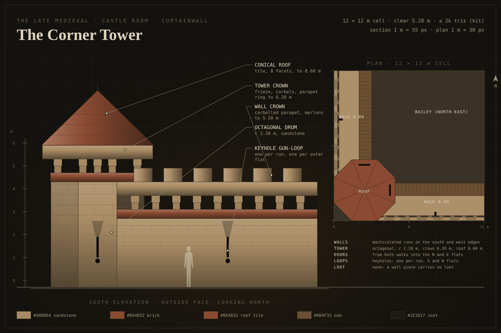

The Burgundian builders turned their corners with octagons: an eight-sided sandstone drum that sees along both walls, crowned like the curtain with a brick frieze and a corbelled parapet over machicolation slots, but roofed against the rain with a steep cone of clay tile. The walks on both walls lead in through doorways in the tower's inner flats; from the outer flats keyhole gun-loops cover the foot of both walls. The roof makes it a landmark and a dry place for the watch; it also makes it the one part of the wall that burns.

**Build** (kit metres: x east, y north, from the cell centre; heights above ground, no floor slab)

- Cell: 12.1 × 12.1 m (±6.05), no floor slab; walls on the south and west edges, the bailey open to the north-east.
- Tower drum: dressed sandstone, octagonal with flats facing the axes, circumradius 2.20 m (apothem 2.03 m), centred (−3.57, −3.57) so its south and west flats lie on the walls' face line 0.45 m in from the cell edge; 0 to 4.60 m.
- Tower crown: a brick frieze ring 4.60–5.00 m; two-stage corbels on the five outward flats (S, SW, W, SE, NW), 5.00–5.60 m; a sandstone parapet ring, circumradius 2.60 m, 5.30–6.20 m.
- Conical roof: clay tile, eight facets, circumradius 2.65 m at 6.20 m tapering to an iron finial at 8.60 m.
- Doorways: soot panels 0.90 × 1.90 m on the tower's north and east flats from 4.00 m, off the walks.
- South run: the Late wall section (sandstone 1.60 m, face 0.45 m in, walk 4.00 m, brick frieze, corbels, parapet out to d 0.05, merlons to 5.20 m, timber walk on the inner face) from the tower's south flat corner (x −2.73) to the east cell edge.
- West run: the same along the west edge from y −2.73 to the north cell edge.
- Keyhole gun-loops: one in each run at 2.10 m along it, and one in each of the tower's south and west flats.

**Sockets**

- Wall-walks: 4.00 m, stone plus timber, open at the east and north cell edges
- Tower doorways: from both walks into the north and east flats
- Keyhole gun-loops: four, on the outer faces

**Loot anchors**

**Materials** (art-pass colour, then the kit's atlas pigment)

| Material | Hex | Kit pigment | Notes |
|---|---|---|---|
| Dressed sandstone | `#A88B64` | `vellum_dim` | Drum, runs, corbels, parapets. |
| Brick | `#8A4B32` | `leather` | Friezes. |
| Roof tile | `#8A4B32` | `leather` | The conical roof. |
| Oak | `#6B4F33` | `oak` | Timber walks. |
| Soot | `#1E1B17` | `bone_black` | Doorways and gun-loops. |

**In play**

- The tower is a lookout over both walks; its doorways are the only way from one walk to the other.
- The roof is the Late wall's one flammable part.
- No loot: terrain.

### LateBastion

**The Artillery Bulwark** · CurtainWall · stands in for Bastion · ≤ 2k tris (kit)

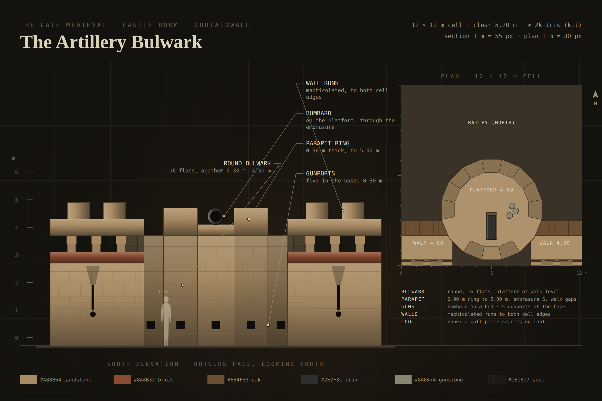

By the middle of the century the Burgundians were building for guns rather than against ladders. The bulwark is a squat round tower as wide as a house, its thick wall rising only to the level of the walks, so that its flat top becomes a gun platform. A parapet ring nearly a metre thick protects the gunners; a single wide embrasure faces the approach, with a bombard on its timber bed laid in it and its stone shot stacked beside. Lower down, five gunports pierce the base for hand-cannon that sweep the ditch. The walks run straight onto the platform through gaps in the parapet on either side.

**Build** (kit metres: x east, y north, from the cell centre; heights above ground, no floor slab)

- Cell: 12.1 × 12.1 m (±6.05), no floor slab; the wall on the south edge, the bailey open to the north.
- Drum: dressed sandstone, sixteen flats (circumradius 3.40 m, apothem 3.34 m), turned so a flat faces south, centred (0, −2.27) so the south flat lies on the walls' face line 0.45 m in from the cell edge; solid from the ground to the platform at 4.00 m, level with the walks.
- Platform: a flagged disc r 2.45 m, 0.02 m, on the drum top.
- Parapet ring: one sandstone block per flat, 0.84 m thick (radius 2.53 … 3.37), 4.00–5.00 m, alternate blocks 0.03 m higher; the four blocks facing 202.5°, 225°, 315° and 337.5° are left out where the walks come in.
- Embrasure: the south block cut down to a sill 0.40 m high (4.00–4.40 m).
- Gunports: five soot ports 0.30 × 0.30 m at 0.60–0.90 m on the flats facing 225°–315°.
- Bombard: an oak bed 0.70 × 1.80 × 0.30 m at (0, −3.37) on the platform; an iron chamber r 0.20 m and bore r 0.30 m, 1.20 m long, along y with the muzzle south in the embrasure; two iron hoops; three stone balls r 0.20 m beside it.
- Wall runs: the Late wall section (sandstone 1.60 m, face 0.45 m in, walk 4.00 m, brick frieze, corbels, parapet out to d 0.05, merlons to 5.20 m, timber walk) from each cell edge to x ±2.60, a keyhole gun-loop in each at x ±4.45.

**Sockets**

- Gun platform: 4.00 m, level with the walks, entered through the parapet gaps from both
- Embrasure: south, sill at 4.40 m, the bombard laid in it
- Gunports: five in the drum's base; keyhole gun-loops: one per run

**Loot anchors**

**Materials** (art-pass colour, then the kit's atlas pigment)

| Material | Hex | Kit pigment | Notes |
|---|---|---|---|
| Dressed sandstone | `#A88B64` | `vellum_dim` | Drum, parapet ring, runs; flagstones in vellum_faint. |
| Brick | `#8A4B32` | `leather` | The runs' friezes. |
| Oak | `#6B4F33` | `oak` | The bombard's bed, timber walks. |
| Iron | `#2E2F31` | `iron` | The bombard; hoops in line. |
| Soot | `#1E1B17` | `bone_black` | Gunports and gun-loops. |

**In play**

- The platform is the Late wall's gun post: the bombard covers the approach, handgunners the base.
- The walks run straight onto the platform, so guards can reinforce it from either side.
- No loot: terrain.

### LateDrawbridge

**The Bascule Bridge** · CurtainWall · stands in for Drawbridge · ≤ 1.6k tris (kit)

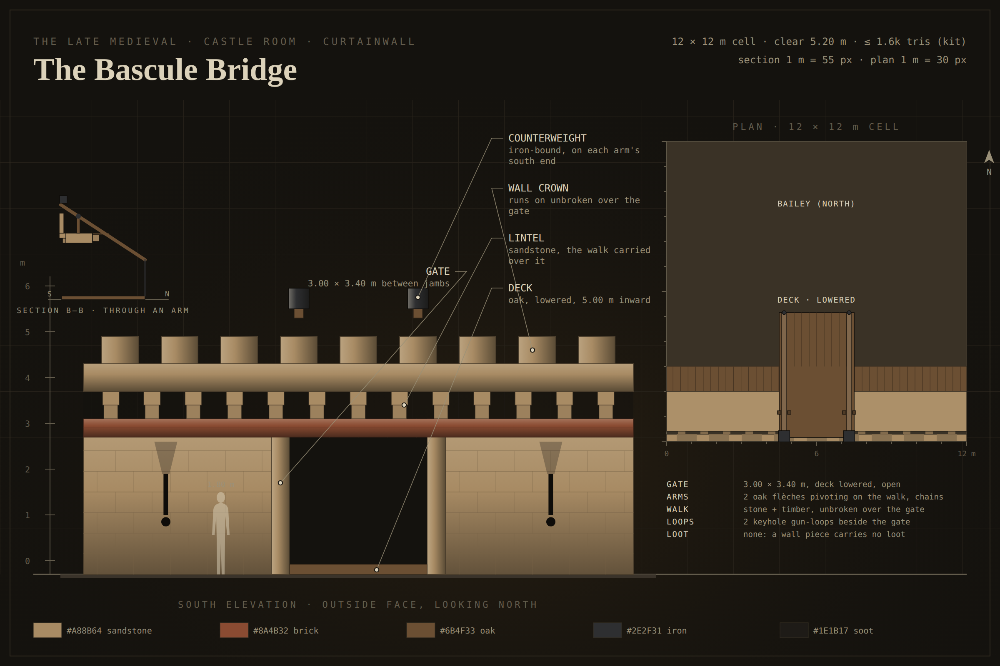

The Burgundian drawbridge is a balance. Two long oak arms pivot on posts on the walk above the gate, their outer ends loaded with iron counterweights that stand up over the parapet, their inner ends hanging over the deck on chains. With the deck down the gate is a plain opening 3 m wide; let the counterweights fall and the arms swing, the chains draw the deck's inner end up, and the gate is shut from inside by its own bridge. The wall's walk and crown run straight over the gate on a sandstone lintel, so the men who work the arms stand among the handgunners.

**Build** (kit metres: x east, y north, from the cell centre; heights above ground, no floor slab)

- Cell: 12.1 × 12.1 m (±6.05), no floor slab; the wall on the south edge, the bailey open to the north.
- Wall: the Late section (sandstone 1.60 m, outer face 0.45 m in from the cell line, walk 4.00 m) in two masses from each cell edge to x ±1.90.
- Gate: 3.00 m wide (x ±1.50) and 3.40 m high between dressed jambs 0.40 m wide, the wall's full depth; a sandstone lintel over it from 3.40 to 4.00 m carries the walk.
- Crown and walk: the brick frieze, corbels, parapet and merlons run the full width, unbroken over the gate; the timber walk on corbels on the inner face likewise; two keyhole gun-loops at x ±4.20.
- Deck: oak 3.00 m wide, 0.22 m thick, lowered, from d 0.20 (in the gate) to d 5.20 inward; an iron hinge bar across its south end.
- Arms (flèches): two oak beams 0.20 m square, 6.03 m long, at x ±1.30, sloping from their south ends (d 0.15, 5.70 m) down to their north ends (d 5.20, 2.40 m) over the deck.
- Pivots and counterweights: two oak posts 0.14 m square on the walk either side of each arm at d 1.20, an iron pin through them and the arm at 5.01 m; an iron counterweight 0.45 m cube on each arm's south end, standing above the merlons.
- Chains: an iron chain from each arm's north end straight down to the deck's inner end.

**Sockets**

- Gate: 3.00 × 3.40 m through the south wall, the deck lowered (open)
- Wall-walk: 4.00 m, unbroken over the gate, open at the east and west cell edges
- Arms: two pivots on the walk above the gate; keyhole gun-loops: two

**Loot anchors**

**Materials** (art-pass colour, then the kit's atlas pigment)

| Material | Hex | Kit pigment | Notes |
|---|---|---|---|
| Dressed sandstone | `#A88B64` | `vellum_dim` | Masses, lintel, crown; jambs in vellum_faint. |
| Brick | `#8A4B32` | `leather` | The frieze. |
| Oak | `#6B4F33` | `oak` | Deck, arms, pivot posts, timber walk. |
| Iron | `#2E2F31` | `line` | Counterweights, pins, chains, hinge bar. |
| Soot | `#1E1B17` | `bone_black` | Gun-loops. |

**In play**

- The gate is open with the deck down; raising it (the arms swinging) shuts the gate from inside.
- The counterweights stand above the parapet: a landmark from outside and a target for TONITRUS.
- No loot: terrain.

## OuterBailey

| Key | Room | Stands in for | |
|---|---|---|---|
| `LateArtilleryYard` | [The Artillery Yard](#lateartilleryyard) | StableBlock | A great hooped bombard lashed into its sledge, a pyramid of stone gunstones, powder kegs, and the powder cart with its spare wheel and rammer rack. |
| `LateGunFoundry` | [The Gun Foundry](#lategunfoundry) | BlacksmithShop | A brick furnace and chimney with its bellows, a casting pit with a clay gun mould standing under an A-frame crane, new barrels on trestles, and the anvil. |
| `LateHandgunnerBarracks` | [The Handgunners' Barracks](#latehandgunnerbarracks) | BarracksBunk | Eight straw pallets for the castle's handgunners, their hand-cannon racked on the north wall, painted pavises propped on the south wall, and a dice table. |
| `LateBrewhouse` | [The Brewhouse](#latebrewhouse) | StorehouseRoom | A copper kettle set into a brick furnace, an open mash tun with its paddle, a cooling trough, and ale casks lying on cradles along the south wall. |
| `LateTreadwheelWell` | [The Treadwheel Well](#latetreadwheelwell) | WellCourtyard | A great oak treadwheel against the north wall winding a rope over a pulley to a bucket above the well-head, a handcart with a water barrel, a stone trough and buckets. |

### LateArtilleryYard

**The Artillery Yard** · OuterBailey · stands in for StableBlock · ≤ 4k tris (kit)

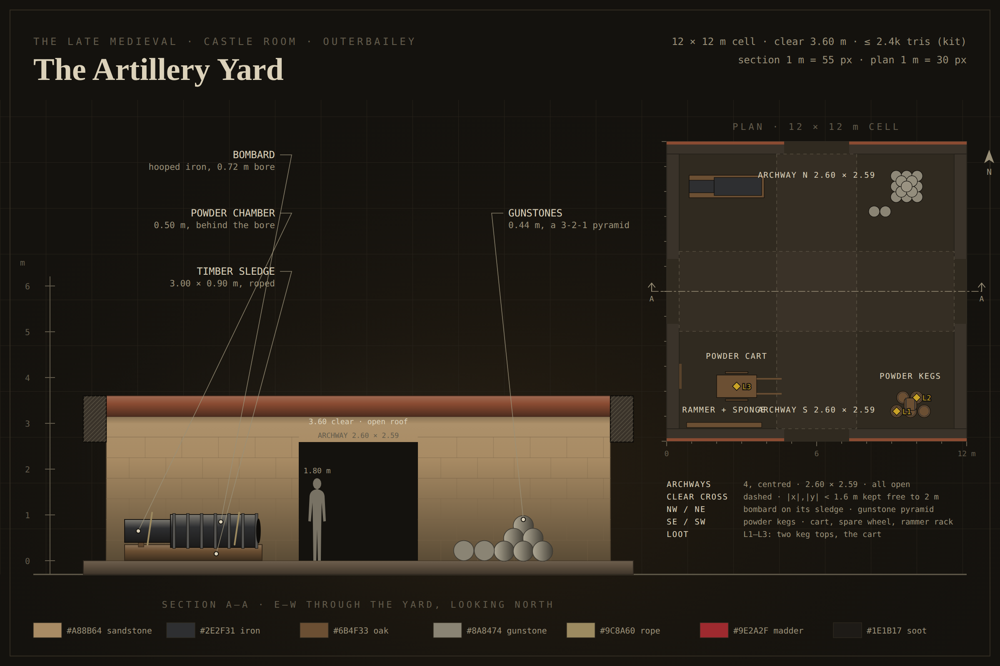

Where the old castle stabled horses, the new one stables guns. The bombard in the north-west corner is wrought-iron staves hooped like a barrel, with a narrower powder chamber behind the bore, and it lies roped into a timber sledge because nothing on wheels could carry it. Its ammunition is stone, cut round by masons and stacked in a pyramid across the yard; each ball is the weight of a man. Powder lives in kegs in the far corner, as far from anything that burns as the gunners can manage, and the two-wheeled cart that brings it stands ready with a spare wheel against the wall and the rammer and sponge racked above. One spark in the south-east corner and the yard is a crater.

**Build** (kit metres: x east, y north, from the cell centre; heights above ground, floor top at 0.30)

- Shell: the kit's OuterBailey shell, 12.0 × 12.0 × 0.30 m slab, 0.50 m dressed-sandstone walls 3.60 m clear, a 0.45 m brick trim course, an archway 2.60 × 2.59 m centred on every wall.
- Sledge (NW): oak 3.00 × 0.90 × 0.35 m at (−3.60, 4.20), long axis east–west; three oak cleats 0.12 × 0.90 × 0.50 m across it at x −4.74 / −3.54 / −2.34.
- Bombard: an iron powder chamber r 0.25 m, 1.00 m long (x −5.10 … −4.10), and the bore r 0.36 m, 1.90 m long (x −4.10 … −2.20), axis at 0.95 m above ground, muzzle east; seven iron hoops r 0.38 m along the bore; a soot disc in the muzzle; two rope lashings round barrel and sledge.
- Gunstones (NE): stone balls r 0.22 m in a 3-2-1 square pyramid centred (3.60, 4.20), each layer settled 0.02 m into the one below; two loose balls at (2.30, 3.20) and (2.75, 3.20).
- Powder kegs (SE): five oak kegs r 0.25 m, 0.50 m tall, two iron hoops each, at (3.20, −4.80), (3.75, −4.80), (4.30, −4.80), (3.45, −4.25), (4.00, −4.25); a sixth lying east–west across three of them at (3.75, −4.52), 0.80–1.30 m above ground.
- Powder cart (SW): an oak bed 1.60 × 0.90 × 0.10 m, top 0.85 m above the floor, at (−3.20, −3.80) on two supports and an iron axle; two spoked wheels r 0.45 m; two short shafts 0.70 m pointing east, ending at x −1.85.
- Spare wheel: a spoked oak wheel r 0.45 m standing against the west wall at y −3.40.
- Rammer rack: two iron brackets on the south wall at x −4.80 and −2.60; an oak rammer and a linen-headed sponge, each on a 3.00 m pole, at 1.55 and 1.90 m above ground.

**Sockets**

- Archway ×4, centred on each wall: 2.60 × 2.59 m (OuterBailey), all open
- Keg tops: two loot anchors at 0.80 m
- Powder cart bed: a loot anchor at 1.15 m

**Loot anchors**

- L1: the west powder keg at (3.20, -4.80, 0.80)
- L2: the east powder keg at (4.30, -4.80, 0.80)
- L3: the powder cart at (-3.20, -3.80, 1.15)

**Materials** (art-pass colour, then the kit's atlas pigment)

| Material | Hex | Kit pigment | Notes |
|---|---|---|---|
| Dressed sandstone | `#A88B64` | `vellum_dim` | Walls. |
| Wrought iron | `#2E2F31` | `iron` | Bombard barrel and chamber; hoops in line. |
| Oak | `#6B4F33` | `oak` | Sledge, kegs, cart, wheels, rammer. |
| Gunstone | `#8A8474` | `vellum_faint` | The balls, the lashings. |
| Linen | `#D6CDB6` | `vellum` | The sponge head. |
| Soot | `#1E1B17` | `bone_black` | The muzzle. |

**In play**

- The powder kegs are the Late bailey's bomb: fire in the SE corner detonates them.
- The bombard is scenery too heavy to move, and the best cover in the yard.
- Three loot anchors: two kegs and the cart.

### LateGunFoundry

**The Gun Foundry** · OuterBailey · stands in for BlacksmithShop · ≤ 2k tris (kit)

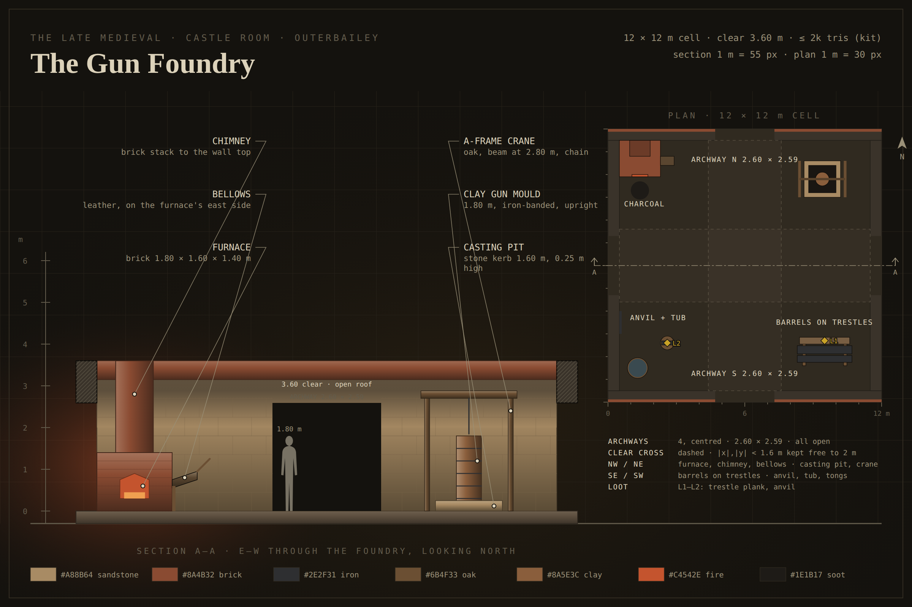

The castle casts its own guns now. Bronze is melted in the brick furnace in the corner, blown hot by the leather bellows, and poured into a clay mould stood upright in the casting pit, a long cylinder of clay banded in iron and hung from an A-frame crane so it can be lifted out and broken open. What comes out is a gun barrel: two lie across the trestles by the south wall waiting to be bored and filed. The smith keeps his anvil, tongs and quench tub in the other corner for the ironwork. The foundry is the hottest room in the castle and smells of it.

**Build** (kit metres: x east, y north, from the cell centre; heights above ground, floor top at 0.30)

- Shell: the kit's OuterBailey shell, 12.0 × 12.0 × 0.30 m slab, 0.50 m dressed-sandstone walls 3.60 m clear, a 0.45 m brick trim course, an archway 2.60 × 2.59 m centred on every wall.
- Furnace (NW): brick 1.80 × 1.60 × 1.40 m in the corner at (−4.60, 4.70), a glowing madder fire mouth 0.70 × 0.50 m on its south face; a brick chimney 0.90 × 0.70 m from its back rising to the wall top (3.90 m above ground).
- Bellows and charcoal: a leather wedge 0.60 × 0.40 m rising 0.30 m on an oak post, on the furnace's east side at (−3.40, 4.60); a charcoal heap r 0.40 m at (−4.60, 3.30).
- Casting pit (NE): a sandstone kerb 1.60 m square, 0.20 m thick, 0.25 m high, centred (3.40, 3.80), a dark fill inside.
- Gun mould: clay, r 0.30 m, 1.80 m tall, standing in the pit, five iron bands.
- A-frame crane: two oak A-frames (legs 0.12 m, splayed 0.80 m north–south) at x 2.40 and 4.40, a beam 2.30 m at 2.80 m above the floor, an iron chain down to the mould's head.
- Barrels (SE): two oak trestles 1.20 m wide, 0.77 m high at x 2.60 and 4.40, y −3.80; two iron gun barrels 2.40 m long, r 0.15 and 0.18 m tapering to the muzzle, across them at y −4.10 and −3.70; an oak tool plank 2.20 × 0.30 m on the trestles at y −3.30.
- Anvil (SW): an iron anvil 0.50 × 0.18 × 0.25 m on an oak stump r 0.30 m, 0.60 m tall, at (−3.40, −3.40); an oak quench tub r 0.45 m with water at (−4.70, −4.50); a tong rack on the west wall at y −2.50, four tongs.

**Sockets**

- Archway ×4, centred on each wall: 2.60 × 2.59 m (OuterBailey), all open
- Trestle plank and anvil: loot anchors
- Furnace: a fire source, NW

**Loot anchors**

- L1: the tool plank on the trestles at (3.50, -3.30, 1.14)
- L2: the anvil at (-3.40, -3.40, 1.15)

**Materials** (art-pass colour, then the kit's atlas pigment)

| Material | Hex | Kit pigment | Notes |
|---|---|---|---|
| Dressed sandstone | `#A88B64` | `vellum_dim` | Walls, the pit kerb. |
| Brick | `#8A4B32` | `leather` | Furnace and chimney; the mould and bellows share it. |
| Blackened iron | `#2E2F31` | `line` | Barrels, anvil, bands, chain, tongs. |
| Oak | `#6B4F33` | `oak` | Crane, trestles, stump, tub. |
| Fire | `#C4542E` | `madder` | The furnace mouth. |
| Soot | `#1E1B17` | `bone_black` | Pit fill, charcoal. |

**In play**

- The furnace lights the NW corner; the crane's A-frames are the only cover in the NE.
- The finished barrels are scenery: too heavy to carry, but a guard behind them is hard to see.
- Two loot anchors, both in the south half.

### LateHandgunnerBarracks

**The Handgunners' Barracks** · OuterBailey · stands in for BarracksBunk · ≤ 2.4k tris (kit)

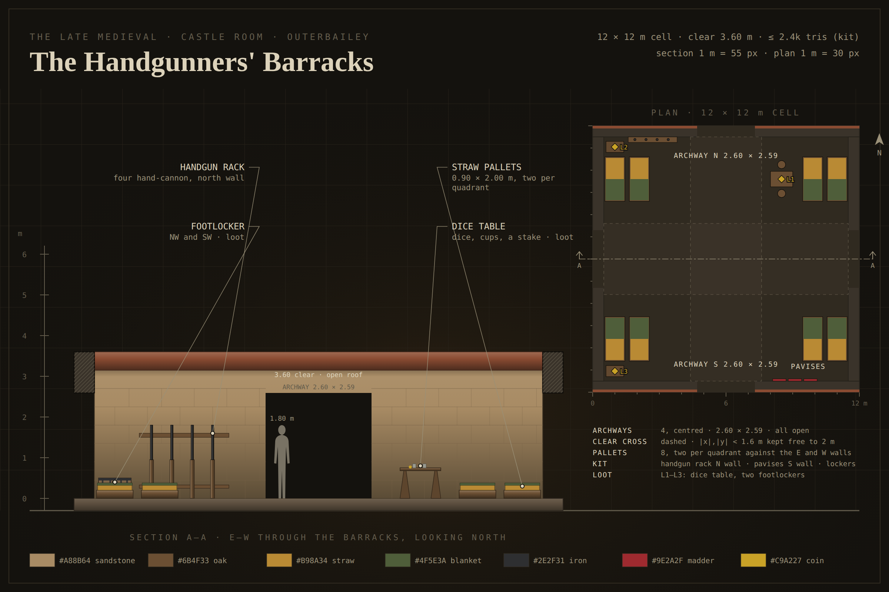

The handgunners are the new men of the garrison, paid more than the halberdiers and resented for it. They sleep eight to a room on straw pallets against the side walls, their hand-cannon racked on the north wall where the sergeant can count them, and their pavises, the tall painted shields they fight behind, propped along the south wall ready to be snatched up. Off duty they play dice at the table by the north archway, with a small stake of coin between the cups. Their footlockers hold everything they own, which is not much, and everything they have taken from the dead, which is sometimes a great deal.

**Build** (kit metres: x east, y north, from the cell centre; heights above ground, floor top at 0.30)

- Shell: the kit's OuterBailey shell, 12.0 × 12.0 × 0.30 m slab, 0.50 m dressed-sandstone walls 3.60 m clear, a 0.45 m brick trim course, an archway 2.60 × 2.59 m centred on every wall.
- Pallets: eight, two per quadrant, oak frames 0.90 × 2.00 × 0.20 m at |x| 3.90 and 5.00, |y| 2.60 … 4.60, long axis north–south; a straw tick 0.12 m on each and a green wool blanket over the half nearer the crossing.
- Handgun rack (NW): two oak rails 2.20 m on the north wall at 0.59 and 1.85 m above ground, centred x −3.30; four hand-cannon, oak stocks 0.95 m standing on the floor, iron barrels 0.85 m.
- Footlockers: iron-bound oak 0.80 × 0.50 × 0.50 m at (−5.00, 5.05) and (−5.00, −5.05), at the heads of the outer west pallets.
- Dice table (NE): oak 1.00 × 0.70 m, top 0.75 m at (2.50, 3.60), between the pallets and the crossing; two oak stools r 0.18 m at y 2.95 and 4.25.
- On the table: two pewter cups, two dice, a stake of gilt coin.
- Pavises (SE): three oak shields 0.60 × 0.08 × 1.30 m stood against the south wall at x 2.40 / 3.10 / 3.80, madder painted faces 0.50 × 1.10 m.
- The crossing: bare floor between all four archways.

**Sockets**

- Archway ×4, centred on each wall: 2.60 × 2.59 m (OuterBailey), all open
- Dice table: a loot anchor at 1.05 m
- Footlockers: two loot anchors

**Loot anchors**

- L1: the dice table at (2.50, 3.60, 1.05)
- L2: the NW footlocker at (-5.00, 5.05, 0.85)
- L3: the SW footlocker at (-5.00, -5.05, 0.85)

**Materials** (art-pass colour, then the kit's atlas pigment)

| Material | Hex | Kit pigment | Notes |
|---|---|---|---|
| Dressed sandstone | `#A88B64` | `vellum_dim` | Walls. |
| Oak | `#6B4F33` | `oak` | Pallet frames, rack, table, stools, pavises. |
| Straw | `#B98A34` | `bronze` | The ticks. |
| Blanket wool | `#4F5E3A` | `verdigris_lo` | Blankets. |
| Blackened iron | `#2E2F31` | `line` | Gun barrels, locker straps. |
| Madder | `#9E2A2F` | `madder` | Pavise faces. |

**In play**

- Handgunners wake here: a noise in the barracks turns eight sleepers into eight guards.
- The racked hand-cannon are the garrison's firepower; taking them disarms the handgunners.
- Three loot anchors: the stake on the table and two footlockers.

### LateBrewhouse

**The Brewhouse** · OuterBailey · stands in for StorehouseRoom · ≤ 2.4k tris (kit)

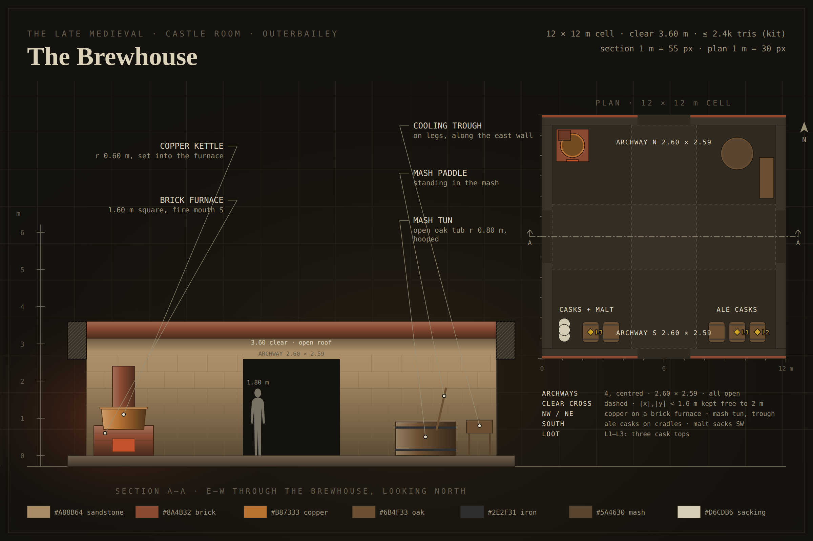

A garrison drinks more ale than water, and brews it here. The copper kettle sits sunk into the top of a round brick furnace in the corner, the wort boiling over a fire fed from the mouth on its south side, a short flue carrying the smoke up the wall. The mash tun across the room is an open oak tub as wide as a cart, the grain steeping in it and a paddle left standing upright in the mash. When the wort has boiled it runs into the cooling trough on the east wall, and from there into the casks that lie on their cradles along the south wall. The malt comes in sacks, stacked in the south-west corner.

**Build** (kit metres: x east, y north, from the cell centre; heights above ground, floor top at 0.30)

- Shell: the kit's OuterBailey shell, 12.0 × 12.0 × 0.30 m slab, 0.50 m dressed-sandstone walls 3.60 m clear, a 0.45 m brick trim course, an archway 2.60 × 2.59 m centred on every wall.
- Furnace (NW): brick 1.60 × 1.60 × 0.80 m in the corner at (−4.50, 4.50), a madder fire mouth 0.60 × 0.35 m on its south face; a brick flue 0.60 × 0.50 m from its back corner to 2.70 m above ground.
- Copper kettle: r 0.60 m tapering to 0.54 m, 0.60 m deep, set into the furnace's top so its rim (r 0.64 m) stands at 1.55 m above ground; the wort in it.
- Mash tun (NE): an open oak tub r 0.80 m, 0.90 m tall at (3.60, 4.10), two iron hoops, the mash 0.02 m below the rim; an oak paddle 1.30 m standing in it, leaning 15°.
- Cooling trough: oak 0.70 × 2.00 × 0.35 m on four legs 0.60 m, along the east wall at (5.05, 2.90), the wort in it.
- Ale casks (south): five casks r 0.40 m, 1.00 m long, lying north–south on two oak cradle blocks 0.20 m high each, two iron hoops; at x 2.60 / 3.60 / 4.60 and −2.60 / −3.60, y −4.70; tops at 1.25 m above ground.
- Malt sacks (SW): three linen sacks, two on the floor at (−4.90, −4.90) and (−4.90, −4.30), one on top between them.
- The crossing: bare floor between all four archways.

**Sockets**

- Archway ×4, centred on each wall: 2.60 × 2.59 m (OuterBailey), all open
- Cask tops: three loot anchors at 1.25 m
- Furnace: a fire source, NW

**Loot anchors**

- L1: the middle SE cask at (3.60, -4.70, 1.25)
- L2: the east SE cask at (4.60, -4.70, 1.25)
- L3: the west SW cask at (-3.60, -4.70, 1.25)

**Materials** (art-pass colour, then the kit's atlas pigment)

| Material | Hex | Kit pigment | Notes |
|---|---|---|---|
| Dressed sandstone | `#A88B64` | `vellum_dim` | Walls. |
| Brick | `#8A4B32` | `leather` | Furnace and flue; the mash and wort share it. |
| Copper | `#B87333` | `bronze` | The kettle. |
| Oak | `#6B4F33` | `oak` | Tun, paddle, trough, casks, cradles. |
| Blackened iron | `#2E2F31` | `line` | Hoops. |
| Sacking | `#D6CDB6` | `vellum` | Malt sacks. |

**In play**

- The casks are knee-to-waist cover along the whole south wall.
- The furnace is a fire source; the mash and casks are not flammable, the malt sacks are.
- Three loot anchors on the cask tops.

### LateTreadwheelWell

**The Treadwheel Well** · OuterBailey · stands in for WellCourtyard · ≤ 2.4k tris (kit)

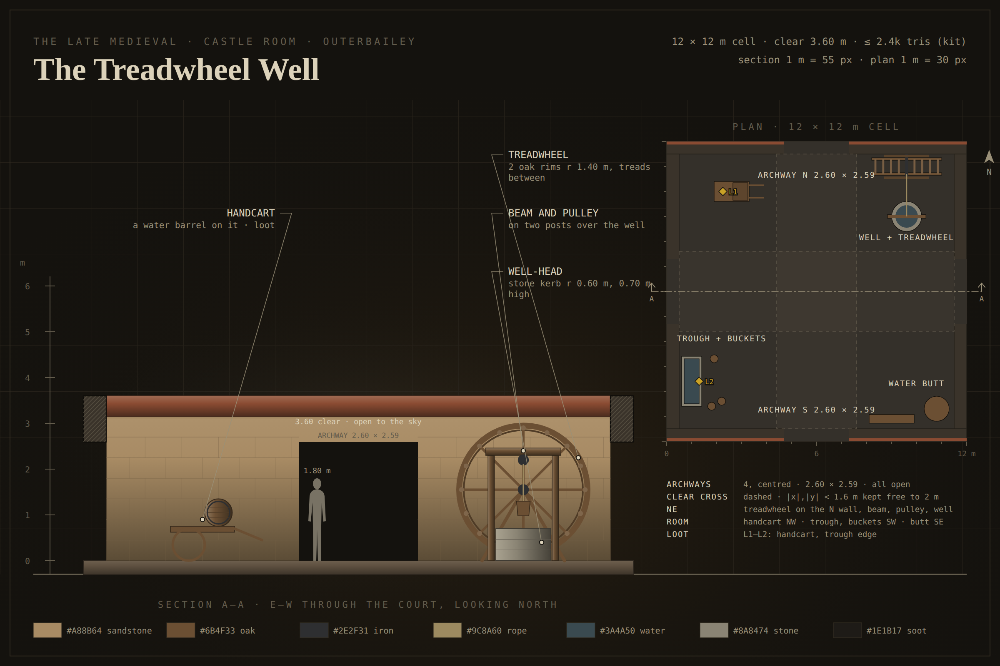

The castle's well is deep enough that a windlass will not do, so a man walks inside a wheel. The treadwheel stands against the north wall, two oak rims taller than a man joined by treads, turning on an iron axle between two A-frames; the rope it winds runs south over a pulley on a beam and drops to the bucket hanging above the stone well-head. Water goes into the trough along the west wall for the horses, into buckets for the kitchen, into the barrel on the handcart for anywhere further, and into the butt in the south-east corner for fire. In a siege this room decides how long the castle lasts.

**Where the kit differs from the art bible**

- The plan put the treadwheel along the east wall in the SE quadrant; it stands against the north wall in the NE, its plane east–west, so the section shows it face-on and the well sits in front of it.

**Build** (kit metres: x east, y north, from the cell centre; heights above ground, floor top at 0.30)

- Shell: the kit's OuterBailey shell, 12.0 × 12.0 × 0.30 m slab, 0.50 m dressed-sandstone walls 3.60 m clear, a 0.45 m brick trim course, an archway 2.60 × 2.59 m centred on every wall.
- Treadwheel (NE): two oak spoked rims r 1.40 m at y 4.70 and 5.30, centred x 3.60, axle at 1.85 m above ground, ten oak treads 0.12 × 0.66 m joining them; an iron axle r 0.08 m from y 4.50 to the north wall.
- A-frames: oak legs 0.10 m square, splayed 0.90 m east and west from the axle to the floor, at y 4.55 and 5.42.
- Well-head: a stone kerb r 0.60 m, 0.70 m high at (3.60, 3.00), dark water inside its rim.
- Beam and pulley: two oak posts 0.14 m square, 2.30 m, at x 2.90 and 4.30, y 3.00; an oak beam 1.64 m on them; an iron pulley r 0.12 m hanging under its middle.
- Rope and bucket: a rope from the pulley down to an oak bucket (r 0.15 m, 0.32 m) hanging over the kerb at 1.28–1.60 m above ground, and a rope from the pulley back to the axle.
- Handcart (NW): an oak bed 1.40 × 0.80 m, top 0.75 m above the floor, at (−3.40, 4.00), two spoked wheels r 0.35 m on an iron axle, two handles and two legs to the east; a water barrel r 0.30 m lying on its east half.
- Trough and buckets (SW): a stone trough 0.80 × 2.00 × 0.60 m along the west wall at y −3.60, water in it; three oak buckets beside it.
- Water butt and bench (SE): an oak butt r 0.50 m, 1.00 m, two iron hoops, at (4.80, −4.70); an oak bench 1.80 m at (3.00, −5.10).

**Sockets**

- Archway ×4, centred on each wall: 2.60 × 2.59 m (OuterBailey), all open
- Handcart bed: a loot anchor at 1.05 m
- Trough rim: a loot anchor at 0.90 m

**Loot anchors**

- L1: the handcart at (-3.75, 4.00, 1.05)
- L2: the trough's east rim at (-4.70, -3.60, 0.90)

**Materials** (art-pass colour, then the kit's atlas pigment)

| Material | Hex | Kit pigment | Notes |
|---|---|---|---|
| Dressed sandstone | `#A88B64` | `vellum_dim` | Walls. |
| Oak | `#6B4F33` | `oak` | Wheel, frames, posts, beam, cart, buckets, butt. |
| Blackened iron | `#2E2F31` | `iron` | Axles, pulley, hoops. |
| Stone | `#8A8474` | `vellum_faint` | Kerb and trough. |
| Water | `#3A4A50` | `verdigris_lo` | Well and trough. |
| Rope | `#9C8A60` | `leather` | The ropes. |

**In play**

- The treadwheel is a siege landmark: a thief can hide behind its rims against the north wall.
- The water butt SE is the castle's fire bucket store.
- Two loot anchors: the handcart and the trough.

## InnerWard

| Key | Room | Stands in for | |
|---|---|---|---|
| `LateCountingHouse` | [The Counting House](#latecountinghouse) | GuardRoomInner | The steward's office: a brick strong room with an iron-latticed door, a ledger case of four tiers, and a counting table under a chequered cloth with a balance and stacks of coin. |
| `LateArmouryHall` | [The Armoury Hall](#latearmouryhall) | ArmouredCourtyard | Four harnesses of plate on their stands under madder banners, racks of halberds and poleaxes, a grinding wheel, and the armourer's table. |
| `LateSpitKitchen` | [The Spit Kitchen](#latespitkitchen) | KitchenRoom | A hearth big enough to roast a boar on a long iron spit, a dresser of pewter, a chopping block, a work table, a flour bin and barrels. |
| `LateChantryChapel` | [The Chantry Chapel](#latechantrychapel) | ChapelRoom | A sandstone altar with a gilded triptych, the founder's tomb and alabaster effigy, a parclose screen closing off a private chantry, and a prie-dieu between candles. |
| `LateLibrary` | [The Library](#latelibrary) | GreatHallMain | Four tall presses of books against the north and south walls, a sloped lectern with a chained book in every quadrant, and a reading table by the east wall. |

### LateCountingHouse

**The Counting House** · InnerWard · stands in for GuardRoomInner · ≤ 2.4k tris (kit)

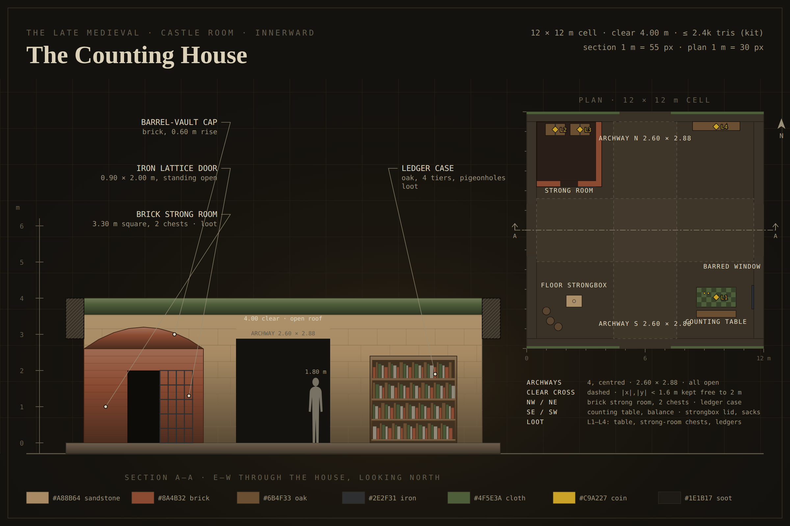

Every coin the estate takes in passes across the counting table, laid out in rows on the squares of a chequered wool cloth, weighed on the balance and written into the ledger by candlelight. The steward trusts none of it to the house. What has been counted goes into the brick strong room in the corner, fire-proof under its low vault, behind a door of iron lattice with three locks, and today, for once, the door is standing open. The ledger case on the north wall holds the record of every debt in the county, which is worth more to the right buyer than the gold. Under a flagstone in the south-west corner there is a strongbox the steward believes nobody knows about.

**Where the kit differs from the art bible**

- The art bible's floor strongbox is sunk 0.55 m into a pit; kit rooms keep one floor level, so it becomes a flat flagstone lid with an iron ring.
- The strong room's iron-latticed door stands open against its front, so the two chests inside are reachable (the kit has no door interaction).
- The art bible's single wall of ledger shelves and the table move into the kit's quadrants: strong room NW, ledger case NE, table SE, strongbox SW.

**Build** (kit metres: x east, y north, from the cell centre; heights above ground, floor top at 0.30)

- Shell: the kit's InnerWard shell, 12.0 × 12.0 × 0.30 m slab, 0.50 m dressed-sandstone walls 4.00 m clear, a 0.45 m verdure-green trim course, an archway 2.60 × 2.88 m centred on every wall.
- Strong room (NW): brick walls 0.30 m thick, 2.60 m tall on its south and east sides, enclosing x −5.50 … −2.20, y 2.20 … 5.50 against the room's north and west walls; a doorway 0.90 × 2.00 m in its south wall at x −4.30 … −3.40 under a brick lintel.
- Vault cap: a brick segmental barrel vault over the strong room, axis north–south, 0.60 m rise, from 2.90 to 3.50 m above ground.
- Lattice door: an iron grille 0.90 × 2.00 m (five uprights, six rails, 0.04 m bars) standing open flat against the strong room's front east of the doorway.
- Strong-room chests: two iron-bound oak chests 1.00 × 0.60 × 0.60 m inside against the north wall at x −4.55 and −3.30, y 5.10.
- Ledger case (NE): oak, 2.40 m wide, 0.45 m deep, 2.40 m tall against the north wall centred x 3.60: back, sides, top and four shelves; five ledgers on each shelf, the middle of each shelf left clear.
- Counting table (SE): oak 2.00 × 1.00 m, top 0.80 m at (3.60, −3.40), under a verdure-green cloth chequered in 0.25 m squares; a balance with two steel pans, three gilt coin stacks, an open ledger and a candle on it; an oak bench 2.00 m before it at y −4.25.
- Barred window: a framed embrasure panel 1.20 × 1.30 m on the east wall at y −3.40, from 1.60 m, four iron bars across it.
- Floor strongbox (SW): a flagstone lid 0.80 × 0.60 × 0.04 m at (−3.60, −3.60) with an iron ring; three leather coin sacks beside it.

**Sockets**

- Archway ×4, centred on each wall: 2.60 × 2.88 m (InnerWard), all open
- Strong room: doorway 0.90 × 2.00 m in its south face, the lattice door open
- Loot anchors: the counting table, both strong-room chests, the ledger case's third shelf

**Loot anchors**

- L1: the counting table at (3.60, -3.40, 1.12)
- L2: the strong room's west chest at (-4.55, 5.10, 0.95)
- L3: the strong room's east chest at (-3.30, 5.10, 0.95)
- L4: the ledger case, third shelf at (3.60, 5.25, 1.53)

**Materials** (art-pass colour, then the kit's atlas pigment)

| Material | Hex | Kit pigment | Notes |
|---|---|---|---|
| Dressed sandstone | `#A88B64` | `vellum_dim` | Walls; flagstones in vellum_faint. |
| Brick lining | `#8A4B32` | `leather` | The strong room and its vault, coin sacks. |
| Oak | `#6B4F33` | `oak` | Ledger case, table, bench, chests. |
| Blackened iron | `#2E2F31` | `line` | Lattice door, bars, balance, chest straps. |
| Counting cloth | `#4F5E3A` | `verdigris_lo` | The chequered cloth. |
| Coin | `#C9A227` | `orpiment` | The coin stacks. |

**In play**

- The strong room is a dead end with one door: the richest corner of the ward and the easiest place to be trapped.
- The ledgers are Banker's Ledger plunder: light, flammable, and worth a fortune to the right fence.
- Four loot anchors; the floor strongbox is scenery the steward thinks is secret.

### LateArmouryHall

**The Armoury Hall** · InnerWard · stands in for ArmouredCourtyard · ≤ 3.2k tris (kit)

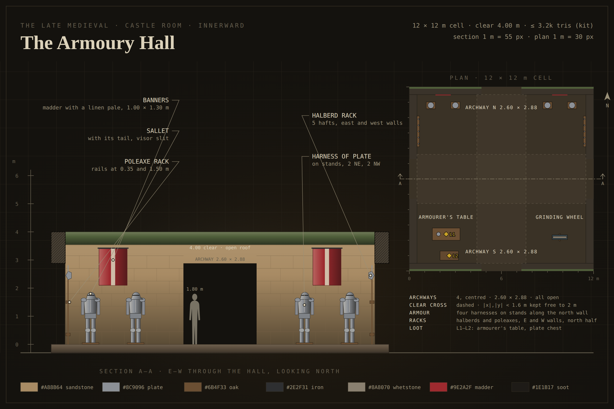

The household's armour stands along the north wall like a row of guests who have been told to wait: four full harnesses of Gothic plate on oak stands, each sallet's visor slit staring at the door, a madder banner over each pair. The racks on either side hold the halberds and poleaxes of the watch, hafts up, blades out. In the south the armourer works: a grinding wheel dips into its trough to keep the edges bright, and on his table a sallet waits for its lining next to a hammer and a pair of gauntlets. The chest against the south wall holds spare plates and straps. A harness is too heavy to carry off whole; a thief who takes a helm leaves a gap in the row the guards will notice.

**Build** (kit metres: x east, y north, from the cell centre; heights above ground, floor top at 0.30)

- Shell: the kit's InnerWard shell, 12.0 × 12.0 × 0.30 m slab, 0.50 m dressed-sandstone walls 4.00 m clear, a 0.45 m verdure-green trim course, an archway 2.60 × 2.88 m centred on every wall.
- Harnesses (NW, NE): four on oak stands 0.60 × 0.45 m at x −4.60 / −3.00 / 3.00 / 4.60, y 4.80: steel legs 0.86 m, faulds, a breastplate 0.52 m tapering to the shoulders, pauldrons, arms, and a sallet r 0.13 m with a visor slit; 1.93 m to the crown.
- Banners: two madder panels 1.00 × 1.30 m on the north wall centred x ±3.80, from 2.40 m, a linen pale 0.15 m down each, hung from iron rods.
- Harness construction: each part a primitive touching the next (legs into the faulds, faulds under the breastplate, pauldrons on its shoulders with the arms hanging from them, the sallet sitting on its top), so nothing floats.
- Racks (east and west walls): two oak rails 2.00 m long, 0.16 m deep at 0.35 and 1.50 m above the floor, centred y 3.10; five hafts 2.30 m in each at y 2.30 … 3.90, each with a steel blade 0.20 × 0.25 m and a spike to 2.95 m.
- Grinding wheel (SE): a whetstone r 0.45 m, 0.12 m thick, on an iron axle between two oak uprights 0.75 m at (3.80, −3.80), its rim dipping into an oak water trough 1.00 × 0.30 × 0.20 m; an iron crank.
- Armourer's table (SW): oak 1.80 × 0.80 m, top 0.85 m at (−3.60, −3.60): a steel sallet, a hammer, a pair of gauntlets.
- Plate chest: iron-bound oak 1.20 × 0.60 × 0.60 m against the south wall at (−3.40, −5.00).

**Sockets**

- Archway ×4, centred on each wall: 2.60 × 2.88 m (InnerWard), all open
- Armourer's table and plate chest: loot anchors
- Racks: ten hafts, the watch's weapons

**Loot anchors**

- L1: the armourer's table at (-3.60, -3.60, 1.15)
- L2: the plate chest at (-3.40, -5.00, 0.95)

**Materials** (art-pass colour, then the kit's atlas pigment)

| Material | Hex | Kit pigment | Notes |
|---|---|---|---|
| Dressed sandstone | `#A88B64` | `vellum_dim` | Walls. |
| Bright plate | `#8C9096` | `iron` | Harnesses, blades, the sallet. |
| Oak | `#6B4F33` | `oak` | Stands, racks, hafts, table, wheel frame. |
| Whetstone | `#8A8070` | `vellum_faint` | The grinding wheel. |
| Madder | `#9E2A2F` | `madder` | The banners. |
| Blackened iron | `#2E2F31` | `line` | Rods, axle, crank, hammer head, chest straps. |

**In play**

- The harnesses read as guards at a glance: a thief entering from the south door sees four armed men.
- The racks arm the watch: a halberdier who reaches this room comes back armed.
- Two loot anchors in the working corner; the parade armour is Late plunder the guards will miss.

### LateSpitKitchen

**The Spit Kitchen** · InnerWard · stands in for KitchenRoom · ≤ 2.4k tris (kit)

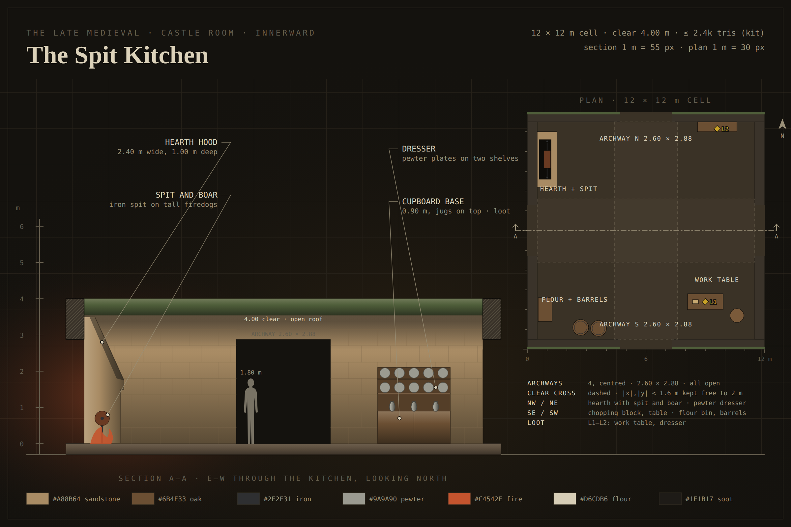

The kitchen is organised around its fire. The hearth on the west wall is two and a half metres across under a sandstone hood black to the ceiling, and across its mouth a long iron spit turns on two tall firedogs with a whole boar on it, basted by a boy who will be deaf by forty. The dresser on the north wall holds the household's pewter, plate by plate on its shelves, with jugs on the cupboard below. In the south the cooks work at a heavy table and a round chopping block scarred by a generation of cleavers; flour is kept in a lidded bin against the west wall, ale in the barrels beside it. Kitchens burn often, and this one has.

**Build** (kit metres: x east, y north, from the cell centre; heights above ground, floor top at 0.30)

- Shell: the kit's InnerWard shell, 12.0 × 12.0 × 0.30 m slab, 0.50 m dressed-sandstone walls 4.00 m clear, a 0.45 m verdure-green trim course, an archway 2.60 × 2.88 m centred on every wall.
- Hearth (NW): the Age's hooded hearth on the west wall centred y 3.60, 2.40 m wide, 1.00 m deep, a 1.50 m mouth, the hood to 3.80 m above ground; sooted back, firedogs, fire.
- Spit: two iron firedogs 0.06 m square, 0.78 m tall, at y 2.70 and 4.50 inside the mouth (x −5.00); an iron spit 2.10 m on them at 1.00 m above ground; a boar on it, a spheroid 0.40 × 0.88 × 0.40 m.
- Dresser (NE): oak cupboard base 2.00 × 0.50 × 0.90 m against the north wall centred x 3.60; a back board 2.00 × 1.20 m above it; two shelves 0.26 m deep at 1.70 and 2.10 m above ground, five pewter plates r 0.14 m standing on each; three pewter jugs on the base.
- Chopping block (SE): an oak round r 0.35 m, 0.80 m tall at (4.60, −4.30), a cleaver bedded in its top.
- Work table (SE): oak 1.80 × 0.80 m, top 0.85 m at (3.00, −3.60), two loaves and a cleaver on it.
- Flour bin (SW): oak 0.70 × 1.20 × 0.80 m against the west wall at y −4.00, a sloped lid rising 0.12 m to the wall.
- Barrels (SW): two upright oak barrels r 0.40 m, 0.90 m, two iron hoops each, at (−3.30, −4.90) and (−2.40, −4.95).

**Sockets**

- Archway ×4, centred on each wall: 2.60 × 2.88 m (InnerWard), all open
- Work table and dresser base: loot anchors
- Hearth: a fire source on the west wall

**Loot anchors**

- L1: the work table at (3.00, -3.60, 1.15)
- L2: the dresser's cupboard base at (3.60, 5.15, 1.20)

**Materials** (art-pass colour, then the kit's atlas pigment)

| Material | Hex | Kit pigment | Notes |
|---|---|---|---|
| Dressed sandstone | `#A88B64` | `vellum_dim` | Walls, hearth. |
| Oak | `#6B4F33` | `oak` | Dresser, table, block, bin, barrels. |
| Blackened iron | `#2E2F31` | `line` | Spit, firedogs, cleavers, hoops. |
| Pewter | `#9A9A90` | `iron` | Plates and jugs. |
| Roast | `#6A3A22` | `leather` | The boar. |
| Fire | `#C4542E` | `madder` | The hearth fire. |

**In play**

- The fire lights the whole west side; the east side is in its shadow.
- A kitchen fire spreads to the flour bin; flour dust is a Late Age hazard.
- Two loot anchors: the pewter is the kitchen's only portable value.

### LateChantryChapel

**The Chantry Chapel** · InnerWard · stands in for ChapelRoom · ≤ 2.4k tris (kit)

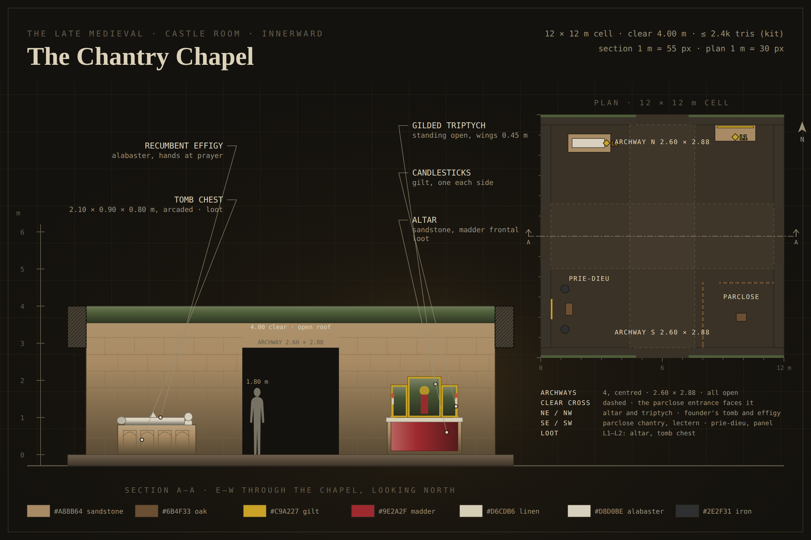

The family paid for this chapel so that a priest would say masses for the founder's soul until the end of the world, and the founder lies in it to make sure. His tomb chest stands in the north-west corner, arcaded sandstone under an alabaster effigy, hands joined in prayer, head on a cushion, feet on a small lion. On the altar across the room a gilded triptych stands open on a madder frontal between two gilt candlesticks. The south-east corner is closed off by a parclose screen of oak, a chantry within the chantry for the family's own prayers; a prie-dieu in the south-west faces a painted panel between two candles. The triptych is the richest thing in the ward that can be carried by one person, just.

**Build** (kit metres: x east, y north, from the cell centre; heights above ground, floor top at 0.30)

- Shell: the kit's InnerWard shell, 12.0 × 12.0 × 0.30 m slab, 0.50 m dressed-sandstone walls 4.00 m clear, a 0.45 m verdure-green trim course, an archway 2.60 × 2.88 m centred on every wall.
- Altar (NE): sandstone 2.00 × 0.80 × 1.00 m against the north wall at (3.60, 5.10), a madder frontal 1.80 × 0.78 m on its front, a linen cloth 0.02 m on top.
- Triptych: three gilt-framed panels standing open on the altar's back edge: the centre 0.90 × 1.10 m, the wings 0.45 × 0.88 m, painted green grounds, a madder figure in the centre.
- Candlesticks: two gilt, 0.35 m, at x 2.75 and 4.45 on the altar, candles and flames.
- Tomb chest (NW): sandstone 2.10 × 0.90 × 0.80 m at (−3.60, 4.60), long axis east–west, arcaded sides (albedo).
- Effigy: alabaster 1.60 × 0.45 × 0.20 m on the lid, a pillow 0.20 × 0.40 m and head r 0.11 m at the east end, hands at prayer, a lion under the feet at the west end.
- Parclose screen (SE): oak, 2.20 m tall: a north run from x 2.80 to the east wall at y −2.30 and a west run from y −2.30 to the south wall at x 2.00, each a solid dado 0.90 m under mullions at 0.30 m and a top rail; the gap x 2.00 … 2.80 on the north run is the entrance, facing the crossing.
- Lectern (inside the parclose): oak post 0.30 × 0.30 × 1.00 m with a sloped top at (3.90, −4.00).
- Prie-dieu (SW): oak 0.35 × 0.60 × 0.85 m at (−4.60, −3.60) facing west, a madder kneeler before it; a gilt-framed devotional panel 1.00 × 1.30 m on the west wall at y −3.60 from 1.50 m; iron candle stands at (−4.80, −2.60) and (−4.80, −4.60).

**Sockets**

- Archway ×4, centred on each wall: 2.60 × 2.88 m (InnerWard), all open
- Parclose entrance: 0.80 m, on its north run, facing the crossing
- Altar top and tomb chest: loot anchors

**Loot anchors**

- L1: the altar at (3.60, 4.90, 1.30)
- L2: the tomb chest, by the effigy's head at (-2.75, 4.60, 1.10)

**Materials** (art-pass colour, then the kit's atlas pigment)

| Material | Hex | Kit pigment | Notes |
|---|---|---|---|
| Dressed sandstone | `#A88B64` | `vellum_dim` | Walls, altar, tomb chest. |
| Oak | `#6B4F33` | `oak` | Parclose screen, lectern, prie-dieu. |
| Gilt | `#C9A227` | `orpiment` | Triptych frames, candlesticks, the panel's frame. |
| Madder | `#9E2A2F` | `madder` | Frontal, kneeler, flames. |
| Alabaster | `#D8D0BE` | `vellum` | The effigy. |
| Tapestry green | `#4F5E3A` | `verdigris_lo` | Painted panel grounds. |

**In play**

- The triptych is a heavy prize: gold, awkward, and visible from both east and north archways.
- The parclose is a room within the room: a thief inside is hidden to the waist and boxed in.
- Two loot anchors: altar and tomb.

### LateLibrary

**The Library** · InnerWard · stands in for GreatHallMain · ≤ 2.4k tris (kit)

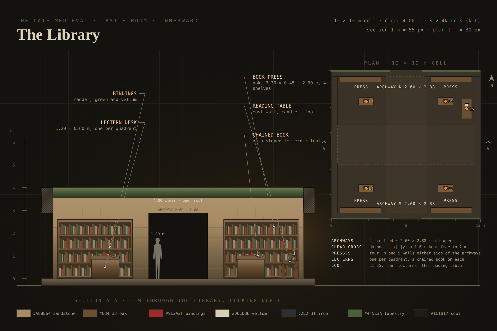

A Burgundian household measured itself in books as much as in plate, and this is where it keeps them: four oak presses, floor to well above head height, each shelf a run of bindings in madder, green and pale vellum. The best books are not on the shelves at all but chained to sloped lectern desks, one in each quadrant, open to be read standing and fixed so that they cannot walk. A reading table by the east wall holds a candle and whatever the chaplain was copying. The chains are iron and short; a thief with a file and five quiet minutes is richer than one with a sack.

**Build** (kit metres: x east, y north, from the cell centre; heights above ground, floor top at 0.30)

- Shell: the kit's InnerWard shell, 12.0 × 12.0 × 0.30 m slab, 0.50 m dressed-sandstone walls 4.00 m clear, a 0.45 m verdure-green trim course, an archway 2.60 × 2.88 m centred on every wall.
- Book presses: four, oak, 3.30 m wide (|x| 2.00 … 5.30), 0.45 m deep, 2.60 m tall, against the north and south walls either side of the archways: back, sides, a top, four shelves.
- Books: three runs of bindings on every shelf, each run 0.97 m long, 0.30 m deep, 0.30–0.40 m tall, 0.06 m apart, madder, green, vellum and oak in turn.
- Lectern desks: four, oak carcasses 1.20 × 0.60 × 0.85 m at (±3.20, ±3.50), sloped tops rising 0.15 m toward the press behind them.
- Chained books: a madder-bound book 0.40 × 0.30 m on each lectern, an iron chain 0.36 m from its edge to the desk.
- Reading table (NE): oak 0.80 × 1.60 m, top 0.80 m, against the east wall at (4.90, 2.90); a book open on it and an iron candlestick with a candle.
- The crossing: bare floor between all four archways.
- Walls: coursed ashlar joints (albedo); no hangings, the books are the decoration.

**Sockets**

- Archway ×4, centred on each wall: 2.60 × 2.88 m (InnerWard), all open
- Lecterns: four loot anchors, one per quadrant, at 1.25 m
- Reading table: a loot anchor at 1.10 m

**Loot anchors**

- L1: the NE lectern at (3.20, 3.50, 1.25)
- L2: the NW lectern at (-3.20, 3.50, 1.25)
- L3: the SE lectern at (3.20, -3.50, 1.25)
- L4: the SW lectern at (-3.20, -3.50, 1.25)
- L5: the reading table at (4.90, 2.90, 1.10)

**Materials** (art-pass colour, then the kit's atlas pigment)

| Material | Hex | Kit pigment | Notes |
|---|---|---|---|
| Dressed sandstone | `#A88B64` | `vellum_dim` | Walls. |
| Oak | `#6B4F33` | `oak` | Presses, lecterns, table, oak bindings. |
| Madder bindings | `#9E2A2F` | `madder` | Bindings, the candle flame. |
| Green bindings | `#4F5E3A` | `verdigris_lo` | Bindings. |
| Vellum | `#D6CDB6` | `vellum` | Pale bindings, open pages, candle. |
| Blackened iron | `#2E2F31` | `line` | Chains, candlestick. |

**In play**

- Five loot anchors, one in every quadrant: the room rewards a thief who clears it methodically.
- The presses are 2.60 m walls of fuel: a fire here is the Late ward's worst.
- Every lectern faces its press, so a reader has their back to the crossing.

## Keep

| Key | Room | Stands in for | |
|---|---|---|---|
| `LateGreatHall` | [The Great Hall](#lategreathall) | ThroneRoomKeep | The lord's hall: a high table on an oak dais under a cloth of estate, a verdure tapestry behind it, a hooded hearth, and the gilded nef on a side table. |
| `LateJewelHouse` | [The Jewel House](#latejewelhouse) | TreasuryVault | The household's plate on a stepped buffet, a strong cupboard behind an iron lattice, iron-bound chests against brick-lined walls, and a jeweller's casket. |
| `LateStateBedchamber` | [The State Bedchamber](#latestatebedchamber) | RoyalBedchamber | A tester bed hung in red under a gilt-fringed canopy, a chest at its foot, a prie-dieu before a verdure tapestry, and a small hearth. |
| `LateTapestrySolar` | [The Tapestry Solar](#latetapestrysolar) | LordsSolar | The lord's private room: a sloped writing desk under a shelf of books, a high-backed settle by the fire, a livery cupboard, and two verdure tapestries. |
| `LateTurretStair` | [The Turret Stair](#lateturretstair) | KeepStairwell | A sandstone stair turning up to an oak gallery with a keyhole gun-loop and an iron-bound chest; a rack of hand-cannon and a pavise below. |

### LateGreatHall

**The Great Hall** · Keep · stands in for ThroneRoomKeep · ≤ 2.4k tris (kit)

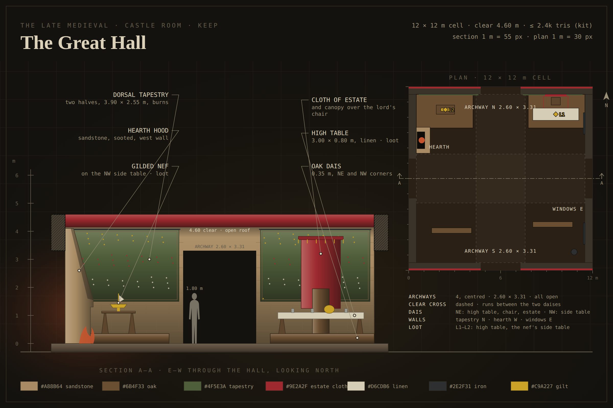

Everything in the great hall is arranged to be looked at from the door. The lord sits on a raised dais at a table under linen, his chair backed by a cloth of estate and roofed by a little canopy with a gilt fringe, and behind him hangs a dorsal tapestry of millefleurs, eight metres of green wool that took a workshop two years. On the other dais a side table holds the gilded nef, a golden ship that carries the lord's salt and knife and exists chiefly to be seen. The hearth on the west wall is big enough to stand in and has blackened its hood to the ceiling. The tapestry burns. The nef does not, and weighs about as much as a child.

**Where the kit differs from the art bible**

- The art bible's single dais and 8 m tapestry are split in two by the kit's clear cross: a dais in each north corner and the tapestry in halves either side of the north archway.
- The art bible's roof trusses, arch braces and candle wheel go: kit rooms are open-roofed and nothing hangs from a ceiling.
- The hearth sits on the west wall just south of the NW dais (the art bible's plan puts it further south).

**Build** (kit metres: x east, y north, from the cell centre; heights above ground, floor top at 0.30)

- Shell: the kit's Keep shell, 12.0 × 12.0 × 0.30 m slab, 0.50 m dressed-sandstone walls 4.60 m clear, a 0.45 m madder trim course, an archway 2.60 × 3.31 m centred on every wall.
- Daises: oak platforms 0.35 m high in the NW and NE corners, each x ±1.80 … ±5.50, y 3.30 … 5.50; tops at 0.65 m.
- Dorsal tapestry: two verdure wool panels 3.90 × 2.55 m on the north wall centred at x ±3.40, 0.04 m thick, from 1.80 to 4.35 m above ground.
- High table (NE dais): oak, 3.00 × 0.80 m, top 0.75 m above the dais (1.40 m) at (3.60, 4.20), a linen cloth 0.02 m on it; three pewter cups and a gilt salt.
- Lord's chair: oak seat block 0.60 × 0.50 × 0.45 m at (3.60, 5.05) with a back 1.60 m high.
- Cloth of estate: a madder panel 1.40 m wide on the north wall behind the chair, from 1.55 m to 4.00 m, 0.04 m proud of the tapestry; a canopy 1.60 × 0.90 × 0.12 m over it at 4.00 m with a gilt fringe strip along its front.
- Side table (NW dais): oak 1.20 × 0.60 m, top 0.80 m above the dais at (−3.60, 4.50); the gilded nef on it, a hull 0.60 m long, 0.28 m wide, 0.13 m high with a mast and a linen sail.
- Hearth (west wall, centred y 2.50): sandstone jambs 0.18 × 0.90 × 1.30 m either side of a 0.94 m opening, a mantel 1.00 × 1.50 × 0.25 m, and a hood tapering from the mantel back to the wall at 4.40 m; a sooted back panel, two iron firedogs and a fire.
- Windows (east wall): two framed embrasure panels 1.40 × 1.60 m at y ±3.60, from 1.90 m, dark glass in a sandstone frame.
- Benches and light: oak benches 2.60 × 0.35 m at (3.40, −3.00) and (−3.20, −3.40); an iron pricket candle stand 1.50 m in the SE corner (4.80, −4.80).

**Sockets**

- Archway ×4, centred on each wall: 2.60 × 3.31 m (Keep), all open
- High table top: loot anchor at 1.40 m
- Side table top (the nef): loot anchor at 1.45 m

**Loot anchors**

- L1: the high table at (3.60, 4.20, 1.40)
- L2: the side table with the nef at (-3.60, 4.50, 1.45)

**Materials** (art-pass colour, then the kit's atlas pigment)

| Material | Hex | Kit pigment | Notes |
|---|---|---|---|
| Dressed sandstone | `#A88B64` | `vellum_dim` | Walls and the hearth. |
| Oak | `#6B4F33` | `oak` | Daises, tables, chair, benches. |
| Tapestry wool | `#4F5E3A` | `verdigris_lo` | The dorsal tapestry. |
| Cloth of estate | `#9E2A2F` | `madder` | The estate cloth, canopy and the fire. |
| Linen | `#D6CDB6` | `vellum` | Table cloth, sail, candle. |
| Gilt | `#C9A227` | `orpiment` | The nef, the salt, the canopy fringe. |
| Blackened iron | `#2E2F31` | `line` | Firedogs, candle stand, window glass. |

**In play**

- The Late keep's showpiece: the nef is headline loot and sits in full view of the south door.
- The daises put the high table 0.35 m up: guards on it see over the benches.
- The tapestry and the cloth of estate burn; a fire here fills the hall with smoke.

### LateJewelHouse

**The Jewel House** · Keep · stands in for TreasuryVault · ≤ 2k tris (kit)

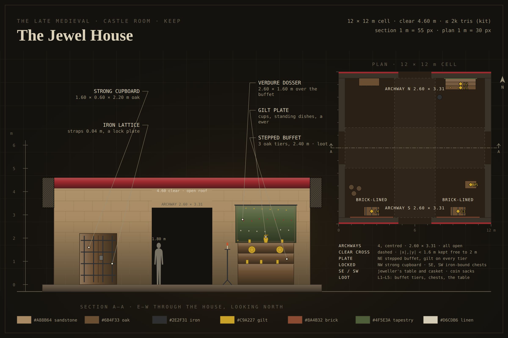

A Burgundian lord kept his wealth where it could be admired and counted. On the stepped buffet against the north wall the gilt plate stands tier above tier under a green dosser: cups, standing dishes, a ewer, everything the household would bring out for a feast and then carry back here under guard. The strong cupboard beside it is oak behind a lattice of iron straps with a lock the size of a hand. To the south the walls are lined in brick, the century's new fire-proof material, and the chests in front of them are bound in iron; a jeweller's table holds a casket, and sacks of coin sit on the floor as if nobody had got round to counting them. Somebody has.

**Build** (kit metres: x east, y north, from the cell centre; heights above ground, floor top at 0.30)

- Shell: the kit's Keep shell, 12.0 × 12.0 × 0.30 m slab, 0.50 m dressed-sandstone walls 4.60 m clear, a 0.45 m madder trim course, an archway 2.60 × 3.31 m centred on every wall.
- Stepped buffet (NE): three oak tiers 2.40 m wide against the north wall, centred x 3.60: 0.90 deep × 0.90 m, then 0.60 deep × 0.45 m, then 0.30 deep × 0.45 m; tier tops at 1.20 / 1.65 / 2.10 m.
- Plate: three gilt cups on the first tier, two gilt dishes 0.30 m standing on edge on the second, a gilt ewer 0.34 m and two cups on the third.
- Dosser: a verdure wool panel 2.60 × 1.60 m on the north wall above the buffet, from 2.10 m.
- Strong cupboard (NW): oak 1.60 × 0.60 × 2.20 m against the north wall at x −3.60; four vertical and four horizontal iron straps 0.04 m over its doors, a steel lock plate.
- Brick lining (south wall): two brick panels 3.40 × 2.40 m, centred x ±3.60, 0.04 m thick.
- Iron-bound chests: oak 1.20 × 0.70 × 0.70 m at (±3.40, −5.00), an iron lid band and three iron straps over each.
- Jeweller's table (SE): oak 0.90 × 0.60 m, top 0.80 m at (4.40, −2.90); a casket 0.30 × 0.20 × 0.20 m with a gilt lid on its east half.
- Coin sacks (SW): three leather sacks 0.35–0.44 m tall at (−4.80, −3.60), (−4.40, −3.20), (−5.00, −3.10).
- Light: an iron pricket candle stand 1.50 m at (1.95, 4.00), by the buffet.

**Sockets**

- Archway ×4, centred on each wall: 2.60 × 3.31 m (Keep), all open
- Buffet tiers: loot anchors on the first (1.20 m) and second (1.65 m) tiers
- Chest lids and the jeweller's table: loot anchors

**Loot anchors**

- L1: the buffet's first tier at (3.60, 4.75, 1.20)
- L2: the buffet's second tier at (3.60, 5.05, 1.65)
- L3: the SE iron-bound chest at (3.40, -5.00, 1.05)
- L4: the SW iron-bound chest at (-3.40, -5.00, 1.05)
- L5: the jeweller's table at (4.40, -2.90, 1.10)

**Materials** (art-pass colour, then the kit's atlas pigment)

| Material | Hex | Kit pigment | Notes |
|---|---|---|---|
| Dressed sandstone | `#A88B64` | `vellum_dim` | Walls. |
| Oak | `#6B4F33` | `oak` | Buffet, cupboard, chests, table. |
| Blackened iron | `#2E2F31` | `line` | Lattice, straps, candle stand. |
| Gilt | `#C9A227` | `orpiment` | The plate and the casket lid. |
| Brick lining | `#8A4B32` | `leather` | The south wall panels, coin sacks. |
| Tapestry wool | `#4F5E3A` | `verdigris_lo` | The dosser. |

**In play**

- Five loot anchors: the richest Late keep room, plate in full view on the buffet.
- The strong cupboard is scenery with a lock on it: it promises more than it holds.
- The chests sit against the south wall, so a thief looting them has their back to the north archway.

### LateStateBedchamber

**The State Bedchamber** · Keep · stands in for RoyalBedchamber · ≤ 2k tris (kit)

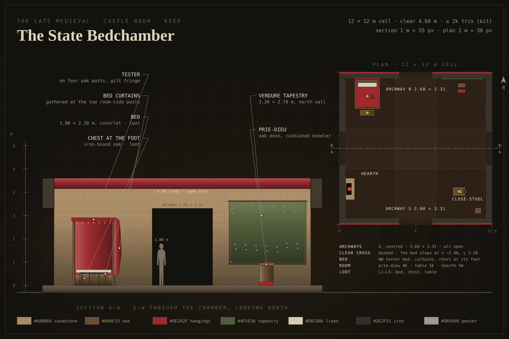

The state bed is as much a throne as a bed: a box of oak raised under a tester on four posts, hung in madder cloth with a gilt fringe, the curtains gathered back on the side that faces the room so visitors can see who lies in it. The lord received petitions here as readily as in the hall. A chest at the foot holds the bed's own hangings, which are worth more than most houses, and across the room a prie-dieu stands before a verdure tapestry where he pretends to pray. A small hearth warms the south-west corner; a table carries the ewer and basin, and the close-stool in the corner is exactly what it looks like.

**Build** (kit metres: x east, y north, from the cell centre; heights above ground, floor top at 0.30)

- Shell: the kit's Keep shell, 12.0 × 12.0 × 0.30 m slab, 0.50 m dressed-sandstone walls 4.60 m clear, a 0.45 m madder trim course, an archway 2.60 × 3.31 m centred on every wall.
- Bed (NW): oak box 1.80 × 2.20 × 0.45 m at (−3.80, 4.30), head to the north wall (x −4.70 … −2.90, y 3.20 … 5.40); a madder coverlet 0.10 m and a linen bolster 1.50 × 0.35 m on it.
- Posts and tester: four oak posts 0.12 m square, 2.75 m tall, at the bed's corners; a madder tester 1.90 × 2.30 × 0.15 m on them.
- Dosser: a madder panel 1.80 m wide on the north wall behind the head, from 0.75 to 3.05 m.
- Curtains: two madder panels 0.60 × 2.25 m, 0.06 m thick, gathered at the room-side (east) posts, hanging from the tester to 0.50 m above the floor.
- Chest at the foot: iron-bound oak 1.20 × 0.50 × 0.55 m at (−3.80, 2.80).
- Tapestry and prie-dieu (NE): a verdure panel 3.30 × 2.70 m on the north wall from 1.20 m; an oak prie-dieu 0.60 × 0.35 × 0.85 m with a sloped top at (3.60, 4.95) and a madder kneeler before it.
- Table (SE): oak 1.00 × 0.70 m, top 0.75 m at (3.40, −3.40), a pewter basin and ewer on it; an oak close-stool 0.50 × 0.45 × 0.45 m with a madder cushion at (4.90, −4.90).
- Hearth (SW): the Age's hooded hearth on the west wall at y −3.20, 1.30 m wide, 0.70 m deep, hood to 3.90 m.
- Window: a framed embrasure panel 1.40 × 1.60 m on the east wall at y 3.00, from 1.70 m.

**Sockets**

- Archway ×4, centred on each wall: 2.60 × 3.31 m (Keep), all open
- Bed: loot anchor on the coverlet at 0.85 m
- Chest lid and table top: loot anchors

**Loot anchors**

- L1: the bed at (-3.80, 4.10, 0.85)
- L2: the chest at the bed's foot at (-3.80, 2.80, 0.90)
- L3: the SE table at (3.40, -3.40, 1.05)

**Materials** (art-pass colour, then the kit's atlas pigment)

| Material | Hex | Kit pigment | Notes |
|---|---|---|---|
| Dressed sandstone | `#A88B64` | `vellum_dim` | Walls, hearth. |
| Oak | `#6B4F33` | `oak` | Bed, posts, chest, prie-dieu, table. |
| Madder hangings | `#9E2A2F` | `madder` | Tester, curtains, coverlet, dosser, kneeler. |
| Tapestry wool | `#4F5E3A` | `verdigris_lo` | The NE tapestry. |
| Linen | `#D6CDB6` | `vellum` | The bolster. |
| Pewter | `#9A9A90` | `iron` | Ewer and basin. |

**In play**

- The bed's hangings and the tapestry burn; the curtains hide whoever is standing behind the bed.
- Three loot anchors on the west and south-east sides; the NE corner is scenery.
- The prie-dieu is where the Gothic Man-at-Arms stops on his round.

### LateTapestrySolar

**The Tapestry Solar** · Keep · stands in for LordsSolar · ≤ 2k tris (kit)

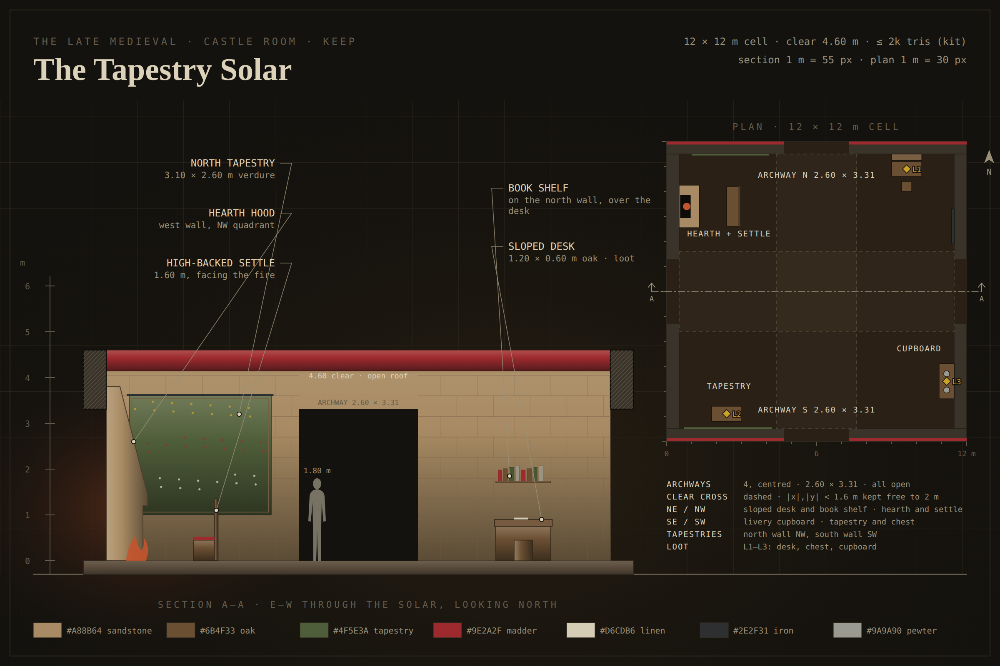

Above the noise of the hall the lord keeps a room of his own. He writes at a sloped oak desk under a shelf of books that he has mostly read, and when he stops he sits in a high-backed settle with its back to the draught and its front to the fire. Two verdure tapestries warm the walls, green wool thick enough to stop a draught and valuable enough to be rolled up and carried out when the household moves. The livery cupboard holds the evening's wine and a pewter flagon; the iron-bound chest under the south tapestry holds the letters he would rather nobody read.

**Build** (kit metres: x east, y north, from the cell centre; heights above ground, floor top at 0.30)

- Shell: the kit's Keep shell, 12.0 × 12.0 × 0.30 m slab, 0.50 m dressed-sandstone walls 4.60 m clear, a 0.45 m madder trim course, an archway 2.60 × 3.31 m centred on every wall.
- Desk (NE): oak carcass 1.20 × 0.60 × 0.75 m at (3.60, 4.90) with a sloped top rising 0.15 m to the north; a linen sheet on it; an oak stool 0.40 m square, 0.45 m tall, at (3.60, 4.20).
- Book shelf: an oak board 1.20 × 0.25 m on the north wall over the desk at 2.00 m, eight books 0.07–0.11 m wide, 0.04 m apart, 0.24–0.33 m tall on it.
- North tapestry (NW): a verdure panel 3.10 × 2.60 m on the north wall centred x −3.45, from 1.30 m.
- Hearth (NW): the Age's hooded hearth on the west wall at y 3.40, 1.30 m wide, 0.80 m deep, 1.20 m mouth, hood to 4.10 m.
- Settle: oak seat 0.50 × 1.60 × 0.45 m at (−3.35, 3.40) facing the hearth, a back 1.35 m high on its east side, a madder cushion.
- Livery cupboard (SE): oak 0.60 × 1.40 × 1.30 m against the east wall at y −3.60, two iron hinge straps, a pewter flagon and dish on top.
- South tapestry (SW): a verdure panel 3.50 × 2.80 m on the south wall centred x −3.55, from 1.10 m; an iron-bound oak chest 1.20 × 0.60 × 0.60 m before it at (−3.60, −4.90).
- Window: a framed embrasure panel 1.40 × 1.60 m on the east wall at y 2.60, from 1.70 m.

**Sockets**

- Archway ×4, centred on each wall: 2.60 × 3.31 m (Keep), all open
- Desk top: loot anchor at 1.13 m
- Chest lid and cupboard top: loot anchors

**Loot anchors**

- L1: the sloped desk at (3.60, 4.90, 1.13)
- L2: the chest under the south tapestry at (-3.60, -4.90, 0.95)
- L3: the livery cupboard at (5.20, -3.60, 1.60)

**Materials** (art-pass colour, then the kit's atlas pigment)

| Material | Hex | Kit pigment | Notes |
|---|---|---|---|
| Dressed sandstone | `#A88B64` | `vellum_dim` | Walls, hearth. |
| Oak | `#6B4F33` | `oak` | Desk, shelf, settle, cupboard, chest. |
| Tapestry wool | `#4F5E3A` | `verdigris_lo` | Two tapestries. |
| Madder | `#9E2A2F` | `madder` | Cushion, book covers, the fire. |
| Pewter | `#9A9A90` | `iron` | Flagon and dish. |
| Blackened iron | `#2E2F31` | `line` | Hinges, chest straps, window. |

**In play**

- Both tapestries are rolled-tapestry plunder in waiting: big, light, burnable.
- The settle's high back hides a crouching thief from the east archway.
- Three loot anchors in three corners.

### LateTurretStair

**The Turret Stair** · Keep · stands in for KeepStairwell · ≤ 2k tris (kit)

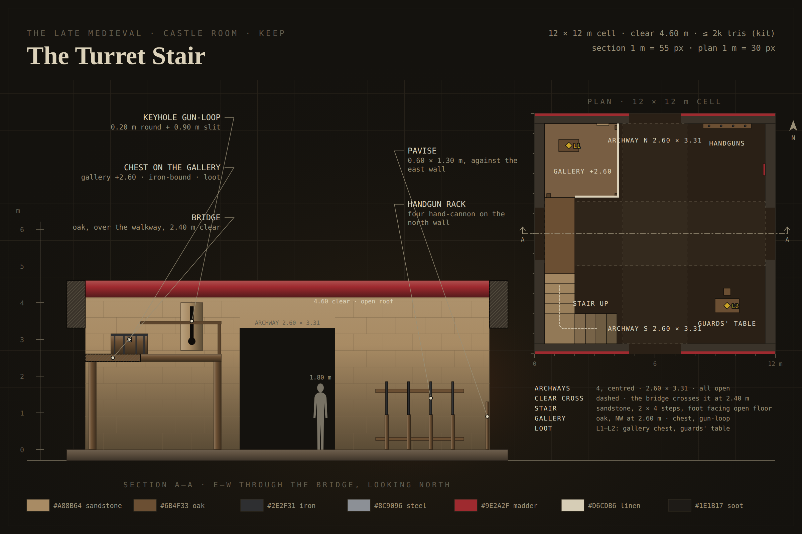

The keep's stair turns a corner on a landing and climbs to an oak gallery that bridges the passage, where a handgunner can kneel at a keyhole loop cut through the north wall. The chest on the gallery holds his powder and shot and, because nobody below can see into it, whatever else the garrison would rather keep off the books. Under the gallery's far side the guards keep their hand-cannon in a rack on the wall, a painted pavise stood against the east wall for the next sally, and a table where they play dice by lantern light and listen for the stair.

**Build** (kit metres: x east, y north, from the cell centre; heights above ground, floor top at 0.30)

- Shell: the kit's Keep shell, 12.0 × 12.0 × 0.30 m slab, 0.50 m dressed-sandstone walls 4.60 m clear, a 0.45 m madder trim course, an archway 2.60 × 3.31 m centred on every wall.
- Stair: the kit's L-stair in dressed sandstone: four steps 1.50 m wide west along the south wall from x −1.90 to the corner landing (1.50 m square at 1.30 m), four steps north along the west wall to the bridge; rises 0.325 m.
- Bridge and gallery: oak, 0.20 m thick at 2.60 m (top 2.90 m above ground): the bridge 1.50 m wide over the east–west walkway, the gallery filling the NW quadrant (x −5.50 … −1.80, y 1.80 … 5.50), three oak posts 0.20 m square under it, oak rails 0.90 m on its east and south edges.
- Chest on the gallery: iron-bound oak 1.00 × 0.60 × 0.55 m at (−4.30, 4.40).
- Gun-loop: a dressed surround 0.60 × 1.30 m on the north wall at x −2.60 from the gallery deck (3.00 m), a soot slit 0.10 × 0.90 m and a round 0.20 m hole under it.
- Handgun rack (NE): two oak rails 2.40 m on the north wall at 0.59 and 1.90 m above ground, centred x 3.60; four hand-cannon at x 2.70 / 3.30 / 3.90 / 4.50, oak stocks 0.95 m standing on the floor, iron barrels 0.90 m above them.
- Pavise: oak 0.08 × 0.60 × 1.30 m stood against the east wall at y 3.20, a madder painted face 0.50 × 1.10 m.
- Guards' table (SE): oak 1.20 × 0.70 m, top 0.75 m at (3.60, −3.60), a steel lantern 0.16 × 0.16 × 0.22 m with a lit madder window, two dice; an oak stool 0.35 m at (3.60, −2.90).

**Sockets**

- Archway ×4, centred on each wall: 2.60 × 3.31 m (Keep), all open
- Gallery: 2.60 m above the floor, reached by the stair, its bridge 2.40 m over the walkway
- Gallery chest and guards' table: loot anchors

**Loot anchors**

- L1: the chest on the gallery at (-4.30, 4.40, 3.50)
- L2: the guards' table at (3.60, -3.60, 1.05)

**Materials** (art-pass colour, then the kit's atlas pigment)

| Material | Hex | Kit pigment | Notes |
|---|---|---|---|
| Dressed sandstone | `#A88B64` | `vellum_dim` | Walls and stair flights. |
| Oak | `#6B4F33` | `oak` | Bridge, gallery, rails, rack, pavise, table. |
| Blackened iron | `#2E2F31` | `line` | Gun barrels, chest straps. |
| Steel | `#8C9096` | `iron` | The lantern. |
| Madder | `#9E2A2F` | `madder` | The pavise face, the lantern's light. |
| Soot | `#1E1B17` | `bone_black` | The gun-loop. |

**In play**

- The gallery is a handgunner's post over both the passage and the stair's foot.
- The hand-cannon on the rack are the Late Age's first guns: a thief who takes one leaves the guards short.
- Two loot anchors, one up the stair and one by the guards.

## Crypt

| Key | Room | Stands in for | |
|---|---|---|---|
| `LateUndercroft` | [The Undercroft](#lateundercroft) | CryptAntechamber | A low vaulted cellar on four squat octagonal piers, its great wine casks lying on cradles along the east and west walls. |
| `LateOubliette` | [The Oubliette](#lateoubliette) | TombCorridor | Four barred cells behind stone partitions, stocks, shackles on the wall, and an iron grate over the pit where the castle forgets people. |
| `LateCharnelHouse` | [The Charnel House](#latecharnelhouse) | BurialVault | Four oak ossuary racks of stacked long bones and rows of skulls, a small altar with a candle, and the charnel cart that brings more. |
| `LateEffigyCrypt` | [The Effigy Crypt](#lateeffigycrypt) | CryptChamberFinal | The founder's arcaded tomb chest with a gilded effigy under a four-post canopy, a candle hearse burning before it, and three lesser tombs with brass plates. |
| `LateUndercroftStair` | [The Undercroft Stair](#lateundercroftstair) | CryptStairwell | Four sandstone steps to a dais where the great tun lies on its cradles, casks along the north wall, and the butler's table with its lantern and tally sticks. |

### LateUndercroft

**The Undercroft** · Crypt · stands in for CryptAntechamber · ≤ 2.4k tris (kit)

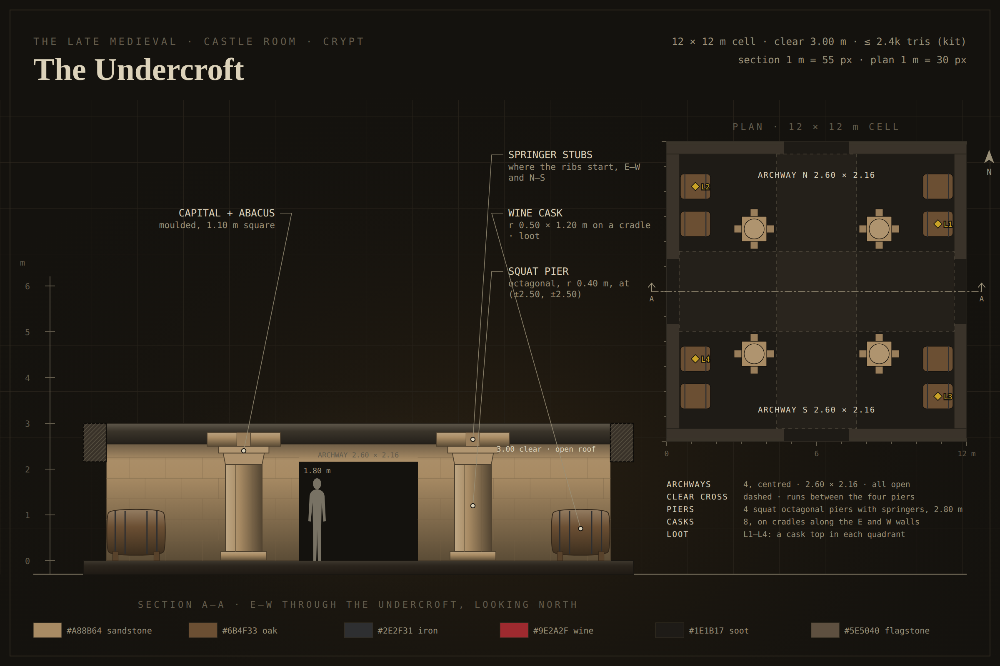

Below the hall the castle keeps its wine, in a cellar built to carry the weight of everything above it. Four squat piers hold up the vault, octagonal shafts on square bases with moulded capitals and the stubs of the ribs springing off them in four directions. Between them the floor is flagged and clear from door to door; along the side walls the great casks lie on their cradles with their heads to the room, two to a corner, each the size of a small cart. The butler's men come down with jugs; the cellar is cool, dark and almost always empty.

**Build** (kit metres: x east, y north, from the cell centre; heights above ground, floor top at 0.30)

- Shell: the kit's Crypt shell, 12.0 × 12.0 × 0.30 m slab, 0.50 m dressed-sandstone walls 3.00 m clear, a 0.45 m dark trim course, an archway 2.60 × 2.16 m centred on every wall.
- Piers: four at (±2.50, ±2.50): a sandstone base 1.00 m square, 0.20 m; an octagonal shaft r 0.40 m to 2.10 m above the floor; a moulded capital flaring to r 0.60 m, 2.10–2.35 m; an abacus 1.10 m square, 2.35–2.50 m.
- Springers: on each abacus two crossing rib stubs, 1.60 × 0.30 × 0.30 m east–west and 0.32 × 1.60 × 0.28 m north–south, to 2.80 m; the vault they would carry is left open.
- Casks: eight, r 0.50 m, 1.20 m long, lying east–west against the east and west walls (x ±4.25 … ±5.45) at |y| 2.70 and 4.20, heads to the room.
- Cradles: two oak blocks 0.12 × 0.90 × 0.20 m under each cask; two iron hoops per cask.
- Cask tops: 1.45 m above ground.
- The crossing: bare flagged floor between the piers and all four archways.
- Walls: coursed ashlar joints (albedo), soot darkening down from the top.

**Sockets**

- Archway ×4, centred on each wall: 2.60 × 2.16 m (Crypt), all open
- Cask tops: four loot anchors, one per quadrant, at 1.45 m
- Piers: cover at (±2.50, ±2.50)

**Loot anchors**

- L1: the NE cask nearer the crossing at (4.85, 2.70, 1.45)
- L2: the NW cask by the north wall at (-4.85, 4.20, 1.45)
- L3: the SE cask by the south wall at (4.85, -4.20, 1.45)
- L4: the SW cask nearer the crossing at (-4.85, -2.70, 1.45)

**Materials** (art-pass colour, then the kit's atlas pigment)

| Material | Hex | Kit pigment | Notes |
|---|---|---|---|
| Dressed sandstone | `#A88B64` | `vellum_dim` | Walls, piers, springers. |
| Abacus stone | `#635C4C` | `vellum_faint` | The abaci. |
| Oak | `#6B4F33` | `oak` | Casks and cradles. |
| Blackened iron | `#2E2F31` | `line` | Hoops. |
| Floor | `#1E1B17` | `bone_black` | The Crypt floor. |

**In play**

- The four piers break every sightline: the undercroft is the Late crypt's hiding room.
- The casks are waist-high cover along both side walls.
- Four loot anchors, one per quadrant.

### LateOubliette

**The Oubliette** · Crypt · stands in for TombCorridor · ≤ 2.4k tris (kit)

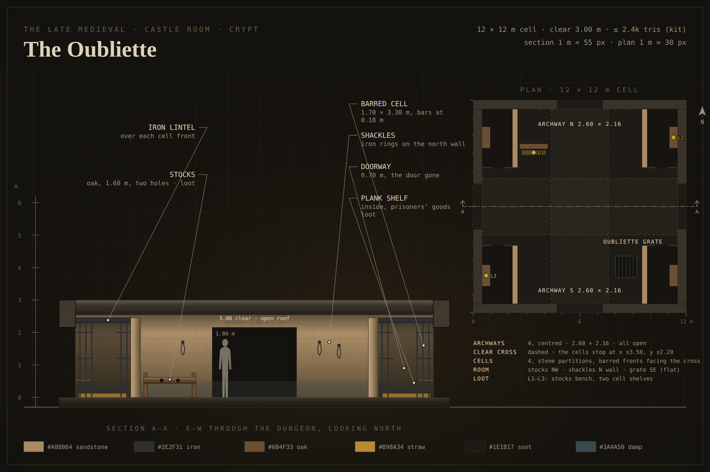

The castle's prison is kept below the undercroft where the damp climbs the walls. Four cells take the corners, each a stone-walled pen with a barred front facing the passage and a doorway whose door went for firewood long ago; straw on the floor and a plank shelf where the prisoner keeps whatever the guards let him keep. The stocks stand in front of one cell for the petty offenders, and iron shackles hang from the north wall for the ones who need persuading. The oubliette itself is only a grate in the floor of the south-east corner: the name means 'place of forgetting', and under the grate is a shaft with no stair.

**Build** (kit metres: x east, y north, from the cell centre; heights above ground, floor top at 0.30)

- Shell: the kit's Crypt shell, 12.0 × 12.0 × 0.30 m slab, 0.50 m dressed-sandstone walls 3.00 m clear, a 0.45 m dark trim course, an archway 2.60 × 2.16 m centred on every wall.
- Cells: four, one per quadrant, from x ±3.50 to the east or west wall and from |y| 2.20 to the north or south wall.
- Partitions: sandstone 0.30 m thick on each cell's inner side (x ±3.50 … ±3.80), 2.45 m tall, running back from the front to the wall.
- Barred fronts: at |y| 2.20 facing the crossing, from the partition to the wall: iron bars 0.04 m square at 0.18 m, 2.30 m tall, three iron rails at 0.30 / 1.20 / 2.00 m, an iron lintel 0.10 × 0.15 m on top; a 0.70 m doorway at |x| 4.25 … 4.95, its door gone.
- Inside each cell: a straw bed 0.12 m on the floor and an oak plank shelf 0.45 × 1.20 m against the outer wall at |y| 3.90, top 0.85 m above ground.
- Stocks (NW, before the cell): two oak posts 0.12 m square, 0.75 m, and a board 1.60 × 0.12 × 0.20 m at 0.72–0.92 m above ground, two dark holes; a kit bench 1.40 × 0.30 m for the prisoner behind it, seat at 0.74 m.
- Shackles: three iron wall plates with a short chain each on the north wall at x 2.00, 2.60 and −2.20.
- Oubliette grate (SE): a dark slab 1.20 m square, 0.03 m, at (2.60, −3.40), five iron bars across it; flat and walkable (0.06 m).

**Sockets**

- Archway ×4, centred on each wall: 2.60 × 2.16 m (Crypt), all open
- Cell doorways: 0.70 m in each barred front, facing the crossing
- Loot anchors: the stocks bench, the NE and SW cell shelves

**Loot anchors**

- L1: the stocks bench at (-2.60, 3.05, 0.74)
- L2: the NE cell's shelf at (5.28, 3.90, 0.85)
- L3: the SW cell's shelf at (-5.28, -3.90, 0.85)

**Materials** (art-pass colour, then the kit's atlas pigment)

| Material | Hex | Kit pigment | Notes |
|---|---|---|---|
| Dressed sandstone | `#A88B64` | `vellum_dim` | Walls and partitions. |
| Blackened iron | `#2E2F31` | `line` | Bars, rails, lintels, shackles, grate bars. |
| Oak | `#6B4F33` | `oak` | Shelves, stocks, bench. |
| Straw | `#B98A34` | `bronze` | The cell floors. |
| Soot | `#1E1B17` | `bone_black` | The grate's shaft, the stocks' holes. |

**In play**

- Each cell is a dead end with one 0.70 m doorway: a thief looting a shelf is trapped by a guard in the door.
- The barred fronts are see-through cover: a guard in the passage sees into every cell.
- Three loot anchors; the grate is scenery, flat and walkable.

### LateCharnelHouse

**The Charnel House** · Crypt · stands in for BurialVault · ≤ 5k tris (kit)

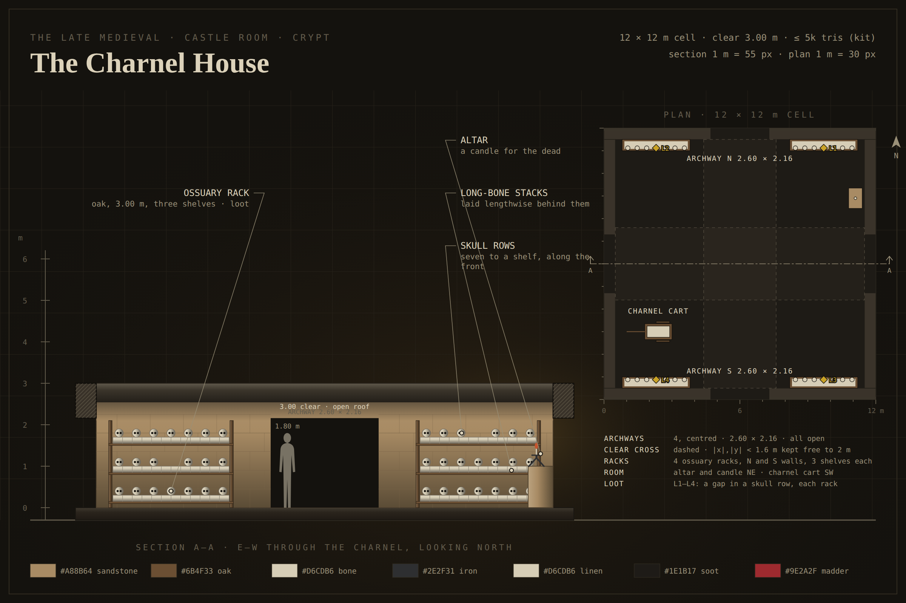

When the churchyard fills, the old graves are dug up and the bones come here. They are stacked with a clerk's tidiness: long bones laid lengthwise on the shelves of four oak racks, a row of skulls along the front of each shelf looking out at the room. A small altar against the east wall keeps a candle burning for all of them at once. The charnel cart in the south-west corner is loaded for the next shelf. The dead were buried with rings and the diggers were not always thorough, so here and there a gap in a skull row holds something small and bright that a relative left, or a digger hid.

**Build** (kit metres: x east, y north, from the cell centre; heights above ground, floor top at 0.30)

- Shell: the kit's Crypt shell, 12.0 × 12.0 × 0.30 m slab, 0.50 m dressed-sandstone walls 3.00 m clear, a 0.45 m dark trim course, an archway 2.60 × 2.16 m centred on every wall.
- Racks: four oak ossuary racks 3.00 m long (|x| 2.20 … 5.20), 0.50 m deep against the north and south walls, 2.10 m tall: two end posts and three shelves 0.05 m at 0.10, 0.80 and 1.50 m above the floor.
- Bone stacks: on every shelf a stack of long bones 2.70 × 0.34 × 0.15 m laid lengthwise at the back.
- Skulls: seven to a shelf along the front edge on top of the stack, each an eight-sided drum r 0.10 m, 0.16 m deep, facing the room.
- Gaps: on one shelf of each rack (NE and SW the top, NW and SE the middle) the middle skull is missing; the loot anchor sits in the gap on the bone stack.
- Altar (NE): sandstone 0.60 × 0.90 × 1.00 m against the east wall at y 2.90, an iron candlestick and candle on it.
- Charnel cart (SW): an oak bed 1.20 × 0.70 m, 0.10 m thick, top 0.95 m above ground at (−3.60, −3.00), two spoked wheels r 0.30 m on an iron axle, a leg and a handle to the west; a load of bones 1.00 × 0.50 m on it.
- The crossing: bare floor between all four archways.

**Sockets**

- Archway ×4, centred on each wall: 2.60 × 2.16 m (Crypt), all open
- Skull-row gaps: four loot anchors, one per rack
- Altar: a candle, NE

**Loot anchors**

- L1: the NE rack, top shelf gap at (3.70, 5.12, 2.00)
- L2: the NW rack, middle shelf gap at (-3.70, 5.12, 1.30)
- L3: the SE rack, middle shelf gap at (3.70, -5.12, 1.30)
- L4: the SW rack, top shelf gap at (-3.70, -5.12, 2.00)

**Materials** (art-pass colour, then the kit's atlas pigment)

| Material | Hex | Kit pigment | Notes |
|---|---|---|---|
| Dressed sandstone | `#A88B64` | `vellum_dim` | Walls, altar. |
| Oak | `#6B4F33` | `oak` | Racks, cart. |
| Bone | `#D6CDB6` | `vellum` | Bone stacks, skulls, the cart's load, the candle. |
| Blackened iron | `#2E2F31` | `line` | Axle, candlestick. |
| Madder | `#9E2A2F` | `madder` | The candle flame. |

**In play**

- Four loot anchors hidden among bones: the skull gaps reward a thief who looks closely.
- The racks line the north and south walls; the crossing is open and exposed.
- Disturbing the bones is noisy: a Late crypt alarm point.

### LateEffigyCrypt

**The Effigy Crypt** · Crypt · stands in for CryptChamberFinal · ≤ 1.6k tris (kit)

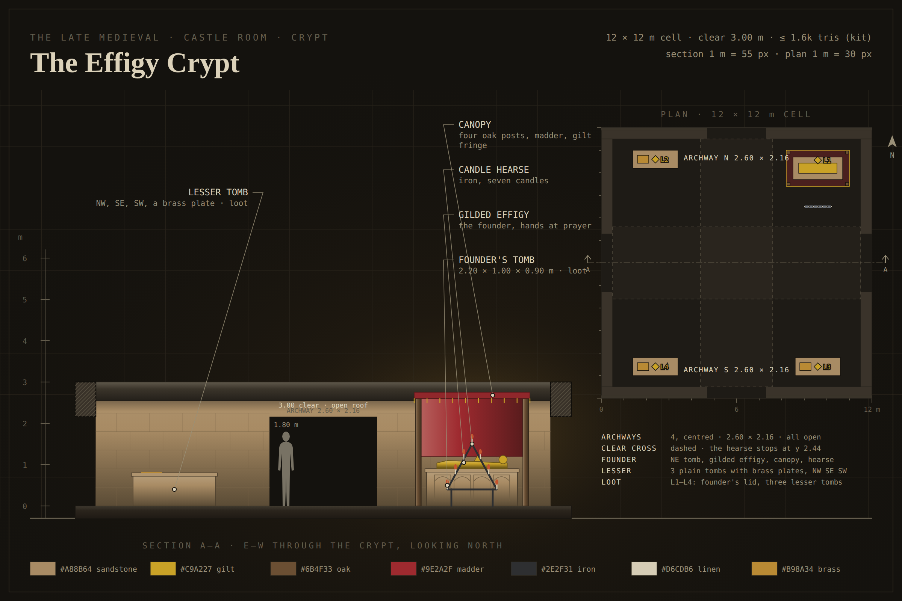

The family that built the castle is buried under it, and the man who began it lies in the north-east corner in gilt. His tomb chest is arcaded sandstone with a moulded lid, and on it his effigy lies in beaten gold, head on a pillow, hands joined, under a canopy of oak posts hung in madder with a gilt fringe. Before him a candle hearse, an iron triangle of seven candles, burns on the anniversary of his death and on every other day the chaplain is paid for. His descendants were buried more cheaply: plain chests in the other three corners with engraved brass plates let into their lids. The effigy is the richest thing in the Late castle and the hardest to carry.

**Build** (kit metres: x east, y north, from the cell centre; heights above ground, floor top at 0.30)

- Shell: the kit's Crypt shell, 12.0 × 12.0 × 0.30 m slab, 0.50 m dressed-sandstone walls 3.00 m clear, a 0.45 m dark trim course, an archway 2.60 × 2.16 m centred on every wall.
- Founder's tomb (NE): sandstone chest 2.20 × 1.00 × 0.90 m at (3.60, 4.20), long axis east–west, arcaded sides (albedo), a moulded lid 2.28 × 1.08 × 0.08 m.
- Gilded effigy: a gilt body 1.60 × 0.45 × 0.20 m on the lid, head r 0.11 m at the east end, hands at prayer.
- Canopy: four oak posts 0.14 m square at the tomb's corners plus 0.20 m (x 2.30 / 4.90, y 3.50 / 4.90) to 2.60 m above the floor; a madder tester 2.80 × 1.60 × 0.15 m on them; a gilt fringe strip along its south edge; a madder hanging 2.60 m wide between the north posts from 1.50 m to the tester.
- Candle hearse: iron, before the tomb at (3.60, 2.50): two legs 0.40 m, a base bar 1.20 m, two sloped bars meeting at 1.80 m above ground, seven candles up its edges with flames.
- Lesser tombs: three sandstone chests 2.00 × 0.80 × 0.80 m at (−3.60, 4.60), (3.60, −4.60), (−3.60, −4.60), long axis east–west.
- Brass plates: an engraved brass plate 0.50 × 0.35 m let into each lesser lid, west of centre.
- The crossing: bare floor between all four archways.

**Sockets**

- Archway ×4, centred on each wall: 2.60 × 2.16 m (Crypt), all open
- Founder's lid: a loot anchor beside the effigy at 1.20 m
- Lesser tomb lids: three loot anchors at 1.10 m

**Loot anchors**

- L1: the founder's lid, beside the effigy at (3.60, 4.56, 1.20)
- L2: the NW lesser tomb at (-3.60, 4.60, 1.10)
- L3: the SE lesser tomb at (3.60, -4.60, 1.10)
- L4: the SW lesser tomb at (-3.60, -4.60, 1.10)

**Materials** (art-pass colour, then the kit's atlas pigment)

| Material | Hex | Kit pigment | Notes |
|---|---|---|---|
| Dressed sandstone | `#A88B64` | `vellum_dim` | Walls, tomb chests. |
| Gilt | `#C9A227` | `orpiment` | The effigy and the canopy fringe. |
| Oak | `#6B4F33` | `oak` | Canopy posts. |
| Madder | `#9E2A2F` | `madder` | Tester, hanging, flames. |
| Blackened iron | `#2E2F31` | `line` | The hearse. |
| Brass | `#B98A34` | `bronze` | The lesser tombs' plates. |

**In play**

- The Late crypt's final room: the gilded effigy is the headline loot, lit by the hearse and visible from the north and east archways.
- The canopy posts and hanging screen the founder's tomb from the north.
- Four loot anchors, one per quadrant.

### LateUndercroftStair

**The Undercroft Stair** · Crypt · stands in for CryptStairwell · ≤ 2.4k tris (kit)

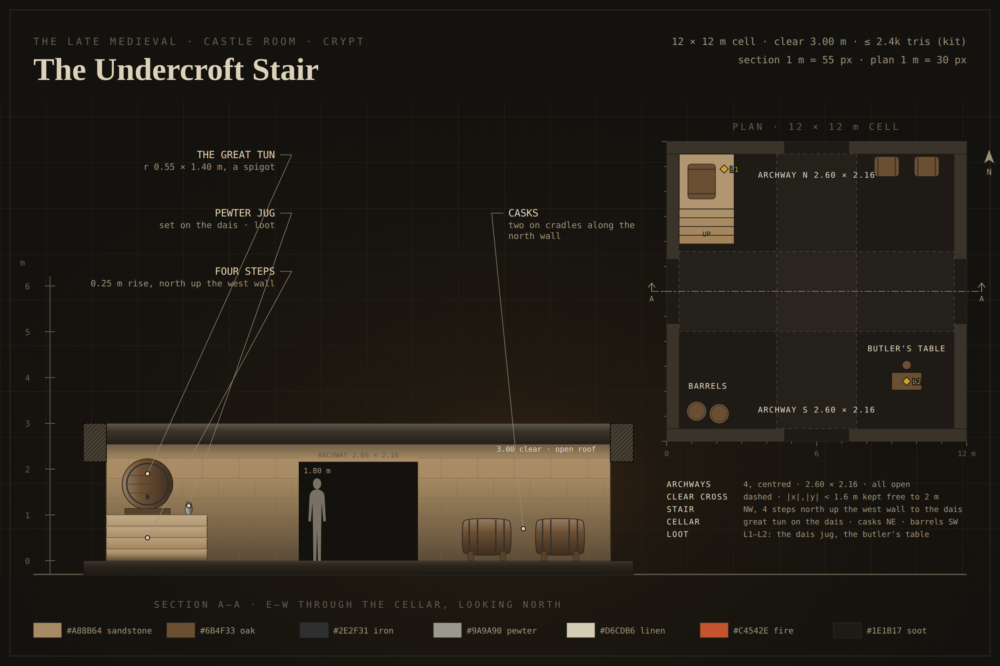

At the foot of the cellar stair the butler keeps his best wine where he can watch it: the great tun, a cask too big to carry through any door in the castle, lies on a raised dais at the top of four steps, a spigot in its head and a pewter jug waiting beside it. Two lesser casks rest along the north wall, and two upright barrels in the far corner hold whatever the kitchen has asked for. The butler's table in the south-east has a lantern, a pair of jugs and a bundle of notched tally sticks recording every measure drawn, which do not add up.

**Build** (kit metres: x east, y north, from the cell centre; heights above ground, floor top at 0.30)

- Shell: the kit's Crypt shell, 12.0 × 12.0 × 0.30 m slab, 0.50 m dressed-sandstone walls 3.00 m clear, a 0.45 m dark trim course, an archway 2.60 × 2.16 m centred on every wall.
- Stair and dais (NW): the kit's stair-to-dais in sandstone: four steps 2.20 m wide, 0.35 m tread, 0.25 m rise, north along the west wall from y 1.90 to 3.30, then the dais 2.20 × 2.20 × 1.00 m in the corner (x −5.50 … −3.30, y 3.30 … 5.50).
- The great tun: a cask r 0.55 m, 1.40 m long, lying north–south on two oak cradle blocks at (−4.60, 4.40) on the dais, two iron hoops, an iron spigot in its south head.
- Jug: a pewter jug 0.28 m on the dais at (−3.70, 4.90).
- NE casks: two casks r 0.40 m, 1.00 m, lying east–west on cradles against the north wall at x 2.80 and 4.40, y 5.00.
- Butler's table (SE): oak 1.20 × 0.70 m, top 0.80 m at (3.60, −3.60): a steel lantern with a lit madder window, two pewter jugs, three tally sticks; an oak stool r 0.18 m at (3.60, −2.95).
- Barrels (SW): two upright oak barrels r 0.40 m, 0.90 m, two hoops each, at (−4.80, −4.80) and (−3.90, −4.90).
- The crossing: bare floor between all four archways.

**Sockets**

- Archway ×4, centred on each wall: 2.60 × 2.16 m (Crypt), all open
- Dais: 1.00 m above the floor, reached by the stair; the jug on it is a loot anchor
- Butler's table: a loot anchor at 1.10 m

**Loot anchors**

- L1: the jug on the dais at (-3.70, 4.90, 1.30)
- L2: the butler's table at (3.60, -3.60, 1.10)

**Materials** (art-pass colour, then the kit's atlas pigment)

| Material | Hex | Kit pigment | Notes |
|---|---|---|---|
| Dressed sandstone | `#A88B64` | `vellum_dim` | Walls, stair, dais. |
| Oak | `#6B4F33` | `oak` | Casks, cradles, table, stool, tally sticks. |
| Blackened iron | `#2E2F31` | `line` | Hoops, spigot. |
| Pewter | `#9A9A90` | `iron` | Jugs, the lantern. |
| Fire | `#C4542E` | `madder` | The lantern's light. |

**In play**

- The dais is a raised lookout over the crossing; the tun on it is full cover.
- The stair's foot faces open floor, so the dais can be reached from the crossing.
- Two loot anchors: dais and table.
