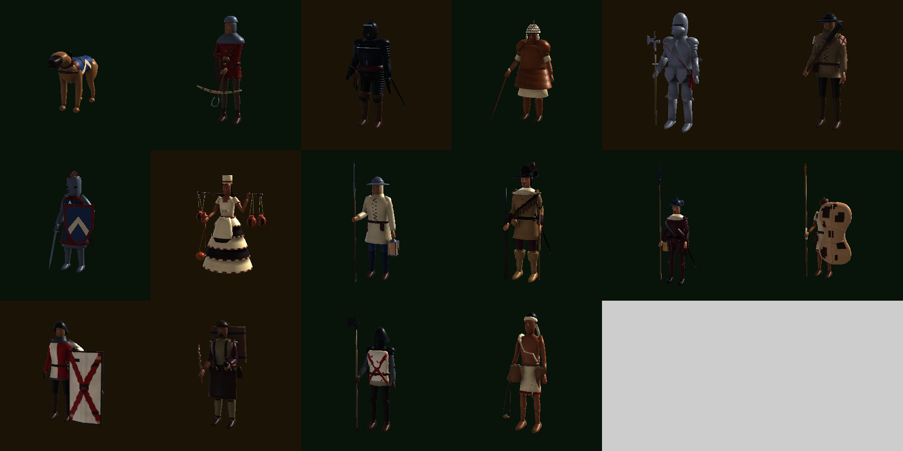
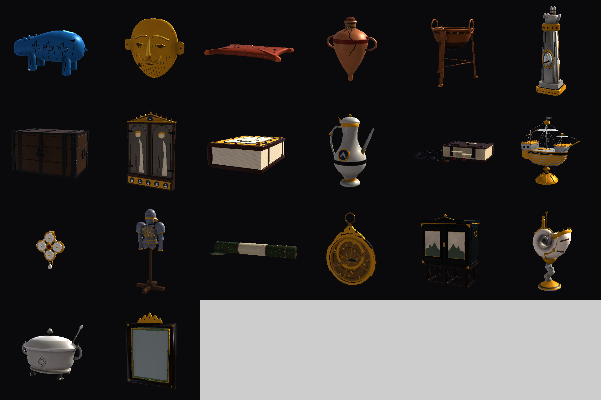
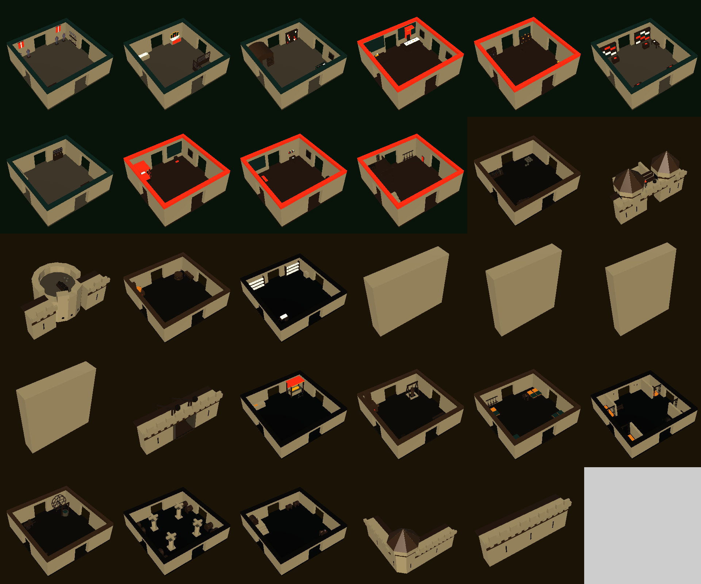
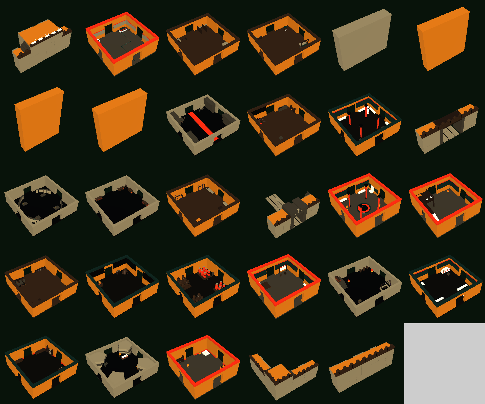

# Merge audit — 2026-09-24

Evidence for [`docs/plans/merge-2026-09-24-art-branches.md`](../../plans/merge-2026-09-24-art-branches.md).
All of it was produced in a live Unity 6000.3.15f1 Editor opened on a trial merge of
`dreamy-curie-jnrkbu` + `era-content-integration` + `castle-bench-rooms-mwucab`
(branch `claude/trial-merge-2026-09-24`, commit `bc8a6f5`), driven with the Unity CLI
(`unity command eval_file`). The Editor reported `compilationFailed: false` with 0 console errors
after the merge.

## Re-running it

Open the trial worktree (or any merged checkout) in Unity, then, for each script:

```powershell
unity command eval_file --project-path "C:\Users\Ayden's mini\Desktop\GameDev\PlunderSpell-trialmerge" --file "C:\Users\Ayden's mini\Desktop\GameDev\PlunderSpell\docs\generated\merge-audit-2026-09-24\audit_inventory.cs"
```

| Script | Reports |
|---|---|
| `audit_inventory.cs` | Each era's catalogue entry, roster (with animator/skinned-mesh state per enemy), room registry; Late Medieval models with no prefab; art-bible enemies with no roster entry |
| `audit_clips.cs` | Every AnimationClip under `_Project` and `Models/ArtBible` |
| `audit_era_filter.cs` | Whether each era's roster serves its zones from its own era or from the fallback |
| `audit_enemy_prefab_pairs.cs` | Hand-made AllEnemies prefabs vs era-forged gameplay prefabs, side by side |
| `audit_render.cs` | The four contact sheets below, plus a `.legend.md` per sheet naming every tile |

## Enemies — all 16 modelled, 10 in a roster, none animated

Green = spawned by a raid roster, amber = modelled but in no roster. Every one is a static
bind pose: no Animator on any of them. Tile names: [`enemies.legend.md`](enemies.legend.md).



## Loot items — 20, five per era, all forged into loot tables

Tile names: [`loot-items.legend.md`](loot-items.legend.md).



## Late Medieval rooms — 10 prefabbed, 19 model-only

Green = prefab in the Late registry (era branch), amber = castle-bench FBX with no prefab yet.
The four flat slabs are the door plugs. Tile names: [`rooms-late-medieval.legend.md`](rooms-late-medieval.legend.md).



## Bronze Age rooms — all 29 prefabbed and registered

Tile names: [`rooms-bronze-age.legend.md`](rooms-bronze-age.legend.md).



## Raw results

`audit_era_filter.cs` in the trial merge:

```
BronzeAge: zones with guards=5, zones served by own-era entries=0, fallback warnings=5
HighMedieval: zones with guards=5, zones served by own-era entries=5, fallback warnings=0
LateMedieval: zones with guards=5, zones served by own-era entries=0, fallback warnings=5
AgeOfPowder: zones with guards=5, zones served by own-era entries=0, fallback warnings=5
```

`audit_inventory.cs`, summary lines:

```
LATE MEDIEVAL models=29 prefabs=10 models without prefab (19): LateArtilleryYard, LateBarbican, LateBastion, LateBrewhouse, LateCharnelHouse, LateDoorPlugCrypt, LateDoorPlugInnerWard, LateDoorPlugKeep, LateDoorPlugOuterBailey, LateDrawbridge, LateEffigyCrypt, LateGunFoundry, LateHandgunnerBarracks, LateOubliette, LateTreadwheelWell, LateUndercroft, LateUndercroftStair, LateWallCorner, LateWallStraight
ArtBible enemies with no roster entry: Cuirassier, GothicManAtArms, Handgunner, KeeperOfTheFlame, Pavisier, Petardier
AnimatorControllers under _Project/Models: 0; AnimationClips: 16
```

`audit_clips.cs`: 16 clips, one per enemy `.blend`, each named `Scene`, 10.38 s — the Blender
timeline imported as a single take, not a game animation.
