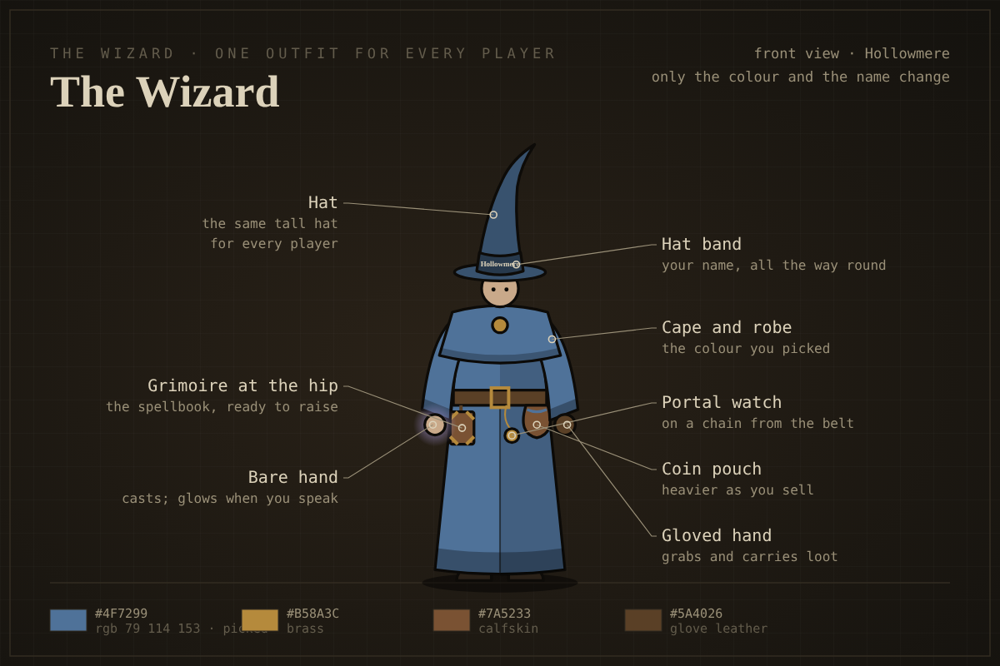
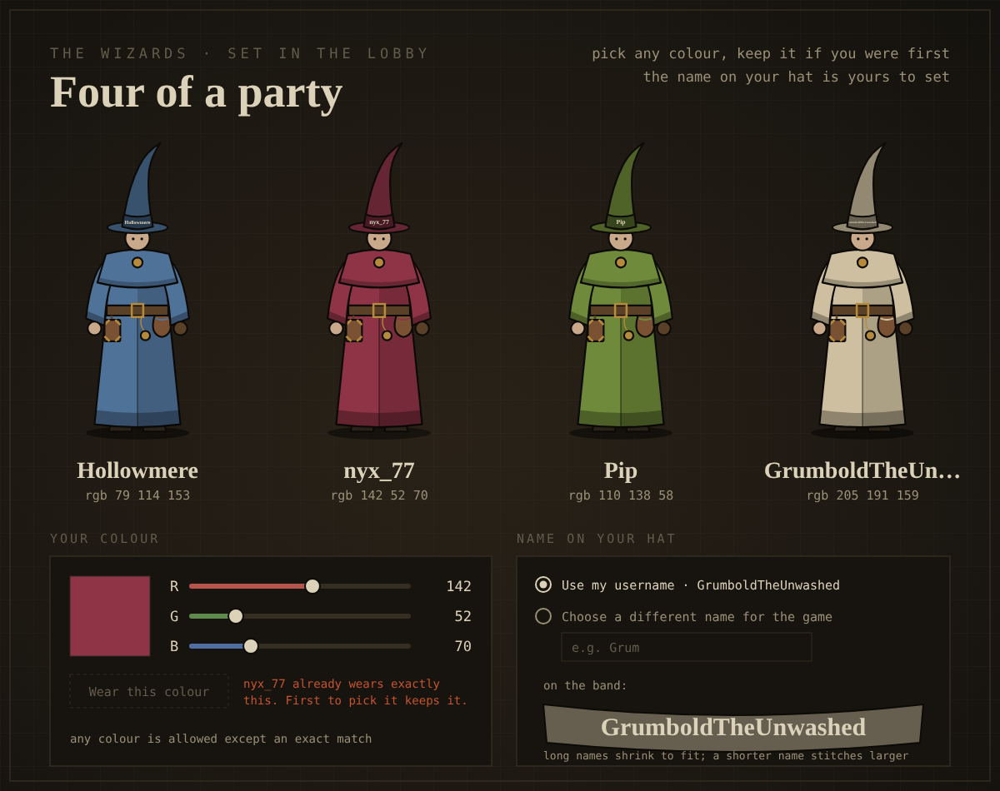
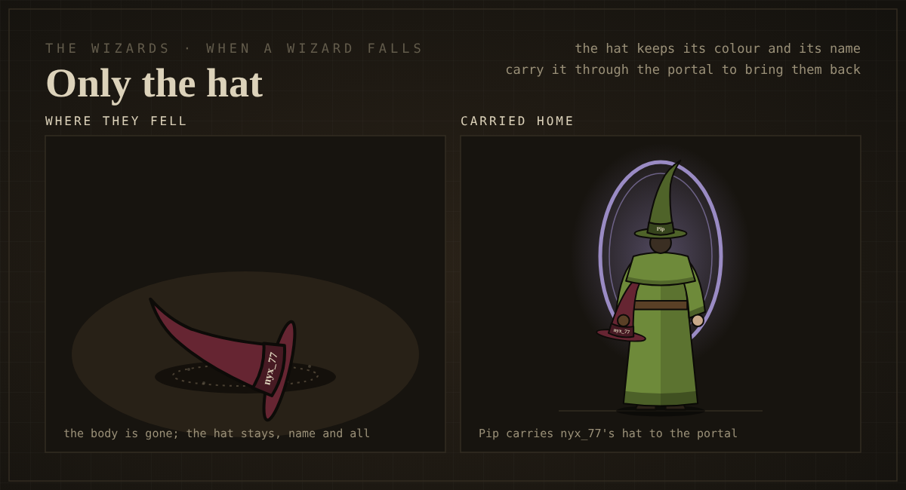
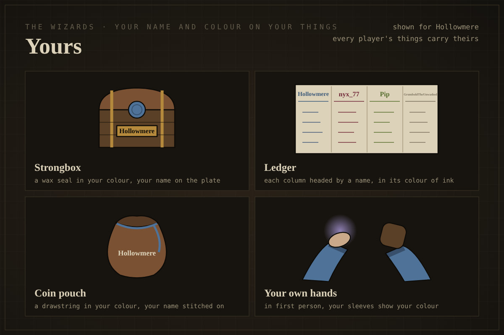

# The wizard: one outfit, a colour you pick, your name on your hat

**Approved by the owner, 2026-10-07. Not started.** Parent issue #335; one child issue per step
(#336–#341). To be built by a local agent with Unity; nothing here is implemented yet.

Concept plates: [`docs/art/concept/wizard/`](../art/concept/wizard/) (five PNGs, plus
[`proposal.html`](../art/concept/wizard/proposal.html), the page the owner approved). The plates are
generated by `docs/art/concept/wizard/source/plates.py`; `source/build.py` rebuilds the page. The
decision is recorded in [`Decisions.md`](../6-decisions/Decisions.md), 2026-10-07.

## What was decided

Every player is the same wizard in the same outfit. Two things differ between players.

1. **Colour.** Each player picks any red, green and blue value (0–255 each) in the lobby. No two
   players in a raid may wear exactly the same three values. Whoever picks a colour first keeps it.
   Two colours one value apart are allowed, even though they look the same.
2. **Name.** The player's name runs around their hat band, front and back, and nowhere else on the
   body. It defaults to their Steam name. The lobby clearly offers a second choice: a different
   name for the game. A long name shrinks to fit the band; it is never cut short.
3. **Death.** When a wizard falls, the body is gone and only the hat is left, in their colour and
   with their name on it. A teammate carries the hat home.

Rejected on the way, so nobody re-proposes them: four fixed wizards with different hat shapes and
marks; a fixed list of eight dyes; names across the shoulders; no names at all.

## The wizard, as drawn

Tall hat with a band, short shoulder cape, long robe, wide sleeves, a belt carrying a grimoire, a
portal watch on a chain and a coin pouch, soft boots. One bare hand (the casting hand) and one
gloved hand (the grabbing hand).

| Part | Colour |
|---|---|
| Robe, cape, sleeves | the player's colour |
| Hat | the player's colour × 0.72 |
| Hat band | the player's colour × 0.50 |
| Name thread | `#2A231A` when the band is pale (0.299 R + 0.587 G + 0.114 B > 150), else `#DCD2BA` |
| Belt, glove, boots | fixed: `#5A4026`, `#2A2118` |
| Grimoire, pouch | fixed calfskin `#7A5233` |
| Buckle, watch, clasp | fixed brass `#B58A3C` |

These numbers are the plates' own (`plates.py`: `hat()`, `thread_for()`), not tuned in engine. Tune
them in Unity and update this table if they change. Spells stay violet for everyone, whatever colour
a player picks.

## What exists today (checked 2026-10-07 on `main`, `b2195d5`)

- **Players are capsules.** `Assets/_Project/Prefabs/RaidPlayer.prefab` has a `Visual` child whose
  mesh is Unity's built-in capsule (`fileID: 10208`). `Player.prefab` also exists; check which one
  the raid spawns before changing both.
- **Steam names** are already read: `SteamFriends.GetPersonaName()` in
  `Assets/_Project/Scripts/Runtime/Net/CoopSession.cs` and `SteamBootstrap.cs`.
- **Going down in co-op** (`docs/4-systems/net.md`, "Spectating and a party wipe"): the body is laid
  on the ground (`ShowDownPose` turns only the `Visual` mesh), the downed player's camera follows a
  teammate (`SpectatorCamera`), every body down means "You died" for all, and a dead player revives
  on entering the next raid. The down flag is `PlayerNetworkOwnership._isDown`.
- **`DownedPlayerCarryAdapter`** (`Assets/_Project/Scripts/Runtime/Loot/`) turns a downed player into
  a 12 kg ragdoll that needs two carriers and revives at 25% health at extraction. It exists but is
  not the path co-op uses today (Decisions, 2026-09-23, "Not decided").
- **Strongbox, ledger and coin pouch per wizard** are not built; they are #313, part of the Lair
  and Market work (#306) from the HUD proposal (#284).

## Steps

One issue each. Do them in this order; 5 waits on #313.

### 1. A blockout wizard replaces the player capsule (#336)

Build the wizard as a blockout, following `1-the-wizard.png`. Build it the way this repo builds its
other models (`docs/4-systems/enemy-asset-pipeline.md`), or from primitives in Unity if that is
quicker; a blockout is enough.

- Keep the existing collider and height. The hat is visual only, so the fit to the rooms (#6) does
  not change.
- Split materials into **dyed** (hat, band, cape, robe, sleeves) and **fixed** (everything else),
  so step 2 can tint the dyed ones.
- Your own camera does not render your own hat; everyone else sees it.
- Final model and animation wait for M7. The roadmap's rule is that expensive presentation comes
  after the systems it dresses ("Game systems come before expensive presentation").

**Done when:** in a two-player raid each player sees the other as the wizard, and the wizard fits
the rooms as the capsule did.

### 2. Players pick a colour in the lobby (#337)

- Three sliders, red, green, blue, 0–255, with the value shown, and a swatch of the result.
- **The host owns the rule.** A client asks to wear a colour; the host refuses it if another player
  wears exactly the same three values, and says who. The refused player's button stays greyed with
  "<name> already wears exactly this. First to pick it keeps it." Two requests for the same colour
  at once: the host takes the first it receives.
- A joining player starts on a colour nobody in the session wears. A player who leaves frees their
  colour.
- The colour is replicated so every machine tints that player's dyed materials the same way.

**Done when:** two players cannot end up on the same exact colour, including both choosing it at the
same moment, and each sees the other's colour in the raid.

### 3. The name around the hat band (#338)

- The name is stitched twice, on the front and the back of the band, so it reads from any side.
- Default: the Steam name. The lobby shows two choices, clearly: **Use my username** and **Choose
  a different name for the game** (with a text field).
- Long names shrink to fit the band and are never cut. A shorter name stitches larger.
- Thread colour by the rule in the table above.
- The font has to cover the characters people use in Steam names, or fall back to one that does;
  an unrenderable character is the reason the "different name" choice exists.

**Done when:** a short name, a 20-plus character name and a name in a non-Latin script each show on
the band, readable up close from the front and from behind.

### 4. A fallen wizard leaves only their hat (#339)

- When a player goes down, the body is hidden on every machine and their hat drops where they fell,
  in their colour and with their name. This replaces the laid-down body (`ShowDownPose`).
- The hat is a loot pickup light enough to carry in one hand: worth nothing, cannot break, and
  guards ignore it (#270 is about guards attacking a downed teammate).
- A teammate can carry the hat to the portal.
- Spectating, the party wipe and the "You died" screen stay as they are.
- **This removes the two-person carry of a fallen friend** (`DownedPlayerCarryAdapter`'s 12 kg
  body). That is the owner's choice of 2026-10-07; see Decisions. Retire the adapter's body path
  once the hat works, per `docs/reference/deprecated-code.md`.

**Done when:** in a two-player raid one player goes down, the body vanishes and a hat appears where
they fell on both machines, and the other player picks it up with one hand and carries it to the
portal.

### 5. Colour and name on your things (#340)

After #313. A strongbox with a wax seal in the player's colour and a brass plate with their name; the
ledger's columns headed by each name in that player's colour of ink; a coin pouch with a drawstring in
the player's colour and their name stitched on. First-person sleeves take the player's colour, if
first-person arms exist by then.

**Done when:** in a two-player Lair each strongbox, ledger column and pouch shows its owner's name
and colour.

### 6. Playtest (#341)

After steps 1–4. Answer each question below in the "Playtest" section at the end of this plan.

- Down a corridor, can players tell each other apart by colour alone? Up close, by name?
- Two players on near-identical colours: is it confusing, and does the name settle it?
- A player picks one of the game's signal colours (spell violet, alarm orange-red, the use-glow
  blue-green, loot gold): does it read wrongly?
- Can a fallen hat be found in the darkest rooms, in each alarm state?
- Do very long names stay readable?

## Not decided

These came up and the owner has not ruled on them. Each step above works without an answer; ask
the owner before building any of them.

- **What carrying the hat out does.** Today a dead player revives on the next raid regardless. The
  default is to keep that. Making the carry matter (back mid-raid, or lost if the hat is left behind)
  is a separate decision.
- **Whether a player's colour and game name are remembered between sessions.**
- **A length limit, or a content filter, on the "different name" text field.** A rude name now sits
  on a hat for a whole raid.

## Risks

- **Look-alike colours.** Only exact matches are blocked, so near-identical colours are allowed. The
  name is the backup.
- **Signal colours.** A violet wizard may read like a spell, an orange-red one like the alarm.
- **Small names.** A very long name shrinks until it is hard to read; the "different name" choice is
  the answer the lobby offers.
- **A hat in the dark** is small and may be lost on a dark floor.
- **Two-person carrying** of a fallen friend goes away; any design that leaned on it needs another
  look.

## Playtest

Not run yet.
